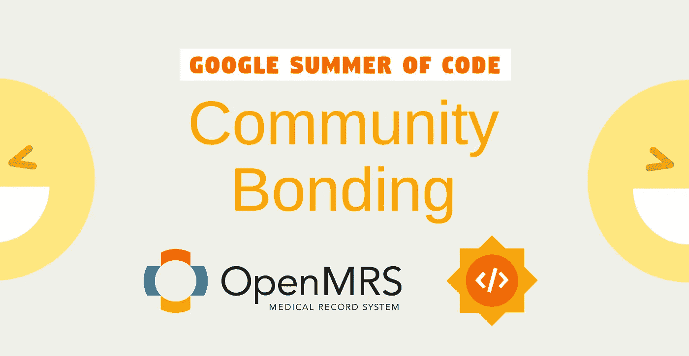
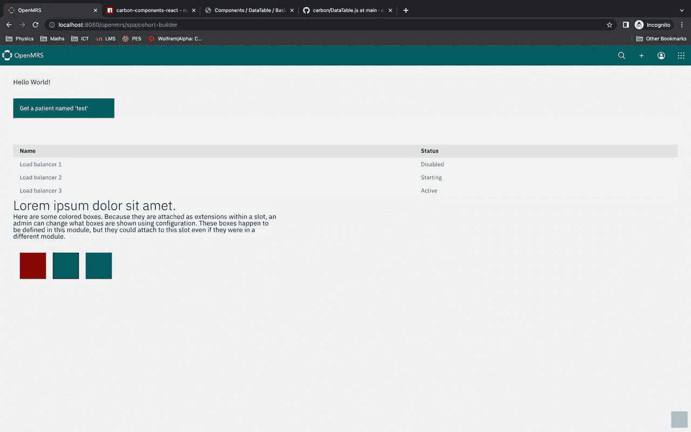

# 社区结合:带 OpenMRS 的 GSoC 2022

> 原文：<https://medium.com/nerd-for-tech/community-bonding-gsoc-2022-with-openmrs-8c8cd17353af?source=collection_archive---------8----------------------->

我的谷歌代码之夏之旅始于 2022 年 5 月 20 日的社区融合期。在这篇博文中，我将与 [OpenMRS](https://openmrs.org/) 分享我的社区联系经验。在此之前，让我简单解释一下我的项目。

我的[项目](https://summerofcode.withgoogle.com/programs/2022/projects/8EksU68Y)是将群组生成器重建为 OpenMRS 3.0 微前端模块。

## 什么是群组构建器？

[群组生成器](https://guide.openmrs.org/en/Using%20Data/cohort-builder.html)是 OpenMRS 1.0 报告兼容性模块中的一个工具(包含在大多数 OpenMRS 安装中),它允许用户对具有已定义特征的患者执行特定查询，并将多个查询组合成更复杂的查询。

我将在接下来的博客文章中讨论更多关于我的项目的细节。

项目一经宣布，我们就受到了 OpenMRS 社区的欢迎。我非常兴奋开始我的项目工作。

接下来，我和导师之一贾亚桑卡·威拉斯辛格进行了第一次会面。我的另一位导师是布兰登·伊斯特尼斯。我们讨论了这个项目，澄清了项目的一切，我被要求为里程碑创建一个文档。我还在《吉拉夫人》中创造了一部史诗。我们还安排了每周一次的拜访。

与此同时，我开始设置开发环境。多亏了 OpenMRS 工具，这变得非常容易。由于我的项目是一个新的 esm 模块，我所要做的就是扩展 OpenMRS 提供的 ESM 模板，它几乎已经配置好了一切。

ESM-模板-应用

然后，我接到了第二个电话，在电话中，我谈到了我遇到的一些小型拦截器。我也加入了每周一次的 O3 电话会议，这样我可以让每个人都了解最新情况。

如果你想跟进，我会在这个 [OpenMRS 对话主题](https://talk.openmrs.org/t/gsoc-2022-redo-legacy-ui-cohort-builder-project-updates/36847)上发布我的更新。

至此，社区融合期于 2022 年 6 月 12 日正式结束。现在是编码的时候了。敬请关注！