# 第一个 TestNG 自动化脚本的完整指南

> 原文：<https://medium.com/nerd-for-tech/complete-guide-for-your-first-testng-automation-script-88977d590ac4?source=collection_archive---------12----------------------->

*   自动化测试人员的最爱 TestNG 是一个 Java 测试框架，可以用来驱动 Selenium 自动化脚本。
*   说到自动化，没有什么比 Selenium 更好。
*   如果您计划深入自动化测试领域，TestNG 应该是您的首要任务。
*   因此，在这篇博客中，我们炮制了一点一点的策略来帮助你开始你的第一个自动化测试脚本。
*   在下面的选项卡中打开您的浏览器，并在 TestNG 中开始您的第一个自动化测试脚本。你只需要 20 分钟。

# 步骤 1:设置环境

*   链接:[http://www . Oracle . com/tech network/Java/javase/downloads/JDK 8-downloads-2133151 . html](http://www.oracle.com/technetwork/java/javase/downloads/jdk8-downloads-2133151.html)
*   为此，进入开始→环境变量→新建→点击后，您需要输入变量名和变量路径。

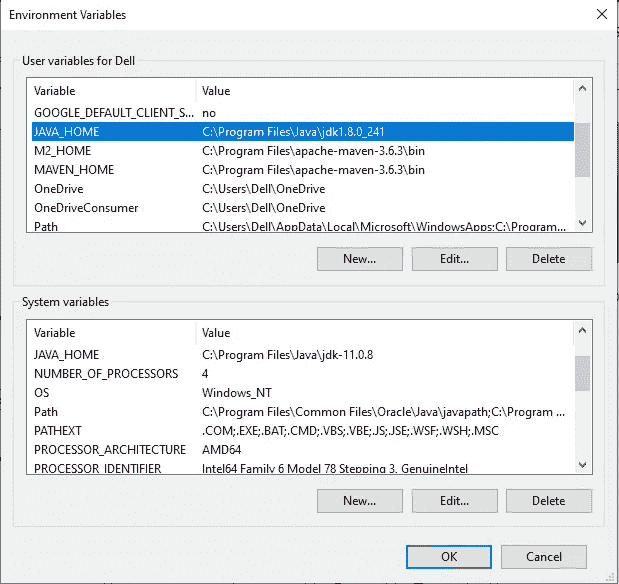

*   让我们验证这是否正确安装。

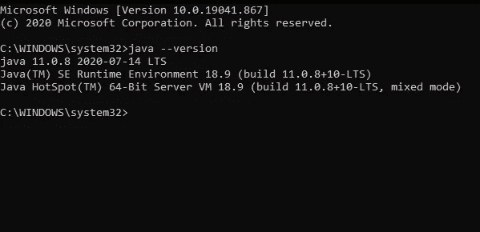

# 步骤 2:下载 Eclipse 并运行

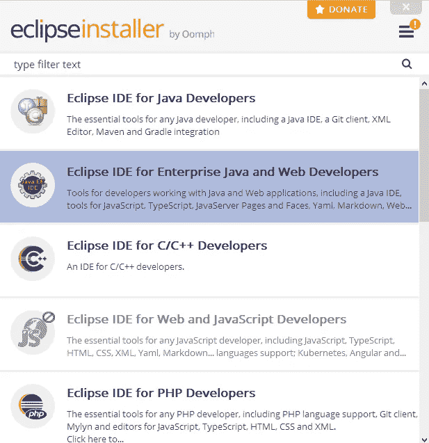

*   安装完成后，将会打开一个 eclipse IDE 窗口来编写脚本，如下所示。

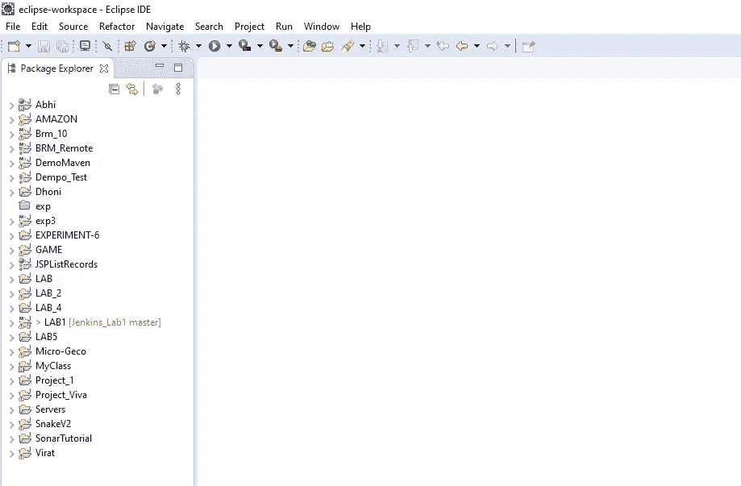

# 步骤 3:从 Eclipse Marketplace 下载 TestNG

*   为此，请转到帮助→ Eclipse Marketplace

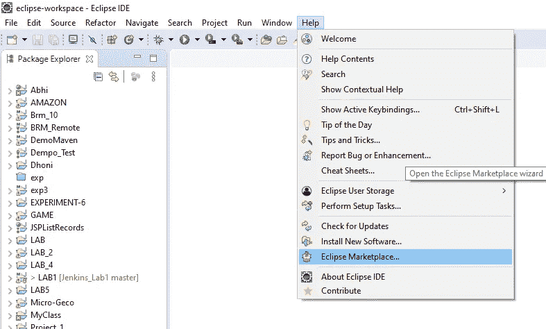

*   在 TestNG for Eclipse 上单击“安装”。

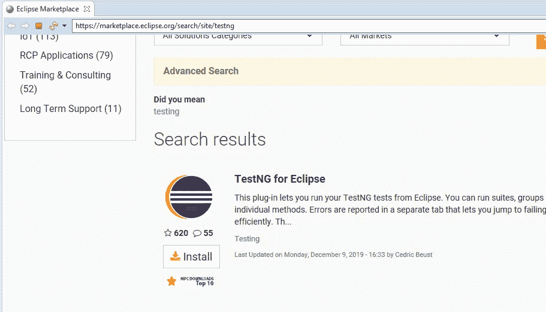

# 步骤 4:下载 Selenium 3.11.0

*   你可以用这个链接下载:【https://www.seleniumhq.org/download/

# 步骤 5:下载 Selenium 依赖文件

*   使用提供的链接为 jdk 11 下载 selenium 依赖文件[http://www . java2s . com/ref/jar/download-selenium Java 314159 jar-file . html](http://www.java2s.com/ref/jar/download-seleniumjava314159jar-file.html)

# 步骤 6:创建项目

*   创建 Java 项目
    要创建它，请转到文件→新建→其他

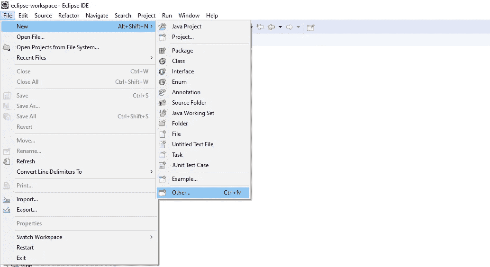

*   选择创建 Java 项目

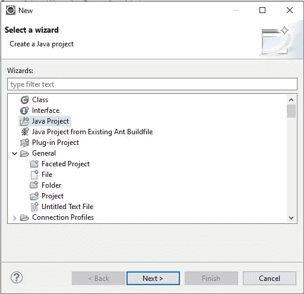

*   请输入您的项目名称，我正在输入“FirstAutomationProject”。
    注意:不要在项目名称中输入空格

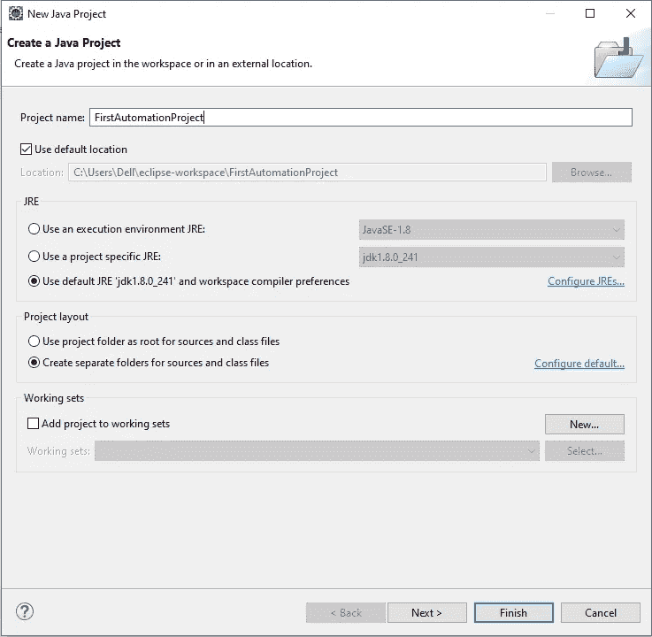

*   您会看到在左侧创建了一个新的 Java 项目。现在，点击“第一自动化项目”。您将看到 src 文件。右击它。选择新建→其他→创建新的 Java 包。

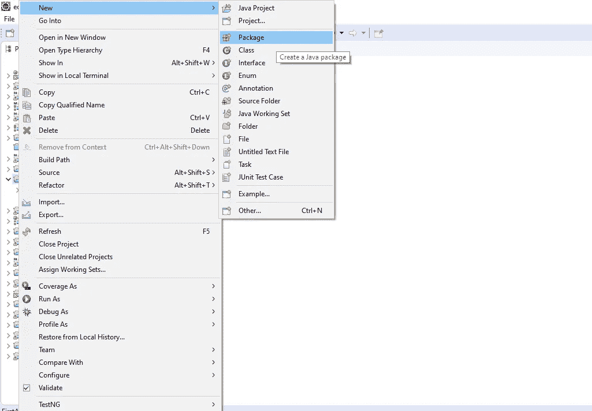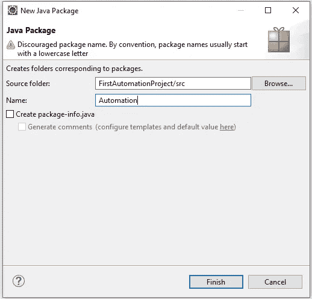

# 步骤 7:创建一个新的 TestNG 类。

*   在包自动化下创建一个新的 TestNG 类。右键单击自动化–>新建–>其他

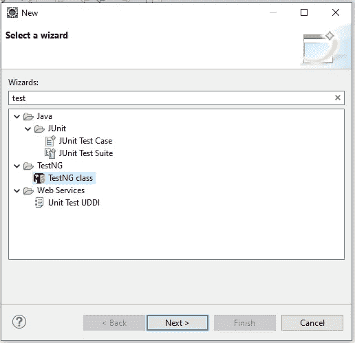

*   检查@BeforeTest 和@AfterTest。单击 Finish 后，您就可以开始编写自动化脚本了。

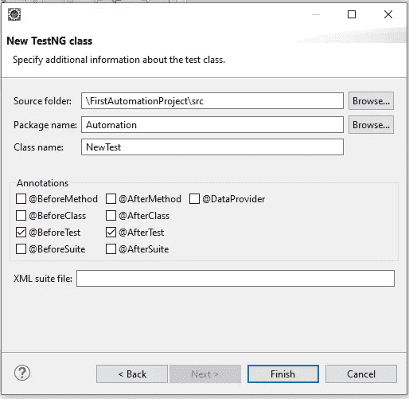

# 步骤 8:在依赖文件中导入 Selenium Jar 文件

右键单击 firstamationproject→Import。点击“添加外部 Jar ”,添加您在上面下载的 Jar 依赖文件。

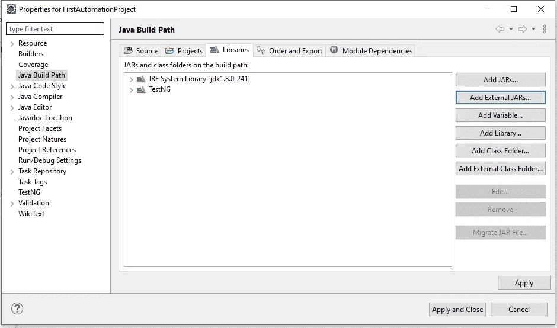

*   选择。上面下载的 jar 文件。

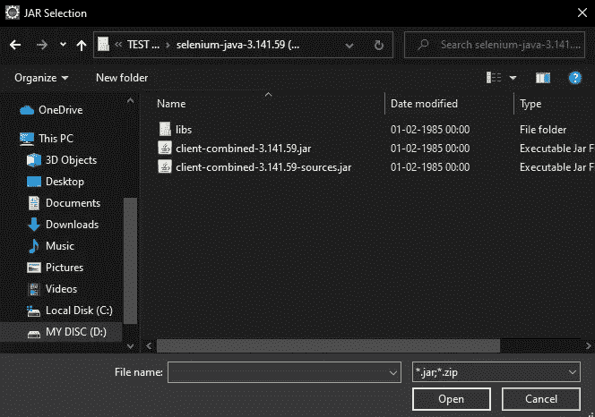

*   从 zip 提取的依赖文件中导入 lib 文件。

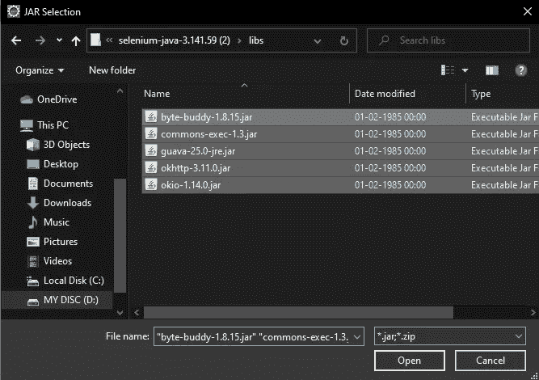

一旦导入了所有文件，就可以开始编写代码了。

# 写剧本

在您现在看到的 eclipse 窗口上，编写以下代码。

包装自动化；

导入静态 org . TestNG . assert .*assert not null*；

导入静态 org . TestNG . assert .*assert true*；

导入 Java . util . ArrayList；

导入 Java . util . set；

导入 org . open QA . selenium . by；

导入 org . open QA . selenium . JavaScript executor；

导入 org . open QA . selenium . web driver；

导入 org . open QA . selenium . web element；

导入 org . open QA . selenium . chrome . chrome driver；

导入 org . TestNG . annotations . after class；

导入 org . TestNG . annotations . before class；

导入 org . TestNG . annotations . test；

公共类 NewTest1 {

WebDriver 驱动程序；

@BeforeClass

公共 void 设置(){

系统。*出*。println(" * * * * * * * * * * * * * * * * * * *)；

系统。*出*。println(“启动 chrome 浏览器”)；

系统。*set property*(" web driver . chrome . driver "，" D:\ \ TEST AUTOMATION \ \ chrome driver \ \ chrome driver . exe ")；

driver = new chrome driver()；

driver . get(" https://www . Amazon . in/")；

driver.manage()。窗口()。最大化()；

}

@测试(优先级=0)

公共 void Search_Field() {

WebElement Search _ field = driver . find element(By。*id*(“twotasearchtextbox”))；

Search_field.sendKeys("板球皮蝙蝠")；

系统。*出*。println("测试 1 ")；

}

@测试(优先级=1)

public void Click_Search() {

WebElement Submit _ search = driver . find element(By。 *id* (“导航-搜索-提交-按钮”))；

Submit_search.click()。

系统。*出*。println("测试 2 ")；

}

@测试(优先级=2)

公共 void Click_product() {

JavaScript executor js1 =(JavaScript executor)驱动程序；

js1 . execute script(" window . scroll by(0，400)")；

WebElement Click _ on _ product = driver . find element(By。*XPath*("//*[@ id = \ " search \ "]/div[1]/div/div[1]/div/span[3]/div[2]/div[7]/div/span/div/span/a "))；

click _ on _ product . click()；

系统。*出*。println("测试 3 ")；

}

@测试(优先级=4)

public void switch_Validate()

{

set<string>listOfTabs = driver . getwindowhandles()；</string>

ArrayList<string>arr = new ArrayList<string>(listOfTabs)；</string></string>

driver.switchTo()。window(arr . get(1))；

系统。*出*。println(" \ n 在另一个窗口中\ n ")；

WebElement Product _ Description = driver . find element(By。*id*(“product title”)；

string check = Product _ description . gettext()；

系统。*出*。println(" check "+check)；

*assertNotNull* (检查)；

*assert true*(check . contains("克什米尔柳树"))；

系统。*出*。println("验证成功！");

}

@课后

公共 void 拆卸(){

系统。*出*。println(“关闭 chrome 浏览器”)；

driver . quit()；

}

}

**输出:**

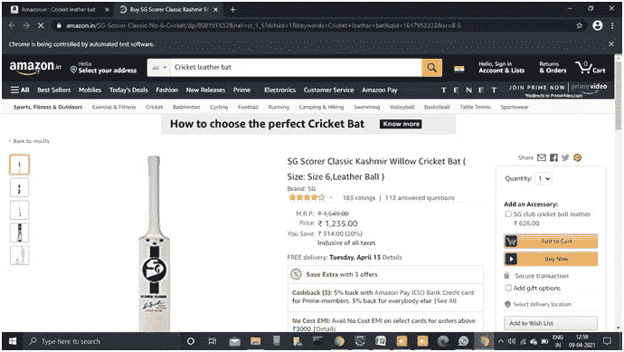

# ***将范围报告与结果报告的自动化脚本集成***

自动化脚本写在下面，用于在亚马逊电子商务网站上实现自动化脚本的 TestNG 报告。

## ***脚本:-***

包装自动化；

导入 Java . lang . reflect . method；

导入 org . open QA . selenium . by；

导入 org . open QA . selenium . web driver；

导入 org . open QA . selenium . web element；

导入 org . open QA . selenium . chrome . chrome driver；

导入 org . TestNG . annotations . after method；

导入 org . TestNG . annotations . after test；

导入 org . TestNG . annotations . before class；

导入 org . TestNG . annotations . before method；

导入 org . TestNG . annotations . before test；

导入 org . TestNG . annotations . test；

导入 com . relevant codes . extent reports . extent reports；

导入 com . relevant codes . extent reports . extent test；

导入 com . relevant codes . extent reports . log status；

公共类 TestNG_Report {

静态延伸报告；

静态拉伸试验；

WebDriver 驱动程序；

string base URL = " https://www . Amazon . in/"；

string driver path = " D:\ \测试自动化\ \ chrome driver \ \ chrome driver . exe "；chromedriver 的路径

@BeforeClass

public void initReport(){

report = new extent reports(" D:\ \ TEST AUTOMATION \ \ report . html ")；//存储范围报告的路径

}

@测试前

公共 void launchBrowser(){

system . set property(" web driver . chrome . driver "，driver path)；

driver = new chrome driver()；

driver . get(base URL)；

driver.manage()。窗口()。最大化()；

}

@ before 方法

公共静态 void startReport(方法结果){

test = report.startTest("范围报告—"+result . getname())；

}

@AfterMethod

公共 void endReport(){

report.endTest(测试)；

report . flush()；

}

@测试(优先级=0)

公共 void clickSignin

driver . find element(by . id(" nav-link-account list-nav-line-1 "))。单击()；

test.log(LogStatus。INFO，“开始登录”)；

if(driver . find element(by . id(" AP _ email "))！=null){

test.log(LogStatus。通过，“邮箱输入框存在”)；

}

否则{

test.log(LogStatus。失败，“邮件输入框不存在”)；

}

test.log(LogStatus。警告，“移动到下一步”)；

}

@测试(优先级=1)

public void enterUsername(){

driver . find element(by . id(" AP _ email "))。sendKeys(" singhabhishek . 7484 @ Gmail . com ")；

if(driver . find element(by . id(" AP _ email "))。getAttribute("value ")。equals(" singhabhishek . 7484 @ Gmail . com "){

test.log(LogStatus。通过，“输入邮件成功”)；

}

否则{

test.log(LogStatus。失败，“无法输入邮箱”)；

}

test.log(LogStatus。警告，“移动到下一步”)；

}

@测试(优先级=2)

public void clickContinue(){

WebElement BTN = driver . find element(by . id(" continue "))；

如果(btn！=null && btn.isEnabled()){

test.log(LogStatus。通过，“电子邮件提交按钮存在并启用”)；

driver . find element(by . id(" continue "))。单击()；

}

否则{

test.log(LogStatus。失败，“电子邮件提交按钮不存在或被禁用”)；

}

test.log(LogStatus。警告，“移动到下一步”)；

}

@测试(优先级=3)

公共 void 企业密码(){

driver . find element(by . id(" AP _ password "))。sendKeys(" qwerty @ 1234 ")；

如果(！driver . find element(by . id(" AP _ password "))。getAttribute("value ")。等于(" "){

test.log(LogStatus。通过，“输入密码成功”)；

}

否则{

test.log(LogStatus。失败，“无法输入密码”)；

}

test.log(LogStatus。警告，“移动到下一步”)；

}

@测试(优先级=4)

public void clickLogin(){

WebElement BTN = driver . find element(by . id(" sign in submit "))；

如果(btn！=null && btn.isEnabled()){

test.log(LogStatus。通过，“电子邮件提交按钮存在并启用”)；

driver . find element(by . id(" sign in submit "))。单击()；

}

否则{

test.log(LogStatus。失败，“电子邮件提交按钮不存在或被禁用”)；

}

test.log(LogStatus。警告，“登录成功”)；

}

@事后测试

public void destroySession(){

driver . close()；

}

}

**测试异常报告:**

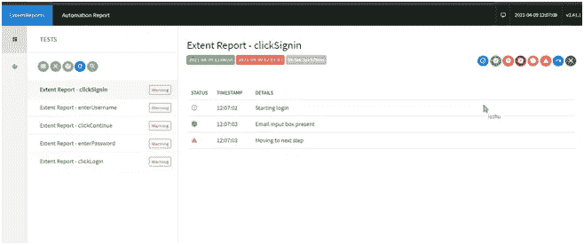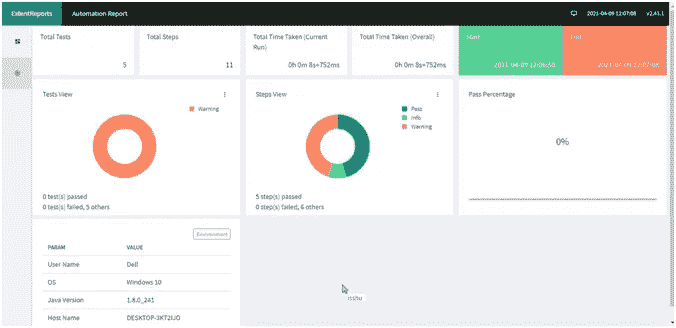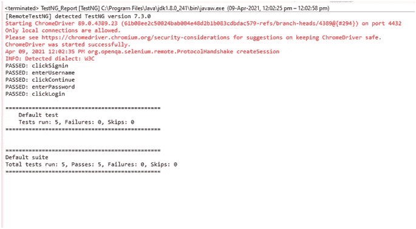

# *将自动化脚本与 Jenkins 集成，以便在构建部署时执行。*

自动化脚本写在下面，用于在亚马逊电子商务网站上实现自动化脚本的 TestNG 报告。

## ***剧本:-***

包 MAHI；

导入静态 org . TestNG . assert .*assert not null*；

导入静态 org . TestNG . assert .*assert true*；

导入 Java . util . ArrayList；

导入 Java . util . set；

导入 org . open QA . selenium . by；

导入 org . open QA . selenium . JavaScript executor；

导入 org . open QA . selenium . web driver；

导入 org . open QA . selenium . web element；

导入 org . open QA . selenium . chrome . chrome driver；

导入 org . TestNG . annotations . after class；

导入 org . TestNG . annotations . before class；

导入 org . TestNG . annotations . test；

公共类 NewTest1 {

WebDriver 驱动程序；

@BeforeClass

公共 void 设置(){

系统。*出*。println(" * * * * * * * * * * * * * * * * * * *)；

系统。*出*。println(“启动 chrome 浏览器”)；

系统。*set property*(" web driver . chrome . driver "，" D:\ \ TEST AUTOMATION \ \ chrome driver \ \ chrome driver . exe ")；

driver = new chrome driver()；

driver . get(" https://www . Amazon . in/")；

driver.manage()。窗口()。最大化()；

}

@测试(优先级=0)

公共 void Search_Field() {

WebElement Search _ field = driver . find element(By。*id*(“twotasearchtextbox”))；

Search_field.sendKeys("板球皮蝙蝠")；

系统。*出*。println("测试 1 ")；

}

@测试(优先级=1)

public void Click_Search() {

WebElement Submit _ search = driver . find element(By。 *id* (“导航-搜索-提交-按钮”))；

Submit_search.click()。

系统。*出*。println("测试 2 ")；

}

@测试(优先级=2)

公共 void Click_product() {

JavaScript executor js1 =(JavaScript executor)驱动程序；

js1 . execute script(" window . scroll by(0，400)")；

WebElement Click _ on _ product = driver . find element(By。*XPath*("//*[@ id = \ " search \ "]/div[1]/div/div[1]/div/span[3]/div[2]/div[7]/div/span/div/span/a "))；

click _ on _ product . click()；

系统。*出*。println("测试 3 ")；

}

@测试(优先级=4)

public void switch_Validate()

{

set<string>listOfTabs = driver . getwindowhandles()；</string>

ArrayList<string>arr = new ArrayList<string>(listOfTabs)；</string></string>

driver.switchTo()。window(arr . get(1))；

系统。*出*。println(" \ n 在另一个窗口中\ n ")；

WebElement Product _ Description = driver . find element(By。*id*(“product title”)；

string check = Product _ description . gettext()；

系统。*出*。println(" check "+check)；

*assertNotNull* (检查)；

*assert true*(check . contains("克什米尔柳树"))；

系统。*出*。println("验证成功！");

}

@课后

公共 void 拆卸(){

系统。*出*。println(“关闭 chrome 浏览器”)；

driver . quit()；

}

}

## ***TestNG.xml***

【1.0】编码=*【UTF-8】*？>

http://testng.org/testng-1.0.dtd">

<suite name="<em" class="md">【样本】平行= *【假】* ></suite>

<test name="<em" class="md">【测试】 ></test>

<classes></classes>

<class name="<em" class="md">《MAHI》。NewTest1" / ></class>

## 输出:

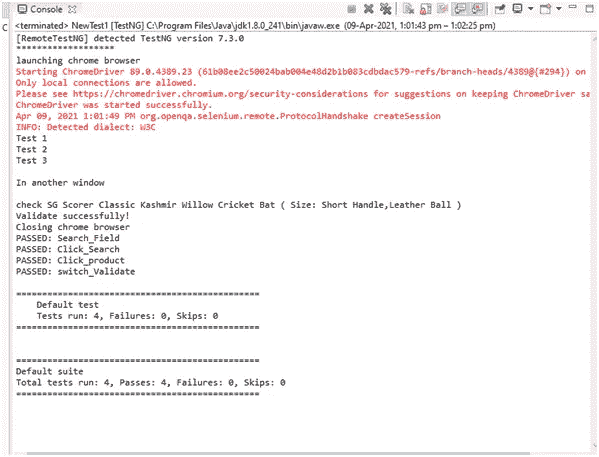

*   在项目中创建一个“run.bat”文件

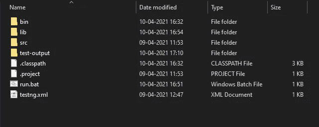

*   终端输出的***【run . bat】***文件用来运行***【TestNG . XML】***文件:

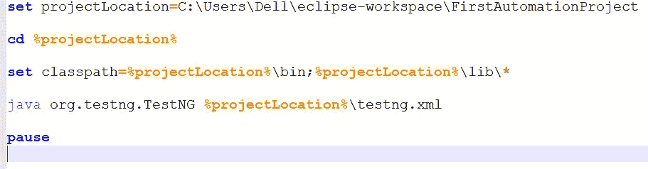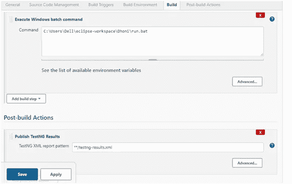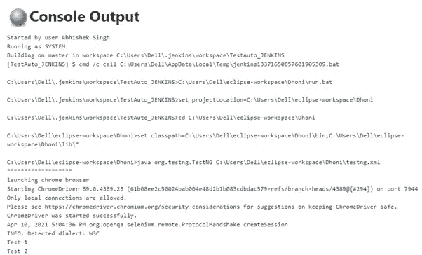

詹金斯输出