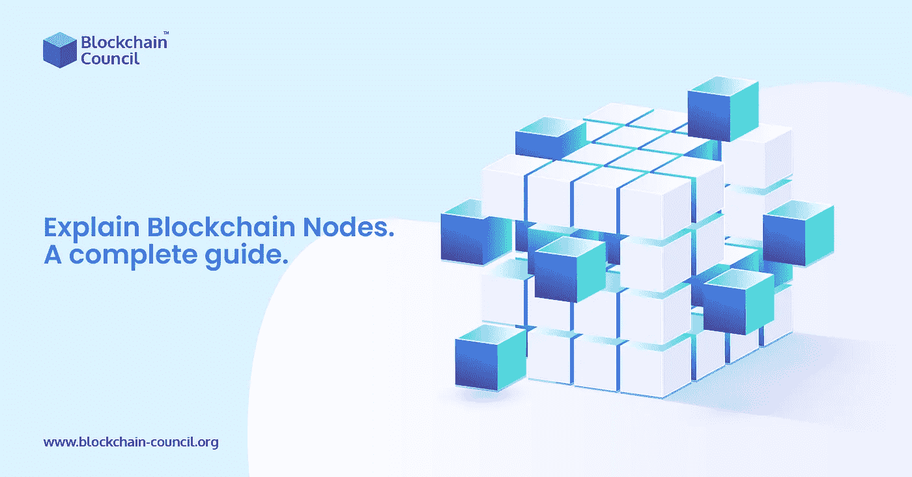

# 区块链节点完全指南:什么是区块链节点？

> 原文：<https://medium.com/nerd-for-tech/complete-guide-to-blockchain-nodes-what-are-blockchain-nodes-7d68f6574f37?source=collection_archive---------6----------------------->

节点最近已经成为区块链社区的热门话题。理由很充分:节点是区块链建筑的重要组成部分。没有节点，区块链的信息将是不可访问的。节点可以被认为是区块链。今天在本帖中，我们将分享与区块链节点相关的一切，这些节点将帮助您在 [**区块链发展**](https://www.blockchain-council.org/certifications/certified-blockchain-developer/) 。

关注我们的媒体出版物，获取最新的区块链更新—【https://medium.com/blockchaincouncil

****

**让我们先理解知道什么是节点的重要性，然后再讨论区块链节点的概念。把自己当成一个足球爱好者。你熟悉足球的规则，有几个最喜欢的球员和一支最喜欢的球队。你经常期待着看到你最喜欢的球队参加足球比赛。你曾经想象过如果没有足球场会发生什么吗？那你会怎么爱呢？**

# **这些节点是什么？**

**基于所提供的目标，节点的概念因情况而异。从**区块链学习**的意义上来说，节点是主要链接到通道的电气设备，并且具有 IP 地址。节点基本上是区块链系统的传输端点。这意味着节点实际上被任何试图与之连接的用户或程序所使用。因此，节点充当传输再分配点。**

**这是一种常见的误解，即所有节点都执行相同的服务，所有参与区块链系统的人都是节点。在这种情况下，主要需要记住两件事。首先，并不是每个链接到区块链系统的项目都是节点。此外，并非区块链系统上的所有节点都执行相同的功能。**

**虽然一个节点通常负责保存区块链的会计记录，但很少有节点不需要这样做。**

**那个区块链系统的需求实际上决定了节点在**区块链开发**中执行的各种功能。**

# **区块链节点的作用是什么？**

**您可能想知道这些不同的节点在**区块链开发**中做什么。**

# **接近**

**由于有了节点，用户可以轻松访问区块链账本。如果你使用过像 Etherescan 这样的区块链分析器，你就和一个节点进行过交互。或者根据交易 id 检索转账信息。区块链分析器只不过是一个连接到节点并从中检索信息的用户界面。**

# **正在处理一项交易。**

**在区块链上进行的任何活动主要传输到特定网络的节点。某些节点参与网络的协议方法来验证传输。同时，其他人单独负责存储记录。**

# **节点如何保证区块链的安全？**

**有两种类型的节点:在线和离线。来自和去往附近节点的所有最近的支付块主要由在线节点接收、保存和广播。但是，脱机节点不会。每当一个离线节点重新进入网络，它必须首先加入区块链体。获取节点离线时实际添加的任何数据块。与区块链网络协调是用来描述这一程序的术语。**

**只有一个节点可能操作一个完整的区块链。然而，它保持在一台机器上，并且特别容易受到断电、攻击者和系统故障等问题的影响。区块链系统的节点越完整，它抵御这种灾难的能力就越强。由于数据分散在如此多的机器上，任何欺诈方很难一次擦除所有的区块链信息。即使大量节点离线，单个节点也可能保持完整的区块链运行。并且由于世界范围的灾难而变得不可用。**

# **区块链开发中使用的各种节点是什么？**

# **归档完整节点。**

**在区块链系统中，这些是最普遍的完整节点。在他们的服务器里，他们保存着整个区块链。内存存储空间似乎更多。**

# **矿工节点**

**“比特币矿工”这个短语现在已经广为人知。这些矿工称之为节点。矿工可以单独工作，也可以作为团队的一部分。一个孤独的矿工有他自己的整个节点来工作。只有挖掘池操作员可以执行完整节点，也称为池挖掘器的完整节点。**

# **锁定节点。**

**某些节点，如 miner 节点，对于验证系统上的事务至关重要。主要是为了保持共识方法的运行。这些节点需要押上它们的现金并对转账进行认证。然后用一种最流行的技术——利害关系证明——来补偿这个过程。**

# **删除完整节点。**

**这些节点在存储数据时确实有内存限制。事实上，引入区块链的区块数量也没有限制。但是，一个完整节点可以保留的块数是有上限的。**

# **结论**

**这是区块链节点的完整指南。如果你正在考虑如何成为一名区块链工程师 ，那么这篇文章会对你有所帮助。**