# 在 Unity 中合成过场动画

> 原文：<https://medium.com/nerd-for-tech/composing-a-cutscene-in-unity-330bc8b99d4c?source=collection_archive---------14----------------------->

## 统一指南

## 关于在 Unity 中构建过场动画的快速指南

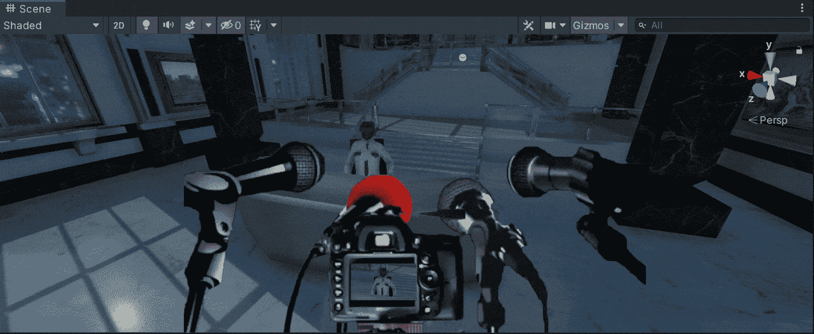

**目标**:使用 3D 模型和 previs 元素在 Unity 中构建一个过场动画。

在上一篇文章中，我提到了在 Unity 中使用 previs 元素制作过场动画的[重要性。现在，是时候在我们的场景中使用 previs 元素作为参考来构建过场动画了。](/nerd-for-tech/working-with-previs-elements-unity-89aa8103007c)

# 现场

首先，让我们看看下一个场景。我们有一个警卫(它在睡觉)的模型在安检台前面。

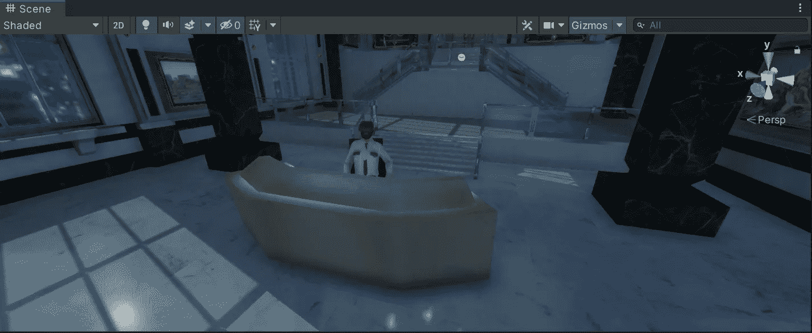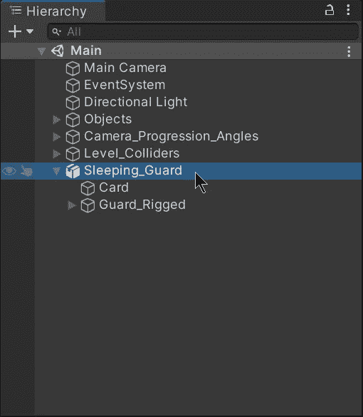

如果我们检查[最后一个帖子](/nerd-for-tech/working-with-previs-elements-unity-89aa8103007c)的预览元素，我们会注意到这个地方就是过场动画发生的地方。因此，为了开始构建过场动画，让我们拖动 [The Great Fleece](https://assetstore.unity.com/packages/templates/tutorials/the-great-fleece-110186) 包中提供的模型:

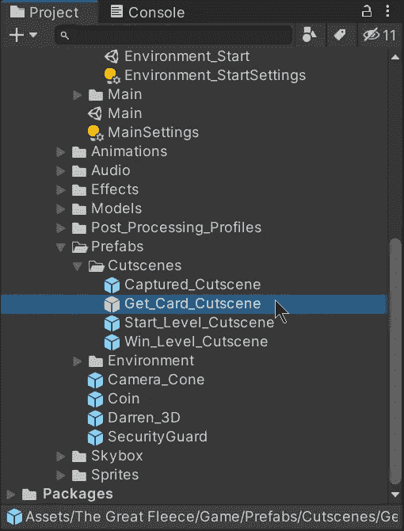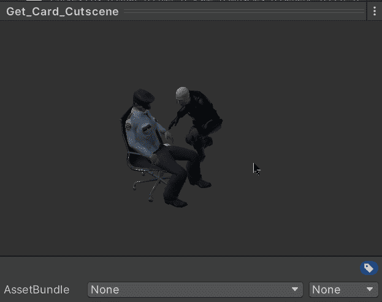

上面的预设包含小偷和守卫的模型，他们各自的动画是协调的。作为一名游戏开发人员，我在这里的工作将是使用艺术家提供的模型、动画和预览元素来构建过场动画。

# 电影院

为了实现由 previs 元素定义的过场动画的特性，我们需要从 Unity 软件包管理器安装 Cinemachine 软件包。

*   要打开软件包管理器，让我们点击*窗口>软件包管理器*。
*   要安装 Cinemachine，让我们搜索软件包并点击*安装*按钮。

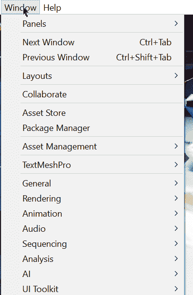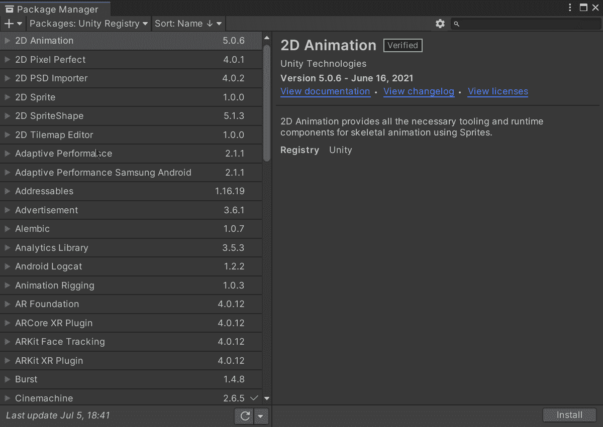

安装完成后，让我们点击*cinema Chine*>*Create Virtual Camera*为第一个 previs 元素创建一个虚拟摄像机。第一个 previs 元素声明相机应该沿着小偷的肩膀爬行，所以让我们给它一个合适的名称来标识它:

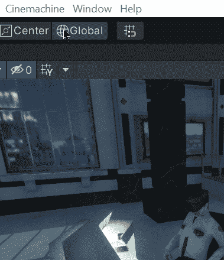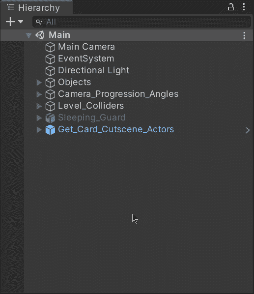

# 合成过场动画摄像机

现在，在场景视图中，让我们移动视图，寻找类似于 previs 元素中的镜头:

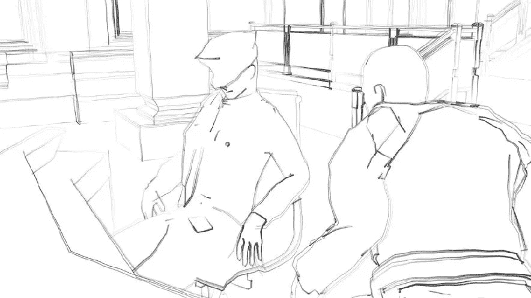

一旦我们使用场景视图找到相应的镜头，让我们单击新的虚拟摄像机，然后选择*游戏对象>与视图*对齐，以将虚拟摄像机与场景视图对齐，并获得相同的镜头:

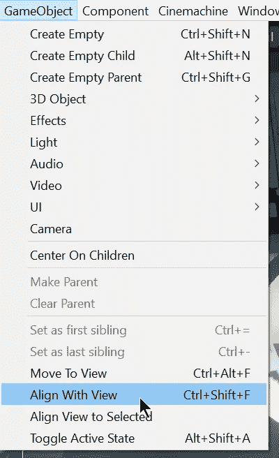

> 注意:您也可以在选择虚拟相机时按下键盘上的 Ctrl+Shift+F 键，以将其与场景视图对齐。

这样，我们将拥有与场景视图中相同的虚拟摄像机镜头，并且我们将满足 previs 元素的要求:

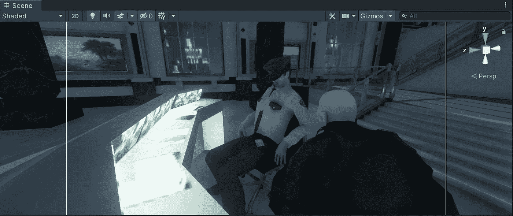

现在，让我们为下一个 previs 元素做同样的事情。我们需要另一个虚拟摄像头指向警卫的卡和另一边的小偷:

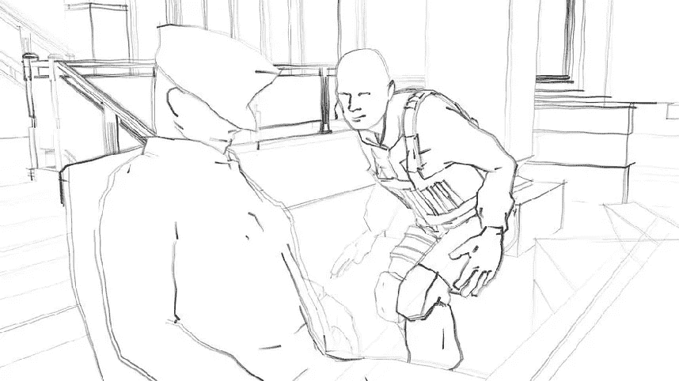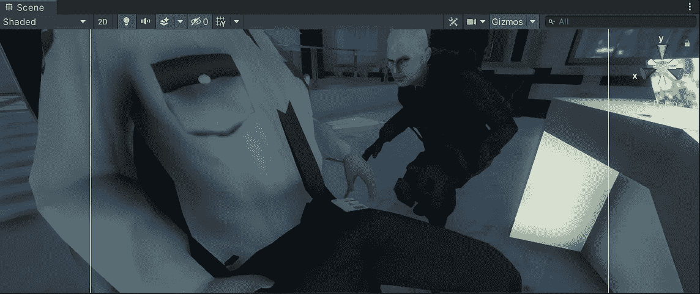

就这样，我们用 previs 元素组成了一个过场动画！:d .我会在下一个帖子中看到你，在那里我将展示如何使用 Unity 的时间轴窗口赋予我们的过场动画以生命。

> *如果你想更多地了解我，欢迎登陆*[***LinkedIn***](https://www.linkedin.com/in/fas444/)**或访问我的* [***网站***](http://fernandoalcasan.com/) *:D**