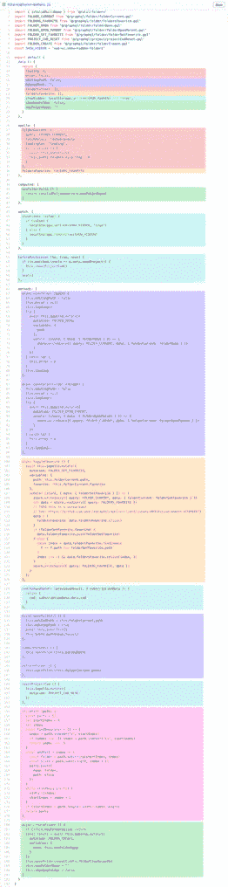
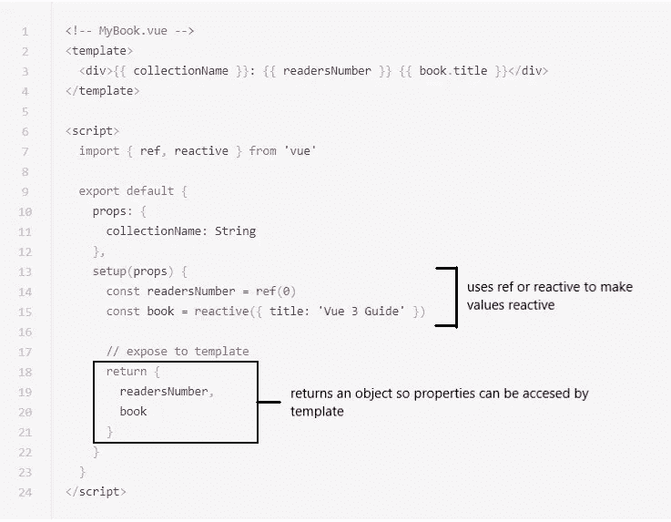

# 组合 API:需要知道基础知识和 3 件要记住的事情。

> 原文：<https://medium.com/nerd-for-tech/composition-api-the-need-to-know-basics-and-3-things-to-keep-in-mind-be664aaedb3a?source=collection_archive---------19----------------------->

## Vue 3 迷你剧

你好！因此，我一直在学习在 Vue 3 上编码，并决定就我迄今为止看到的一些最令人兴奋的事情写一组文章。 **Composition API** 不用多说，第一个。

## 🤔但是为什么呢？？？

从一开始，我就对 Vue 的多才多艺和“初级程序员”的友好印象深刻。选项 API，就像 Composition 的孪生兄弟(开玩笑的！不邪恶，只是双胞胎😜)非常直观，学起来也很好玩。Options API 通过选项名来构造代码逻辑，使其易于学习。

但是 Vue 3 决定用这种方法解决一个共同的问题，(一个非常重要的问题):**可伸缩性**。随着应用程序变得越来越大和越来越复杂，这种方法将组件的功能逻辑分成小块，分散在整个文件中，这使得维护变得很困难，特别是如果您最初没有编写组件的话。下面的示例展示了如何在 Options API 中组织单个功能的逻辑，每个功能逻辑用不同的颜色表示:



不是我的。这是 Vue 的。

如果你有兴趣了解更多关于如何使用组合 API 组织选项 API 逻辑的信息，请务必阅读 Vue 团队的[文档页面](https://v3.vuejs.org/guide/composition-api-introduction.html#why-composition-api)。

另一方面，Vue 团队希望确保有一种实用的方法来创建可重用的代码，因此引入了 **composables 或组合函数**(我们将在下一篇文章中讨论)。

## 👾好吧，那怎么做？

Composition API 引入了在任何生命周期挂钩之前运行的 **setup()选项。一旦解析了属性并准备好使用，Setup()将在组件创建之前运行🤗。在这个平台上，你可以编写任何你需要的 JavaScript 逻辑。看起来像这样:**

```
<!-- MyComponent.vue -->
<template>
  <h1>Title</h1>
  <div>Hello, my name is {{ name }}, and I'm {{ age }} years old.</div>
</template>

<script>
   export default {
    setup() {
      let name = 'Pato'
      let age = 35

      // Return the properties so they can be accessed by template
      return {
        name,
        age
      }
    }
  }
</script>
```

因此，每个特性的逻辑都在一起，使得组件可伸缩且易于维护。

setup()函数有两个参数:第一个是 **props** ，第二个是 **context** 。

***道具*** *是反应性的，所以如果你需要使用 ES6 析构，你应该使用 toRefs，否则会影响道具的反应性。*

***上下文*** *是一个普通的 JS 对象，它不是反应式的，我们下面会讲到这个。*

# ⚠️需要牢记的三件事

作文的 API 面不全是彩虹和阳光。开个玩笑，但请注意:

1.  默认情况下，setup()上声明的值是无效的。您可能还记得，在 Options API 上，数据对象将其属性转换为 getter/setter，使它们**反应**，因此每当我们做出更改，它**就会反映在 DOM 上**。在 setup()上，为了反映变化，您需要通过使用 **Ref 或 reactive 来确保该值是电抗性的。**
2.  **“this”关键字在 setup()中不可用。**在选项 API 上,“this”关键字指的是组件，但在组合 API 上,“this”是未定义的。因为 setup()在任何其他生命周期挂钩之前被调用，所以“this”不会是对当前活动实例的引用，因此不会像在其他选项中一样。
3.  **每当您希望组件的模板访问上下文的属性以及传递给 setup()的属性时，Setup()必须返回一个对象**。无论您想在组件模板中使用 setup()中的哪个属性，都需要在 JS 对象中返回。



这个例子不是我的，它来自 Vue docs。[这里是链接](https://v3.vuejs.org/guide/composition-api-setup.html#accessing-component-properties)。

## 🤩总之…

我认为重要的是要记住，Vue 3 允许在创建组件时使用选项 API 和组合 API。你甚至可以把它们结合起来，所以没有必要满足于一个。

但是，随着 Vue 框架的发展，它希望通过为开发人员提供新的特性来改进自己，使代码更加整洁和可重用；我认为这绝对是值得研究和利用的东西，尤其是在开发更大更复杂的应用程序时。

希望你试一试。下次见！👋