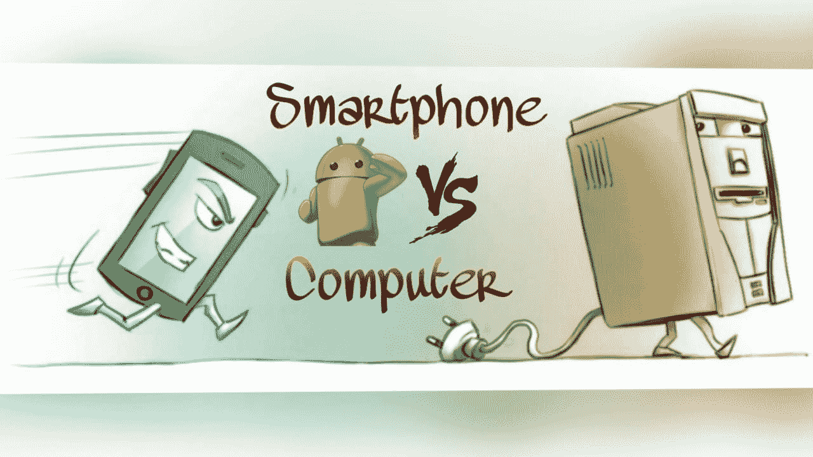
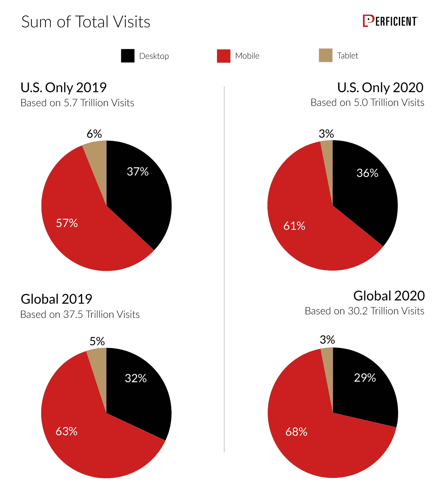
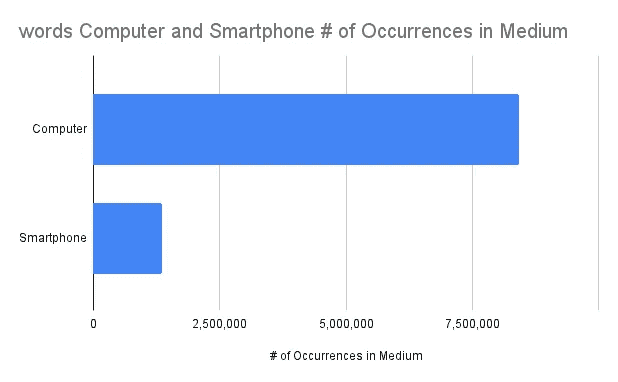
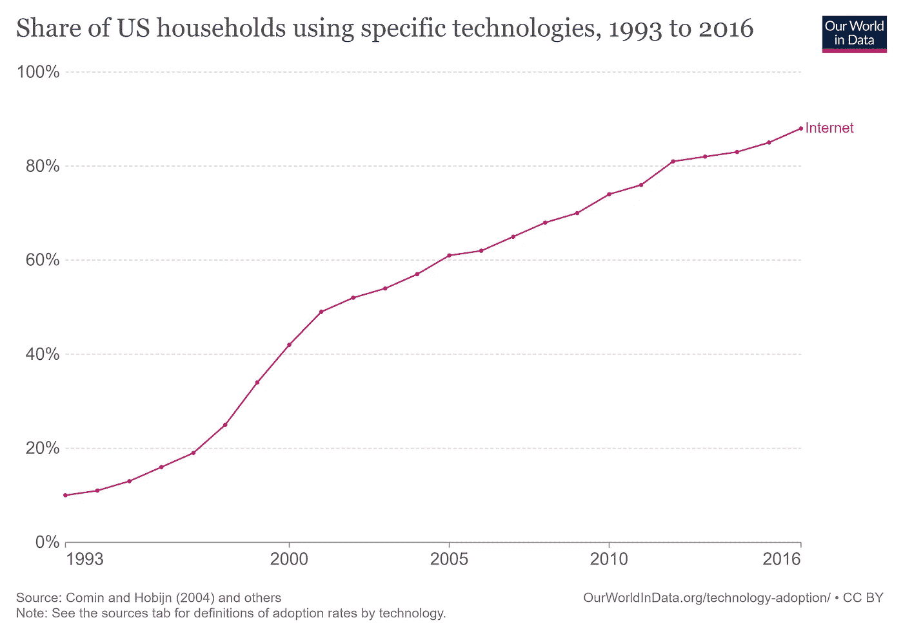
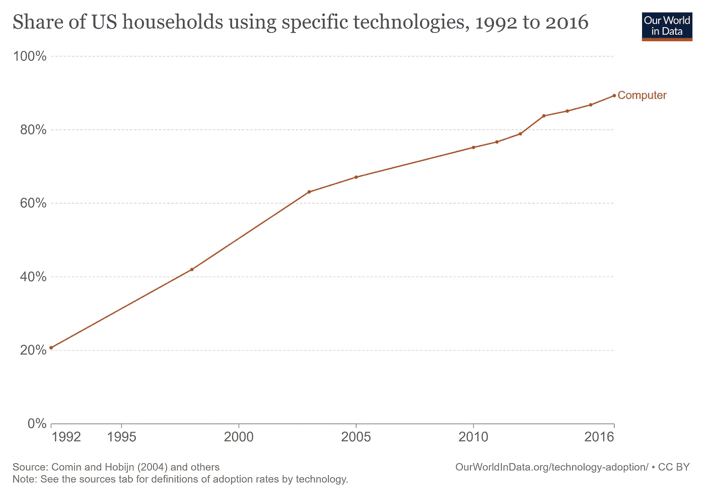
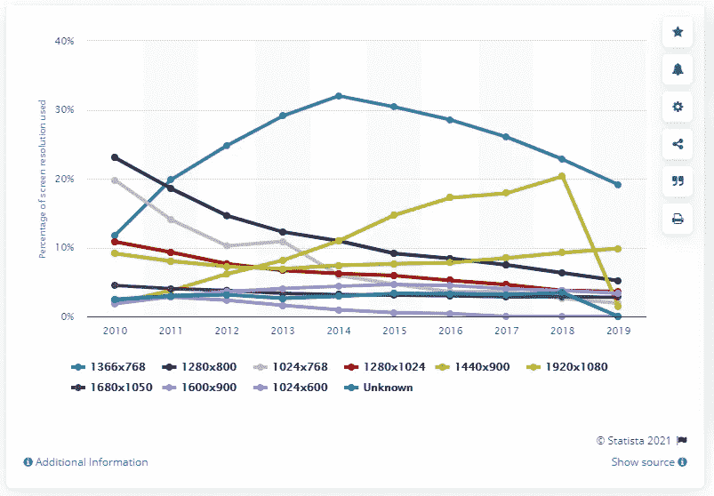

# 电脑 VS 智能手机

> 原文：<https://medium.com/nerd-for-tech/computer-vs-smartphone-5bbb71dccbd4?source=collection_archive---------8----------------------->

## 明确你的想法是给谁的，这一点很重要

如果你把注意力集中在电脑用户身上，完全避免手机和他们的用户身上发生的事情，那会怎么样？因为电脑用户是值得的，因为电脑有更重要的事情要做，这种设备的可访问性和清晰度比手机好得多。我想把这个问题告诉每一个试图建立一个科技型企业或者想在科技行业工作的人。例如，作为一名软件工程师，你可以跳过移动技术。作为一名技术型企业家，你可以跳过移动用户，因为仍然有像我这样的 PC 和 MAC 用户，他们可以在没有智能手机的情况下生活，他们正在做重要的工作，需要一些你可以让我们更轻松的东西。

当然，这些指标很诱人，它们就在这里

移动与计算机统计—来源:[熟练](https://www.perficient.com/insights/research-hub/mobile-vs-desktop-usage)

手机用户比电脑用户多得多，因为数十亿人生活中没有电脑。这可能会让你认为要做的事情是在手机上而不是在电脑上，但这是一种糟糕的决定方式，因为这样做你是在遵循大数定律，而大数什么也不是

最低可行观众也差不多。你可以根据用户使用的设备来筛选用户，你可以把目标锁定在平板电脑上，而不是电脑上。如果你制作的电子书阅读器只适用于给定屏幕尺寸的平板电脑，那会怎么样？有许多很酷的技术支持的想法只有在你可以建造的计算机上才能获得和使用，我无法想象移动网络和基础设施在作为后端操作服务器的计算机上运行。然后，你可以不再是一名移动应用开发者，而是一名纯电脑软件工程师，从事对使用和关心电脑的专业人士来说很重要的工作(纯电脑软件)。

为了给你更多的数字作为决策过程的输入，我认为给你一些关于媒体出版物中的移动和计算机的指标会很酷，就像我如何为我的出版物中的所有这些文章做的那样[文字指标](https://mkrdiop.medium.com/list/words-metrics-0f50785757d8)。作为这个名为 J……的数据新闻技术平台的第一个实验，已经有 6 篇关于文字相关指标的文章。我在[写的这篇文章](/nerd-for-tech/this-journalistic-tech-enabled-and-data-driven-platform-e43998f66690)。

媒体中的计算机和智能手机指标

很有可能这个技术化的平台会应用我在这篇文章中给你的这种建议，因为这个技术化的平台只能用电脑访问，我问自己如果我的文章只能被电脑用户阅读会发生什么。明确是给谁的很重要。这就是 Seth Godin 在他的书《实践和真诚》中建议的，今天每个人使用的大多数东西都是为一小部分人设计的。1993 年没有这么多的互联网用户

美国家庭的互联网采用情况——资料来源: [ourworldindata](https://ourworldindata.org/)

也没有那么多电脑用户。当然，移动推动并加速了互联网的采用，但这并不是我们都应该关心与移动相关的技术和技术支持的想法的原因。

资料来源: [ourworldindata](https://ourworldindata.org/)

同样，关注具体的小事情很重要，如果作为一名寻找下一个机会的数据科学家，你关注 [Ourworldindata](https://ourworldindata.org/technology-adoption) 上关于我们世界的数据，并使它们成为试验预测模型和试图从这些数据中突出系统行为的游乐场，会怎么样？我在这篇文章中写的数据驱动的书需要这些关于种群的数据，就像这本关于进化论的数据驱动的书需要关于物种种群和形态学的数据一样。

有了电脑，屏幕变宽了，你有更多的空间来进行创造性的技术支持的想法和能力，在学习的同时构建这些想法和能力。

[Statistica](https://www.statista.com/statistics/487487/leading-desktop-screen-resolutions-uk/):2010 年至 2019 年英国使用的桌面屏幕分辨率分布