# 机器学习的概念|岭回归或 L2 正则化、拉索回归或 L1 正则化。

> 原文：<https://medium.com/nerd-for-tech/concept-of-machine-learning-ridge-regression-or-l2-regularization-58a5286e7375?source=collection_archive---------18----------------------->

正则化是避免训练数据过度拟合的重要概念，尤其是当训练和测试数据变化很大时。

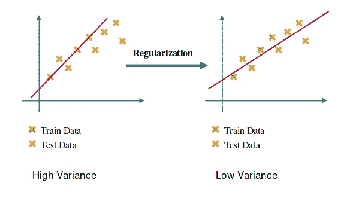

**正规化**

正则化是通过向 RSS 添加一个“惩罚”项来计算的，以实现测试数据的*较小方差*。

## 岭回归:

RSS 通过添加 b 的系数的平方和来修改。

假设下面的方程是回归模型。

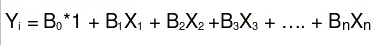

**多元回归模型**

其中 B0，B1……为参数，1，x1，x2……为特征，曲线为 n 维。

岭回归方程是:

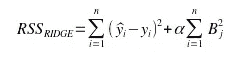

**岭回归**

[但问题是我们为什么要拿 alpha*sum(Bj)做惩罚？](https://datascience.stackexchange.com/questions/93927/why-we-take-alphasumbj%c2%b2-as-penalty-in-ridge-regression)

## 在矩阵表示法中，岭回归成本将被写成:

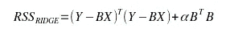

矩阵表示法中的岭回归

## 查找 B(系数) :

计算 RSS 的梯度

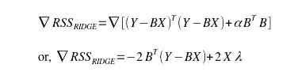

**渐变**

**方法 1:** 梯度下降法:

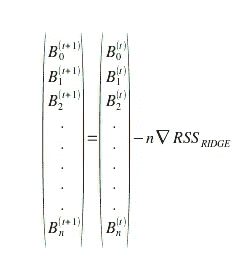

梯度下降法

**方法 2:** 设置梯度= 0

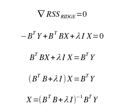

梯度= 0

## 套索回归:

通过添加 b 的系数的模来修改 RSS

拉索回归方程是:

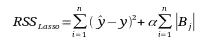

拉索回归方程

## 选择λ(α)的值:

请注意:在文章的这一行之前，我把罚分作为α，在这之后，你会看到我已经讨论了λ。这些α和λ是相同的。

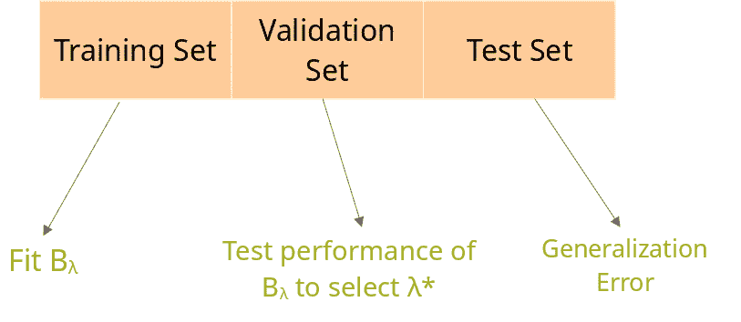

资料组

这里的测试集是指不在数据集中的数据。

现在我们将把数据分成训练集和测试集，我们的目标是最小化测试误差。

因为我们的目标是使测试误差最小，我们以测试误差最小的方式取λ的值。

但是可能有许多测试集。

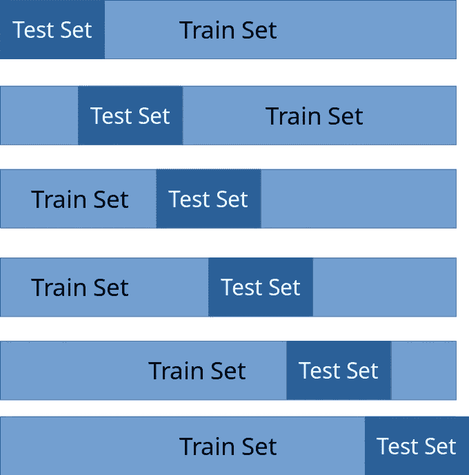

列车测试分离。

哪个测试集？

## k 倍验证:

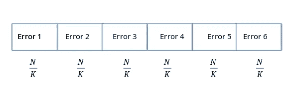

n 个数据分成 K 个集合。

这里，我们将 N 个数据分成 K 个集合。并且每个集合具有 N/K 个数据。

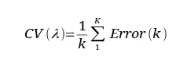

履历

选择λ使 CV(λ)最小。

**K 值→** 5 或 10

## 全文系列:

 [## 机器学习的概念文章系列| Ujjwal Kar

### 回归入门|使用梯度下降的简单线性回归优化…

ujjwalkar.netlify.app](https://ujjwalkar.netlify.app/post/concept-of-machine-learning-tutorial-series/)