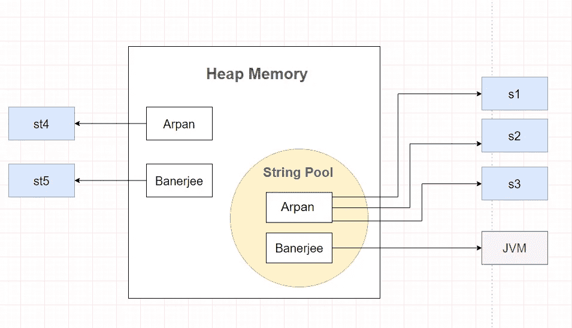
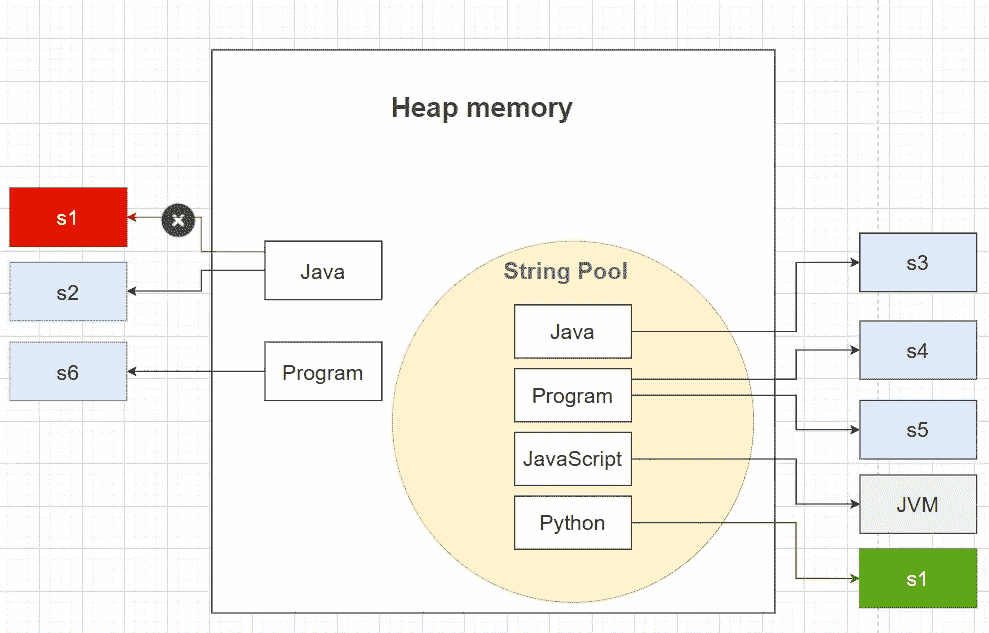
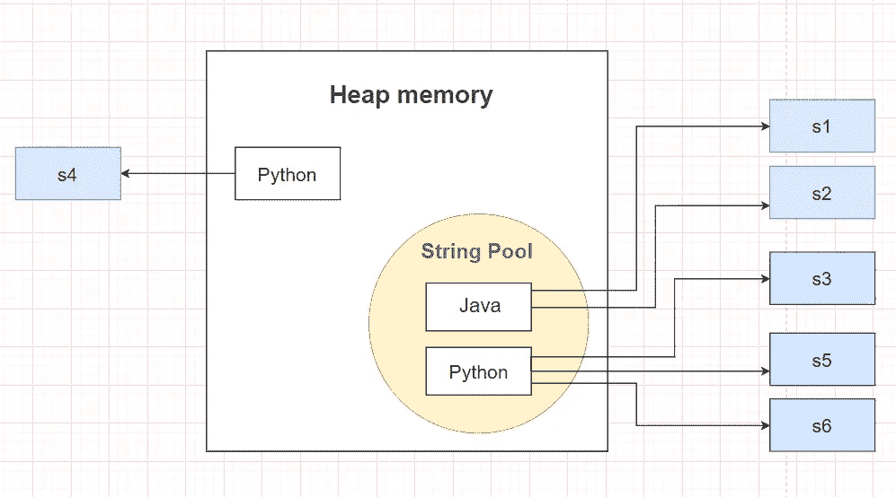

# Java 中字符串池和字符串对象创建的概念

> 原文：<https://medium.com/nerd-for-tech/concept-of-string-pool-and-string-object-creation-in-java-27ed2b3089f5?source=collection_archive---------5----------------------->

详细解释了使用**【字符串文字】**与使用**【new】**关键字时创建了多少对象，以及 JVM 在字符串类中分配内存。


约翰·拉贝莱特在 [Unsplash](https://unsplash.com?utm_source=medium&utm_medium=referral) 上拍摄的照片

你好！欢迎来到新博客。今天我要讲的是一个非常普通却又非常重要的概念。在面试中，你会得到很多围绕这个话题的问题。

> 为什么字符串是不可变的？什么是字符串常量池？你写这段代码`String s1 = new String("Guess");`的时候创建了多少个对象？拥有一个字符串池有什么好处？`String.intern()`方法是做什么的？等等。

让我们通过探索当您使用不同的方法创建一个 String 对象时在幕后发生了什么来找到所有问题的答案

# Java 中的字符串池是什么？

字符串池是 Java 堆内存中存储字符串的地方。

像所有的对象分配一样，字符串分配在时间和内存上都是一件代价很高的事情。JVM 在初始化字符串文字时执行一些步骤，以提高性能和减少内存开销。为了减少 JVM 中创建的字符串对象的数量，String 类保留了一个字符串池。

每次创建一个字符串，JVM 首先检查字符串池。如果字符串池中已经存在该字符串，则返回对池化实例的引用。如果池中不存在该字符串，则会初始化一个新的 string 对象，并将其放入池中。

字符串池之所以可能，仅仅是因为*字符串在 Java 中是不可变的*及其*字符串实习*概念的实现。

# 字符串不变性和优点

如果你看字符串*类*的定义，它已经被声明为 *final* 。**所以字符串对象一旦创建，就不能修改。**

字符串在 java 中是不可变的，因为字符串对象缓存在字符串池中。因为缓存的字符串是在多个对象之间共享的，所以总是存在一个风险，即一个对象所做的更改会影响到其他对象。

## 优势

1.  字符串是 HashMap 键非常受欢迎的候选者，它们需要是不可变的，以检索存储在 HashMap 中的值对象。因为 HashMap 的工作原理是散列，它需要相同的散列值才能正常工作。由于 String 是不可变的，所以它的 hashcode 在创建时就被缓存了，不需要再次计算。如果字符串是可变的，那么在插入和检索时，如果字符串的内容在插入后被修改，就会产生两种不同的 hashcodes，这一点都不理想。
2.  另一个原因是，通过在池中缓存字符串，它帮助 JVM 节省了大量堆空间。
3.  在 Java 中，安全参数通常表示为字符串，例如，网络内连接、数据库连接 URL、用户名/密码等。如果它是可变的，这些参数可以很容易地改变。JVM 类装入器在装入类时也广泛使用它。
4.  使 String 不可变会自动使它们成为线程安全的，从而解决同步问题。

*理论够了！我们来看一些代码片段，了解一下上面的概念。*

# 带有示例的基本概念

## 创建字符串对象有两种方式:

## 1.使用双引号(" ")[当使用字符串时]

每当我们使用这种方法创建 Strig 对象时，它都利用了字符串池的概念，因此是高效的。

```
**String s1= “Arpan”;**
```

上面的语句首先在`string pool`中搜索字符串 **"Arpan"** ，如果找到，就给它一个引用`s1`。如果没有找到，它创建一个字符串对象，并把它放在`string pool`中，然后给它一个引用 s1。

> 在这种情况下，**只创建一个对象: `*string pool*` *中的***。

## 2.使用“新”关键字:

```
**String s2= new String(“Banerjee”);**
```

上面的语句在`heap memory` 中创建一个字符串对象，并检查它是否出现在`string pool`中。如果字符串***"*baner JEE*"***不在`string pool`中，那么它将把这个字符串放在`string pool`中，否则它将跳过它。

> **案例 1:** 创建两个对象:一个在`heap memory`中，另一个在`string pool`中。
> 
> **情况 2:** 只创建了一个对象:在`heap memory`中。

> 现在你可能会有这个问题

假设我们用上面的方法创建了一个字符串。因此，将在堆内存中创建一个字符串对象，其值为**“baner JEE”**并且`s1`将指向它。现在，如果 **"Banerjee"** 不在字符串池中，我刚才说它也会在字符串池中创建一个对象。

**但是，你有没有想过，谁会指向这个物体呢？** `**s1**` **？**

> 不，`JVM`会指向那个物体。

因此，为了速度和优化的利益，使用字符串文字的方式创建字符串总是可取的，除非我们特别希望为字符串创建一个新的对象。

# 通过示例理解不变性

让我们用*字符串文字符号创建一个字符串。*

```
String s1= "java";
```

像往常一样，这将创建一个包含`"java"`的字符串，并给它分配一个引用`s1`。够简单吗？好吧。

让我们看看当我们修改字符串时会发生什么:

```
s1= s1.concat(" code");
```

这将向`s1`追加一个字符串`" code"`。当你试图打印`s1`的值时，你会得到什么？

```
System.out.print(s1);
-> java code
```

但是，我们刚刚了解到字符串是不可变的，对吗？但是控制台上说的是别的，是吗？

**井号**，以上操作未修改`s1`。`JVM`创建了一个新的`String`对象，给了它一个值`"java code"`，给了它一个引用`str`。

> 这里我们有 3 个对象:`java`、`code`和`java code`。`s1`指向`java code`。

## 让概念更清晰的代码示例。

那么，你能告诉我在上面的程序中创建了多少个对象吗？想想我们到目前为止学到的东西…

> 在上面的程序中将创建 4 个对象。

1.  **`heap`中的两个**:由`st1`指向的**【Arpan】**和由`st2`指向的**【baner JEE】**，因为有了`new`关键字。
2.  `string pool`中的两个**:`JVM`指向的**【班纳吉】**和**`s1``s2``s3`指向的**【阿潘】**。****

## **下面是对象和内存分配的示意图:**

****

# **高级示例**

**在上面的例子中创建了多少个对象？**

> **创建了 6 个对象。现在你必须知道为什么和如何。**

**如果你有任何困惑，请看下图。**

****

# **最后一件事:String.intern()方法**

**string 方法的 **intern()** 方法返回 String 对象的规范表示。**

**它在堆内存中创建一个*字符串*对象的精确副本，并将其存储在*字符串*常量池中。**

**当调用 intern 方法时，如果字符串池已经包含一个等于这个使用`String.intern()`方法新创建的字符串对象的字符串，那么就返回池中的字符串。否则，这个字符串对象将被添加到池中，并返回对它的引用。**

## **下面是一个演示上述概念的 java 代码。**

> **对于本例，将创建 3 个对象，一个在`heap`中，另外两个在`string *pool*`中*。***

**这是显示对象及其引用的图表。**

****

**好了，这篇文章就到这里。我相信现在你已经理解了 java 中`string pool`的概念，并且知道如何使用`string literals`符号和`new`关键字在`heap`和`string pool`中创建对象。**

**如果你有任何问题或建议，请在评论区告诉我。**