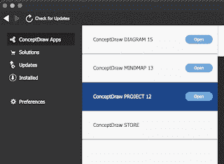

# ConceptDraw Office 获得升级

> 原文：<https://medium.com/nerd-for-tech/conceptdraw-office-gets-an-upgrade-6ccbcd193e7f?source=collection_archive---------11----------------------->

ConceptDraw Office 现在已经升级到版本 8，它包含 3 个(实际上是 4 个)主要软件包

*   概念图 v15
*   概念图思维导图第 13 版
*   ConceptDraw 项目第 12 版

还有一个 ConceptDraw 商店，提供各种 ConceptDraw 解决方案和主包升级。

Diagram 为所有企业提供各种专业质量的图形解决方案，Mindmaop 对于战略规划、知识和团队管理至关重要，Project 提供专业的投资组合和项目管理方法。

ConceptDraw Office 在 Microsoft Windows 和 Apple macOS 上都可用，是 Microsoft Visio 和 Project 的替代产品。

虽然应用程序可以独立运行基本的原语，但是当添加所有 215 个解决方案时，灵活性就来了。许多是免费的，可以通过商店下载，而一些是付费的，新的解决方案一直在增加。

解决方案的类别包括:-

*   建筑平面图
*   商业信息图表
*   业务流程
*   商业生产力
*   合作
*   计算机和网络
*   仪表板
*   图表
*   财务和会计
*   食品和饮料
*   图形和图表
*   健康
*   插图
*   工业工程
*   信息图表
*   管理
*   地图
*   营销
*   项目管理
*   质量管理
*   科学和教育
*   软件开发
*   运动
*   统计图表

其中一些只是构建模块，而另一些可以连接到数据以基于数据生成图表/信息图。

一些实际构建模块的例子

上面的信息图可能是静态的，也可能是利用数据(如分割的条形图)或者只是一张像棒球场一样的图片。

这些应用程序可以导入 Word、Excel、Powerpoint、Project、Visio、Mindmanager、Xmind 和 Freemind 文档，并导出 pdf、图像、大纲、Word、Excel、Powerpoint、Project 和 Visio。

Windows 和 macOS 版本之间仍然存在差异，例如只能在该软件的 Windows 版本上浏览 pdf 图层。

商店还允许升级应用程序和解决方案

也可以购买新的解决方案(当新的解决方案发布时，它会有一个绿色标志)

这些应用程序可以单独购买，也可以作为包含所有应用程序的 ConceptDraw Office 购买。

单用户定价如下:-

因此，目前办公室似乎是个便宜货。

这些解决方案的价格各不相同。

如果你需要一套可以做思维导图和项目规划的应用程序，而你不想走微软的路线，这可能是你的。

*最初发表于*[*【http://eurotechnews.blogspot.com】*](https://eurotechnews.blogspot.com/2022/01/conceptdraw-office-gets-upgrade.html)*。*