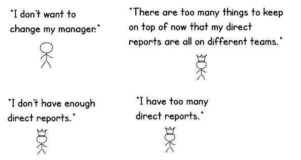

# 我每天使用的概念:BAPO

> 原文：<https://medium.com/nerd-for-tech/concepts-i-use-every-day-bapo-896d0ba0ccbb?source=collection_archive---------1----------------------->

# 因为组织结构变化可能会变得混乱，所以有一种结构驱动战略的趋势

## 改变组织结构可能会很麻烦

组织结构的变化会变得混乱有几个原因:

*   改变组织结构意味着更换经理。鉴于“人们离开…