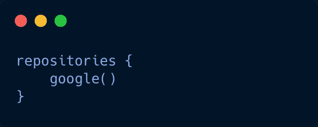
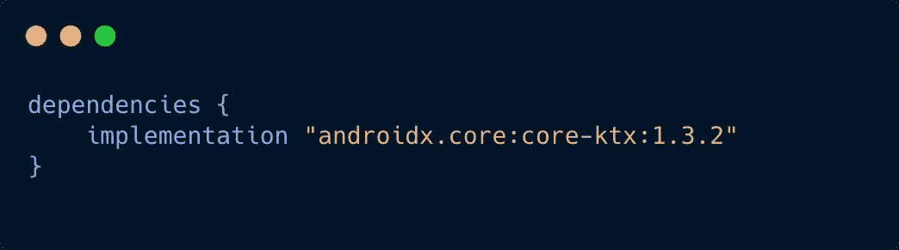
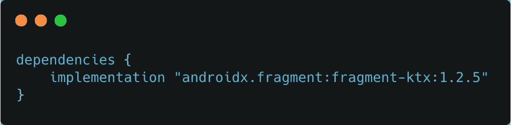
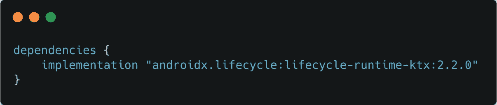
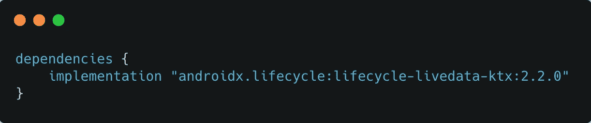

# 使用 KTX 扩展的简明代码库

> 原文：<https://medium.com/nerd-for-tech/concise-codebase-using-ktx-extensions-5e5250e4ce29?source=collection_archive---------0----------------------->


KTX-标题

今天，我们将学习如何使用 Android-KTX 库在 Android 代码库中编写更简洁的代码。

Android KTX 是一组 Kotlin 扩展，包含在 Android Jetpack 和其他 Android 库中。

KTX 扩展为 Jetpack、Android 平台和其他 API 提供了简洁、惯用的 Kotlin。

## 这些扩展利用了几个 Kotlin 语言特性，包括:

*   *扩展功能*
*   *扩展属性*
*   *兰姆达斯*
*   *命名参数*
*   *参数默认值*
*   *协程*

*   Android KTX 被组织成**模块**，其中每个模块包含一个或多个包。
*   支票👉所有 KTX 模块的列表

# 让我们看看它的实际效果

*   要开始使用 Android KTX，请将以下依赖项添加到项目的`build.gradle`文件中:



梯度构型

*   **添加 Core-KTX 模块:**

将以下内容添加到应用程序的`build.gradle`文件中:



核心-KTX 依赖关系

*   现在**同步你的项目**，我们可以开始了💃

*   **使用 KTX 扩展修改或访问视图的属性**:

```
**// OLD WAY** 
view.visibility = View.GONE|VISIBLE**// WITH KTX**
view.isVisible = true/false**// check if view is visible or not**
when*(*editText.*isVisible){* true ->*{

    }* false ->*{

    }
}***// get bottom margin**
view.marginBottom()**// iterate over the menu** 
menu.childern() // it returns the sequence**// check menu is empty or not**
menu.isEmpty()
menu.isNotEmpty()
```

*   **编辑 SharedPreferences:**

```
**// OLD WAY**sharedPreferences
        .edit()  // create an Editor
        .putBoolean("key", value)
        .apply() // write to disk asynchronously**// WITH KTX**

**// Commit a new value asynchronously**sharedPreferences.edit { putBoolean("ktx", value) }

**// Commit a new value synchronously**sharedPreferences.edit(**commit = true**) { putBoolean("ktx", value) }
```

*   **字符序列扩展**:

```
// if the give string contains only digits
"1224".isDigitsOnly()// convert to Spannable 
"KTX".toSpannable()// get layout direction for Locale
Locale.layoutDirection
```

*   **Android 实用程序类的扩展:**

像**longparsecarray 等。**

```
// if array contains given key
longSparseArray.contains(0.5)// create new collection by adding another collection
longSparseArray1.plus(longSparseArray2)
```

*   **TextChangeListener****使用 KTX:**

这 1 是我最喜欢的💚💚

```
**// OLD WAY** 
add text change listener
editText.addTextChangedListener(object : TextWatcher {
      override fun afterTextChanged(s: Editable?) {
      }

      override fun beforeTextChanged(s: CharSequence?, start: Int, count: Int, after: Int) {
      }

      override fun onTextChanged(s: CharSequence?, start: Int, before: Int, count: Int) {
      }
    })**// WITH KTX you can use which ever fits your requirement**1) editText.*doAfterTextChanged* **{** *editable* **->** Log.d*(*"KTX", "onCreate: *${editable*.*toString()}*"*)* **}** 2) editText.*doBeforeTextChanged* **{** *text*, *start*, *count*, *after* **->  

   }** 3) editText.*doOnTextChanged* **{** *text*, *start*, *before*, *count* **-> 

   }**
```

# **片段 KTX** :

提供了许多扩展来简化片段 API。

*   将以下依赖项添加到您的应用程序的`build.gradle`文件中:



FragmentKTX 依赖项

*   **简化提交片段事务的流程**

```
**// OLD WAY**
   getSupportFragmentManager()
                .beginTransaction()
                .replace(containerViewId, fragment, fragmentTag)
                .addToBackStack(backStackStateName)
                .commit()
**// WITH KTX**
fragmentManager().commit {
   addToBackStack("KTX")
   replace(fragment, "KTX")
}
```

*   **初始化片段中的视图模型:**

```
**// OLD WAY****fragmentScopedViewModel** = ViewModelProviders.of(this).get(MyViewModel.class);**activityScopedViewModel** = ViewModelProviders.of(requireActivity()).get(MyViewModel.class);**// WITH KTX**// Get a reference to the ViewModel scoped to this **Fragment**
val viewModel: MyViewModel by viewModels()

// Get a reference to the ViewModel scoped to its **Activity**
val viewModel by activityViewModels<**MyViewModel**>()**// viewModel with parameter**
val viewModel by *viewModels<*ViewModel*>* **{****// check the repo for the implementation of 👇** viewModelFactory{ ViewModel*(*"KTX"*) // viewModel requires String parameter
  *}}
```

# 生命周期 KTX:

为每个生命周期对象提供生命周期范围。你可以在当前生命周期对象的特定范围内做你的事情

*   将以下依赖项添加到您的应用程序的`build.gradle`文件中:



生命周期依赖性

```
*lifecycleScope*.launchWhenCreated **{ 
   // do your stuff when activity/fragment created 
}** *lifecycleScope*.launchWhenResumed **{
// do your stuff when activity/fragment resumed
}** *lifecycleScope*.launchWhenStarted **{
// do your stuff when activity/fragment started
}****// access the coroutine context of current lifecycleScope** *lifecycleScope*.coroutineContext
```

# LiveData KTX:

提供各种扩展功能，使我们在使用 LiveData 时更加轻松

*   将以下依赖项添加到您的应用程序的`build.gradle`文件中:



Livedata KTX 依赖项

```
// livedata builder
private val _livedata:MutableLiveData*<*Boolean*>* = MutableLiveData*()* val livedata: LiveData*<*Boolean*>* = *liveData* **{** emitSource*(*_livedata*) // directly emit the changes whenever source gets updated* **}**
```

# 视图模型 KTX:

提供了一个 **viewModelScope()** 函数，使得从 ViewModel 启动协程或任何任务变得更加容易。

*   将以下依赖项添加到您的应用程序的`build.gradle`文件中:


视图模型 KTX 依赖项

```
fun doTaskTiedToViewModelScope*(){
    viewModelScope*.*launch* **{** *// do your stuff here* **}** *}*
```

*   **检查样本项目👇**它包括我们今天讨论的所有**例子**:

[](https://github.com/navczydev/ktx) [## navczydev/ktx

### ktx 扩展的示例代码。在 GitHub 上创建一个帐户，为 navczydev/ktx 开发做出贡献。

github.com](https://github.com/navczydev/ktx) 

# 👨‍💻👏👏👏👏快乐编码👏👏👏👏👨‍💻

# 保持联系

*   [推特](https://twitter.com/navczydev)
*   [领英](https://www.linkedin.com/in/navczydev/)

# 参考

[Android KTX 文档](https://developer.android.com/kotlin/ktx?gclid=CjwKCAiAxp-ABhALEiwAXm6IyfX8F0zUr6abjRTNZFO8oHrdMqCT8LMV9t2zTrDZ8isuomHYuOOUmxoCUJEQAvD_BwE&gclsrc=aw.ds)