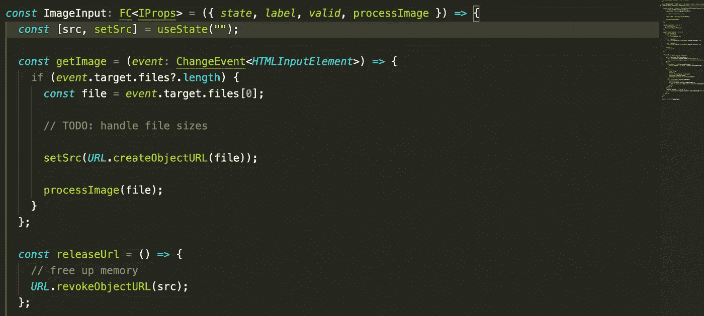
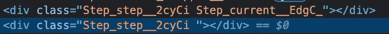
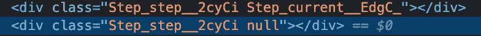
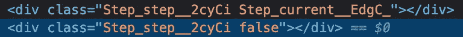

# React 中的条件渲染(jsx)

> 原文：<https://medium.com/nerd-for-tech/conditional-rendering-in-react-jsx-4aadc0f0b63f?source=collection_archive---------4----------------------->

## 我的发现…



处理文件输入

基本上条件必须评估为真或假。这与 js 中条件句的工作方式不同。我的意思是:

```
data.length > 0 && <div />
```

仅当左边的条件评估为真时，才呈现组件。但是从纯 js 来看，`> 0`是多余的，所以我希望下面的代码行可以工作:

```
data.length && <div />
```

结果那行不行，(如预期的)为什么—

在第一种情况下，如果数组的大小为 0，`0 > 0`将计算为`false`，因此`false && [anything really]`计算为 false，因此组件不会被呈现。

然而，在第二种情况下，如果大小为 0，`0 && <div />`的计算结果为`0<div />`。换句话说，0 和元素都将被呈现。从 js 来看，我希望`&&`操作符将左边的 0 强制转换为布尔值(false ),但这并没有发生，所以它们都被渲染了——这就是 jsx 的工作方式？

您可能希望语句`0 && <div />`的计算结果为`false`。实际上，在 jsx 之外就是这种情况。

```
*const* value = data.length ? 1 : 0;
```

如果大小大于 0，上面的语句给`value`赋值 1，否则赋值 0——我发现这比 jsx 更具决定性。我知道强制负值返回 true，但是长度不能是-ve——我可能是错的。

下面的陈述怎么样，你认为结果会是什么？

```
data.length ? <div />: <err />;
```

这就是让人困惑的地方。这往往与我们先前讨论的相矛盾。它实际上像正常 js 那样工作。

所以，我猜这归结为`binary (&&)`和`ternary (? :)`操作符如何处理 jsx 中的条件——一个强制(三进制),另一个不强制(二进制)。

如果我们交换二元运算符的操作数会怎么样

```
<div /> && data.length > 0
```

对于大多数初学者来说，这可能是个陷阱。不管右边的计算结果如何，组件都会被渲染！很奇怪，对吧？

我认识一些人，他们远离 jsx 中的二元操作符，因为它具有不确定性。他们使用三元组，当他们不想为特定的评估渲染任何东西时，提供`null`作为操作数。

我还发现上面的规则同样适用于动态的。

假设您有一个指示流程中当前步骤的组件，并且您想赋予它不同的颜色/行为——扩展所有步骤组件的样式。


我的意思是…

```
<div className={`step ${*current* ? 'current' : ''}`} />
```

当您在 dev tools 中检查组件时，上面的方法在 DOM 中为非当前组件创建了第二个类(作为额外的空间出现)。如果有一个`space`选择器(也许有——我不知道)会导致名称冲突。



使用`null`操作数进行假评估怎么样？

```
<div className={`step ${*current* ? 'current' : null}`} />
```

嗯，你猜对了——这将把`null`添加到其余元素的空格分隔的类名列表中。更加混乱。



去二进制怎么样？嗯，让我想想…

```
<div className={`step ${*current* && 'current'}`} />
```

事实证明，这个看似优雅的解决方案也是可行的，但是问题同上——您将`false`作为非当前项目的类名。



我最喜欢的还是虚评的空弦`''`。让我知道你部署的技术。

如果你设计组件的方式不会继承任何样式，就像我上面做的那样(所有当前和非当前组件都有一个父类`step`)——并且可能愿意复制一些规则(有什么损害)，那么问题会变得容易得多:

```
<div className={*current* ? 'current' : 'not-current'} />
```

因此组件根据它们的状态采用完全不同的类。这可能需要复制几个规则，但它似乎解决了前面的问题。挑战在于保持这两个类的同步！

不过，我最喜欢的还是`''`。