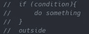
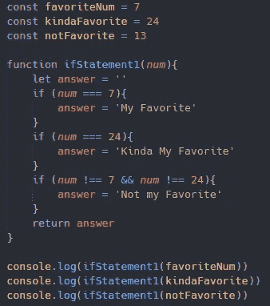
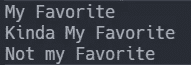
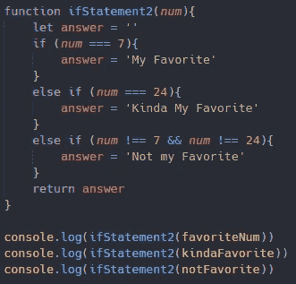
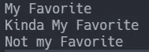
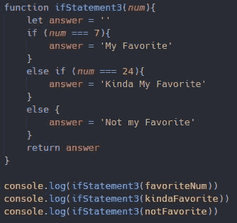
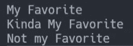
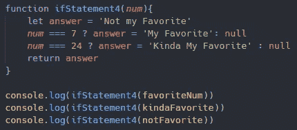

# JavaScript 中的条件语句

> 原文：<https://medium.com/nerd-for-tech/conditional-statements-in-javascript-3d0d1a2025ce?source=collection_archive---------20----------------------->

## 设定你自己的条件

*什么是条件语句？条件语句允许我们创建一个等同于真或假的条件。如果我们的条件被证明是真的，那么我们可以选择对我们的数据做些什么。另一方面，如果我们的条件被证明是假的，它们将被排除在发生的事情之外。但是我不会将它们排除在外，因为我们能够创建多个条件语句来满足我们的函数需求。让我们直接开始吧。*

**If 语句**

作为开发人员，您可能会遇到的最常见的条件语句是 if 语句。if 语句接受我们设定的一个条件，如果这个条件被证明为真，我们就可以做一些事情。让我们看看下面的例子，我们创建一个伪 if 语句来帮助获得格式的可视化表示。

如你所见，我们从一个 if 开始，然后在我们的括号里是我们设置条件的地方。如果条件为真，我们将进入我们的花括号，并可能在到达外面之前做一些事情。如果我们的条件是假的，我们甚至不会进入花括号来开始和结束我们的外部。Outside 在这里表示 if 语句的外部，很可能是函数中的下一行代码。让我们看看下面的示例函数中的 if 语句。

返回

这里我们创建了一个接受数字的函数。如果这个数字等于 7，那么我们的答案将变成我最喜欢的。在我们的第二个 if 语句中，如果这个数字恰好等于 24，那么我们的答案会变成我最喜欢的。但是在我们的第三个 if 语句中，数字不应该等于 7 和/或 24。那我们的答案就会变成不喜欢。这当然将完全取决于提供给它数据。让我们介绍一下 if 的弟弟，这样我们可以更好地学习格式化。

**Else If 语句**

else if 语句看起来与 if 语句相同，但有一点不同。Else 只需要在我们的 if 前面，否则一切看起来和运行起来都一样。唯一不同的是，我们永远不会以 else if 语句开头。我们总是从一个 if 语句开始，然后如果我们需要额外的条件语句，它们总是跟随着 else if，如果我们需要条件。让我们来看一下同一个例子，但是把 else if 放在适当的位置。

返回

正如你所看到的，我们以一个 if 语句开始，正如我之前所说的，但是后面的每个 if 语句都是一个 else if。这确实需要多写 8 个字符的代码，但对于额外的 if 语句来说，这是更正确的格式。如果我告诉你，我们仍然需要引入 if 的妹妹，这将进一步帮助我们格式化这个函数。

**Else 语句**

else 语句的外观和行为与我们之前看到的两个语句稍有不同。else 语句不接受任何条件，因为它的内置条件是在所有其他 if 和/或 else if 语句失败时运行。因此，else 语句总是放在条件语句的最后。把它看作是条件语句行中最后一个运行的条件。让我们看一下我们插入 else 语句的示例。

这也是在函数中格式化条件语句的正确方法。

返回

再一次，你可以看到当我们再次改变我们的条件时，我们得到了相同的结论。主要原因是我们的前两个条件句 if 和 else if 寻找特定的数字。这些是我们真正感兴趣的数字，尤其是当你想到所有可能输入的数字时。else 接受没有通过 if 或 else if 语句条件的所有值。如果数据不满足特定条件，Else 几乎是数据的最后手段。

***:加成:条件三元运算符:加成:***

如果我告诉你，你可以用一种比我之前说的更简洁有效的方式写一个 if 语句。我们仍然需要提供一个条件，如果为真，将运行我们的代码。但是相比较而言，如果我们的条件为假，我们也会做一些事情。让我们看看下面的例子，我们创建一个伪条件三元组来帮助获得格式的可视化表示。

这几乎就像你在问问题，这是真的吗？问号总是标志着我们状况的结束。如果我们的条件为真，接下来会发生什么。冒号表示如果我们的条件为假，将会发生什么。让我们看看下面的示例函数中的条件三元运算符。

返回

很难不注意到我们的代码有多精简，但仍然实现了同样的方法。在这种情况下，我们已经直接设置了我们的答案不是我最喜欢的，因为玩赔率，它不会是我最喜欢的或在更大的事情计划中有点喜欢的。然后我们有两个条件三元组，第一个寻找数字 7，然后将答案设置为 7。如果它是假的，我决定什么也不做。我们的第二个条件三元组做了几乎完全相同的事情，除了数字 24。

我个人更喜欢用这种方式写条件句，因为它简洁明了。更不用说可读性在我看来是极其受欢迎的。但一如既往地各有所好。

我要感谢你的阅读，并希望你学到了新的东西！请关注未来的更多文章！

如果你想查看这些例子的副本，或者只是作为参考，你可以在这里找到 GitHub Repo [的链接。](https://github.com/TheRealKevBot/JSConditionals)