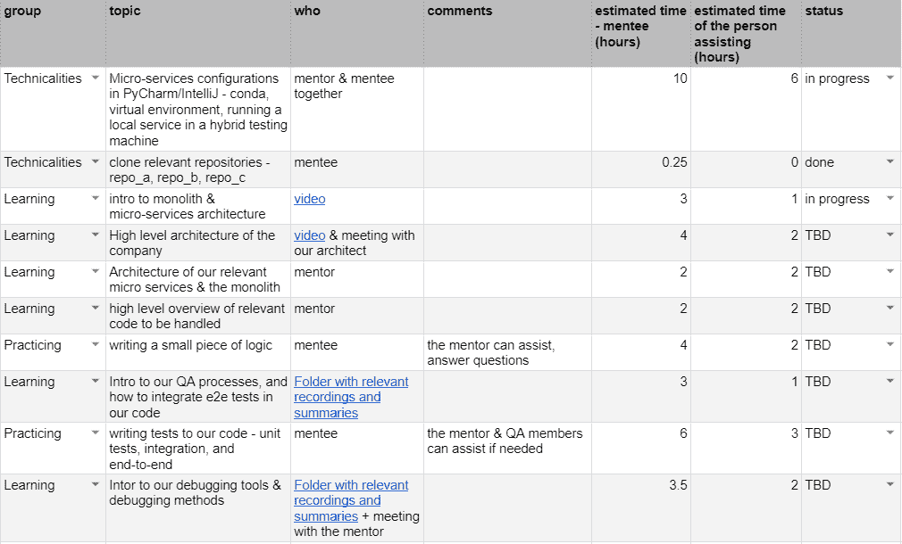

# 实施成功的入职计划和入职流程

> 原文：<https://medium.com/nerd-for-tech/conducting-a-successful-onboarding-plan-and-onboarding-process-6ec1b01ec2ae?source=collection_archive---------4----------------------->

## 计划和执行入职培训，同时牢记您的学员

[Unsplash](http://unsplash.com) 上[绿色变色龙](https://unsplash.com/@craftedbygc)的图片

*几个月前，我被要求负责公司一名新开发人员的入职事宜。
我列出了培训计划中要包含的主题，将它们设置在电子表格中，收集了我开始在这个职位工作以来为团队&公司工作的所有指南和知识分享，并为我的新学员创建了一个 A-Z 培训计划。
现在我可以反思一下这个过程，并说它非常顺利，我想与你分享一些我认为对入职有效的技巧。*

# 1.今天的文档是明天的入职材料—记录培训课程并记录唾手可得的成果

成功的入职在某人加入团队之前很久就开始了。
当我开始从事开发工作时，COVID 刚刚起步，我们都在家工作。在封锁的开始阶段加入并不容易，但看看积极的一面——这一时期是 Zoom 的崛起和辉煌时期，我尽可能多地记录我的培训课程。
此外，我不时会对材料进行总结或指导，以便收集我的想法并与团队分享知识。
当我的学员入职时，材料已经准备就绪，只等使用。

我将指出，并不是所有的事情都需要定期记录。一些技术和工作工具会随着时间的推移而改变，这样的文档会变得无关紧要，并导致团队成员的疲惫。然而，记录培训课程只需要点击“记录”按钮，并且可能与未来 1-2 年相关。此外，创建设计/架构图对于与我们的同事交流非常有用，可以在很长一段时间内保持相关性，并在未来的工作中派上用场。

# 2.设定入职/导师目标

在着手规划入职流程之前，我们应该牢记成功的入职/指导的愿景。
学员的需求是什么？你期望这个过程是什么样的，你如何衡量它的成功？

就我而言，我成为了一位开发人员的导师，这位开发人员的职位与我大约一年前的职位相似，在开始为我的学员工作之前，我首先反思了自己入职过程中的优缺点。

我知道我希望我的学员在入职的不同阶段处理哪些编码任务，他应该熟悉哪些调试工具，他应该与哪些同事合作，以及在着手一些任务之前，学员应该具备哪些相关的技术背景。

我考虑到这是我的学员第一次成为该行业的软件开发人员，因此除了技术问题和“软技能”问题(如处理时间估计)之外，许多事情都是第一次看到，仍然需要获得一个整体的视角。

对我来说，一个成功的入职流程部分是相对独立地处理职位任务以及与团队有效合作的能力，部分是自信地提出问题，在事情不顺利时提出问题，并掌控新的任务和知识领域。

# 3.创建详细且有条理的入职计划

既然我们已经记住了我们的入职目标，那么是时候将它们分成几个部分了。学员应该学习哪些主题？为了获得相关经验，我们希望学员练习什么？让我们确保我们知道我们要去哪里，并且我们写下相关的任务和行动项目。

我想说的是，我是有组织流程的狂热爱好者，我认为清晰详细的入职计划更容易遵循和跟踪，但我也承认，在这个问题上，并不是每个人都像我一样。然而，我听到许多人提到，他们入职过程中最困难的部分是缺乏一个清晰的指南或指导，他们必须自己去理解周围的混乱。

无论如何，开始在新的岗位上工作都是一个充满挑战的过程。即使一切都很顺利——有太多的东西要学，太多的东西要记住和练习。没有明确的指导方针，这个过程会变得更加困难。

因此，让我们来看一个我制作的入职电子表格示例，然后对其进行一点分析。

作者捕获

***在创建这个电子表格时，我记住了哪些相关的经验法则？***

## A.按照讨论的顺序列出主题

虽然有些主题可以并行学习，但其他主题可能存在依赖关系。拥有一份不仅详细而且合理排序的清单，可以让学员在入职过程中更加轻松。

## B.将所有链接集中在一个可访问的位置

我决定在入职电子表格中收集所有记录、文档、图表、在线参考资料等的链接。所以在每一个应该学习或者练习的项目旁边，也有一个预计会用到的链接。

## C.提前获取资料

有时，由于技术困难、负责解释的团队成员或公司员工不在或任何其他原因，特定主题的进展被“卡住”。在这种情况下，提前获得参考资料和材料，将使学员能够同时进入下一个项目，而不是被阻止。

## D.使用高水平的时间估计，并给出缓冲区

每个主题/任务都有时间估计，既适用于学员，也适用于将参与解释/协助该主题的人员。本专栏的目标是 ***而不是*** 对学员的进度进行微观管理，学员肯定不会有这种感觉。
我在本专栏中发现的好处是:

*   让学员大致估计一下这项任务需要多长时间，如果他们发现自己在某件事情上停滞不前，就发出警告。
*   为了让学员知道没问题，任务“需要那么长时间”。从我作为学员和导师的经验来看，我认为有必要知道进步的速度是否足够好，有时会错误地认为速度应该更快，而导师实际上却不这么认为。
*   让团队领导评估将投入到入职培训中的资源——有多少团队成员会因为这种指导而变得不可用？大概持续多长时间？

确保缓冲你的时间估计。学习新东西需要时间——学员可能会有问题问你，搜索新东西，重读材料或再次听讲座，并不时休息一下。因此，在估计预期时间时，要考虑所有这些因素。请记住，让学员知道时间估计并不是截止日期，而是帮助他们知道应该关注什么的一般估计。

## E.使用状态栏

这将使学员、导师和团队领导更容易跟踪整体进度。

## F.将过程分成小块，并提及它们

不仅要考虑某个主题的教学/学习和实践，还要考虑诸如安装、许可等技术问题。能够及时接近他们，从而防止(或减少)学员被可以提前处理的技术问题所阻碍。

此外，列出需要涵盖的主题列表意味着我们知道应该安排哪些会议以及与谁进行。因此，我们可以提前安排相关会议，使入职流程尽可能顺利。
这种方法的另一个优势是，详细的入职计划有助于回顾这一过程，并让学员、导师和团队领导讨论这一过程，以了解未来可以改进的地方。

# 4.给学员犯错和提问的空间

学习的一个重要部分是犯错误，在第一次解释一个话题时，不能理解所有的事情。成长的一个重要部分是足够自信去犯错误，继续前进，或者再试一次。我认为导师的目标之一是让学员有信心做好自己的工作，而不会觉得自己受到了评判或批评。因此，当你的学员做了“错事”或问了一个问题时，即使你已经向他们解释了这个话题，也要确保你的态度是支持和欢迎的。即使这个话题现在对你来说似乎很容易，但当你第一次接触它的时候，你可能也很纠结。如果没有，我肯定你还在为别的事情挣扎。所以，当别人需要你的建议时，保持谦逊。

# 5.变得平易近人，因为你在乎

每个人都需要一个伙伴，尤其是对新员工，更不用说对初级员工了。确保你的学员知道你在那里是为了他们，你在那里不是因为这是你的“任务”，而是因为你真的关心他们。
付出额外的努力去帮助、建议、倾听、微笑，并真正在他们身边。
当他们做得好的时候，记得为他们的进步鼓掌。
你的学员会因此而感激和感谢你。
我非常感激和感谢我的家人🙂

[像素](http://pexels.com)上[像素](https://www.pexels.com/@fauxels)的图片