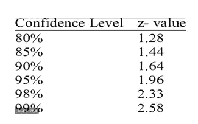
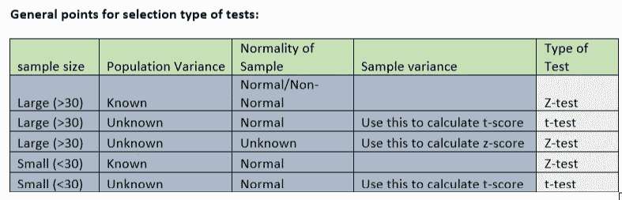
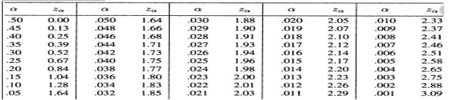
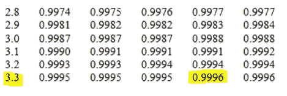

# 置信区间面试问题

> 原文：<https://medium.com/nerd-for-tech/confidence-intervals-interview-questions-3e251cd09a33?source=collection_archive---------2----------------------->

**置信区间:**置信区间，统计学上指的是一个总体参数落在两个设定值之间的概率。置信区间衡量抽样方法中不确定性或确定性的程度。置信区间可以采用任意数量的概率，最常见的是 95%或 99%的置信水平。

**计算置信区间(理论)**

假设一组研究人员正在研究高中篮球运动员的身高。研究人员从人群中随机抽取样本，确定平均身高为 74 英寸。74 英寸的平均值是人口平均值的点估计。点估计本身的用处有限，因为它不能揭示与估计相关的不确定性；你不知道这个 74 英寸的样本平均值与总体平均值有多远。缺少的是这个单一样本的不确定性程度。

置信区间提供了比点估计更多的信息。通过使用样本的均值和标准差建立 95%的置信区间，并假设正态分布由钟形曲线表示，研究人员得出了包含 95%时间真实均值的上下界。假设间隔在 72 英寸和 76 英寸之间。如果研究人员从高中篮球运动员群体中随机抽取 100 个样本，其中 95 个样本的平均值应该在 72 到 76 英寸之间。

如果研究人员想要更大的信心，他们可以将区间扩大到 99%的信心。这样做总是会产生一个更大的范围，因为它为更多数量的样本均值留出了空间。如果他们确定 99%的置信区间在 70 英寸和 78 英寸之间，他们可以预计 100 个样本中有 99 个包含这些数字之间的平均值。90%的置信水平意味着我们期望 90%的区间估计包含总体参数。同样，99%的置信水平意味着 95%的区间将包括该参数。

置信区间基于平均值和标准偏差，给出如下:

**为 n > 30**

置信区间= X (z * s/√n)

其中，z 临界值是根据置信度从 z 得分表中得出的。

x 是样本平均值。

s 是样本标准偏差。

n 是样本量

我们仅从 z-score 表中获得这些值，但由于置信水平在大多数情况下固定为上述值，因此我们可以使用该表。

**为 n < 30**

**置信区间= X (t * s/√n)**

其中 t 临界值是根据置信度从 t 得分表中得出的。

x 是样本平均值。

s 是样本标准偏差。

n 是样本量。

我们将在下面的例子中看到如何创建置信区间。

现在我们已经了解了假设检验背后的所有理论，让我们来看看用于检验的不同类型的检验。我们已经看到了寻找 z-score 和 t-score 的例子，我们将看到它们如何在测试场景中使用。

# 大样本假设检验

经验法则:大于 30 的样本被认为是大样本，根据中心极限定理，我们将假设所有的抽样分布都遵循正态分布。

我们熟悉前面展示的假设检验的步骤。从上表中，我们还知道何时使用哪种类型的测试。

让我们从几个实际例子开始，以帮助我们的理解更多。我们将使用以下标准化临界值表进行计算。

**问:一家打印机墨盒制造商声称其生产的某种墨盒的平均打印容量至少为 500 页。一名批发采购商选择了 100 台打印机进行测试。样本的平均打印容量为 490 页，标准偏差为 30 页。**

**买方是否应该在 5%的显著性水平上拒绝制造商的索赔？**

**Ans** 。人口平均数= 500

样本均值= 490

样本标准偏差= 30

显著性水平(α)= 5% = 0.05

样本量= 100

H0:平均印刷能力> =500

H1:平均印刷能力< 500

We can clearly see it is a one-tailed test (left tail).

Here, the sample is large with an unknown population variance. Since we don’t know about the normality of the data, we will use the Z-test (from the table above).

We will use the sample variance to calculate the critical value.

Standard error (SE) = Sample standard deviation/ (sample size) * 0.5

= 30 / (100) *0.5 = 3

Z(test) = (Sample mean — population mean)/ (SE)

= (490–500)/3 = -3.33

Let’s find out the critical value at the 5% significance level using the above Critical value table.

Z (0.05%) = — 1.645 (since it is left tailed test).

We can clearly see that Z(test) < Z (0.05%), which means our test value lies in the rejection region.

Thus, we can reject the null hypothesis i.e. the manufacturer’s claim at a 5% significance level.

**使用 p 值测试上述假设:**

p-value = P[T <=-3.33] (we know p(-x) = 1 -p(x) also, remember that the p(x) represents the

cumulative probability from 0 to x)

let’s use z-table to find the p-value:

p-value = 1–0.9996 = 0.0004

Here, the p-value is less than the significance level of 5%. So, we are right to **拒绝零假设。**