# AWS CLI 中的配置和凭据文件设置

> 原文：<https://medium.com/nerd-for-tech/configuration-and-credential-file-settings-in-aws-cli-61c7ff0a1cd6?source=collection_archive---------0----------------------->

第 3 部分-了解基本和重要的命令。


[Pic 的功劳](https://www.google.com/url?sa=i&url=https%3A%2F%2Ffoxutech.com%2Fhow-to-install-and-configure-aws-cli-on-linux%2F&psig=AOvVaw3pRh1lElKDVcrViOLVimCB&ust=1635419464161000&source=images&cd=vfe&ved=0CAsQjRxqFwoTCMif57yp6vMCFQAAAAAdAAAAABAJ)

这个博客是第三部分，它非常有趣，因为这个博客包含更少的理论和更多的实践知识。我试图解释 AWS CLI 中使用的最基本的命令。在示例中，我使用了命令提示符，但 AWS 命令在任何类型的 CLI 中都几乎相同。在这篇博客之前我推荐阅读这些博客 [**第一部分**](https://aws.plainenglish.io/how-to-install-aws-cli-aws-command-line-interface-a19c4b91571e) 和[**第二部分**](https://aws.plainenglish.io/how-to-configure-aws-cli-aws-command-line-interface-77d321a9ba4b) **。**

本博客主要关注以下突出主题:

**1。配置设置存储在哪里？**

**2。设置和查看配置设置。**

您可以将常用的配置设置和凭据保存在由 AWS CLI 维护的文件中。

文件分为`profiles`。默认情况下，AWS CLI 使用名为`default`的配置文件中的设置。

一个名为*的概要文件*是一个设置和凭证的集合，您可以将它应用于 AWS CLI 命令。

**—————**

让通过图像了解它是什么剖面:

*   显示或查找**所有配置文件列表**:

```
**$ aws configure list-profiles**
```


图片来源:[安基特·古普塔](/@ankitgupta_974)

*   如果我们必须查看**默认配置文件**:

```
**$ aws configure list**
```

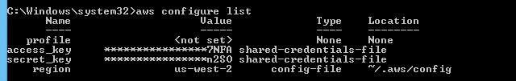

图片来源:[安基特·古普塔](/@ankitgupta_974)

*   如果我们必须**创建默认配置文件**:

```
 **$ aws configure**
```

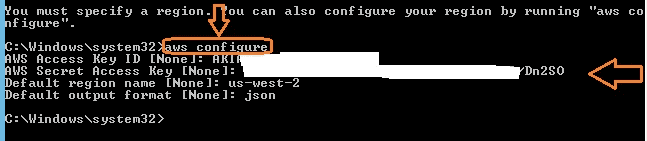

图片来源:[安基特·古普塔](/@ankitgupta_974)

*   如果我们必须**创建**而不是默认轮廓或**特定轮廓**，

例如:配置文件命名为**‘inter’**，然后填充您的访问密钥 ID、秘密访问密钥、区域名称、输出格式。

```
**$ aws configure --profile inter**
```


图片来源:[安基特·古普塔](/@ankitgupta_974)

*   如果您想要查看或显示特定概要文件的**配置值，您可以运行**

```
**$ aws configure list --profile inter**
```

例如:配置文件名为:**‘inter’**

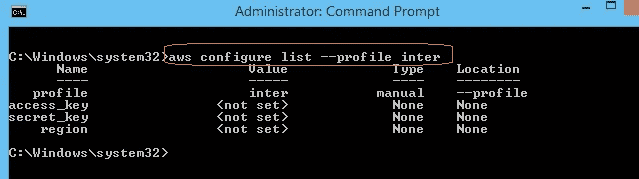

图片来源:[安基特·古普塔](/@ankitgupta_974)

**—————**

## 1.配置设置存储在哪里？

AWS CLI 将您使用`aws configure`指定的敏感凭证信息存储在本地文件`credentials`中，该文件位于您主目录中的文件夹`.aws`中。您用`aws configure`指定的不太敏感的配置选项存储在名为`config`的本地文件中，也存储在您主目录的`.aws`文件夹中。

*   Linux 中的主目录位置:`$HOME`或`~`(波浪号)
*   Windows 中的主目录位置:`%UserProfile%`

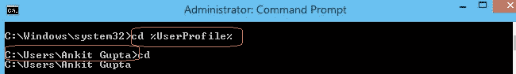

图片来源:[安基特·古普塔](/@ankitgupta_974)

*   您的个人目录中名为`.aws`的文件夹

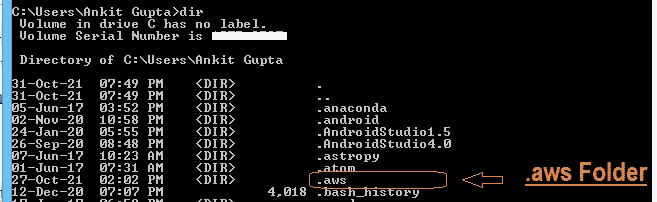

图片来源:[安基特·古普塔](/@ankitgupta_974)

*   一个名为`config`、`credentials` 的本地文件，存储在您主目录的`.aws`文件夹中。

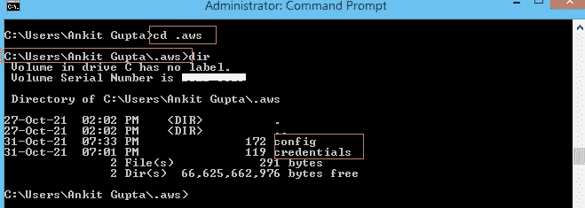

图片来源:[安基特·古普塔](/@ankitgupta_974)

*   如果你必须检查配置文件(区域和输出)的**内容，那么在 CMD 中写下下面的命令，如果有扩展名的话。**

```
**type config        #cmd
cat config         #bash** 
```

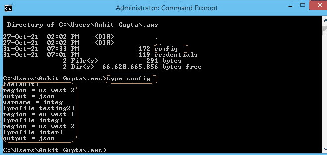

图片来源:[安基特·古普塔](/@ankitgupta_974)

*   如果您必须检查凭证文件的**内容(aws_access key id，aws_secret access key)** ，则在 CMD 中写入以下命令，如果有扩展名。

```
**type credentials       #for cmd
cat credentials        #for bash**
```

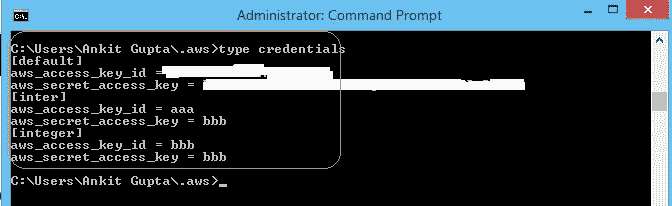

图片来源:[安基特·古普塔](/@ankitgupta_974)

## 注***

**在配置文件中存储凭证**

您可以将所有配置文件设置保存在一个文件中，因为 AWS CLI 可以从`config`文件中读取凭证。如果两个文件中有相同名称的概要文件的凭证，则凭证文件中的键优先。

**—————**

## 2.设置和查看配置设置。

# 设置:

**剧情简介-**

```
aws configure set varname value [--profile profile-name]
```

示例:

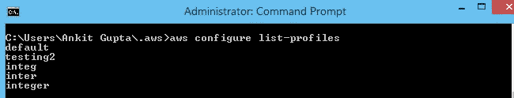

图片来源:[安基特·古普塔](/@ankitgupta_974)

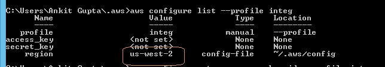

图片来源:[安基特·古普塔](/@ankitgupta_974)

```
**1\. aws configure set region us-west-1 --profile integ**
```

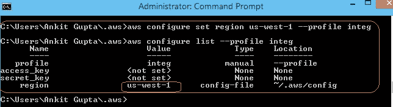

图片来源:[安基特·古普塔](/@ankitgupta_974)

```
2\. **aws configure set profile.integ.region eu-west-1**
```

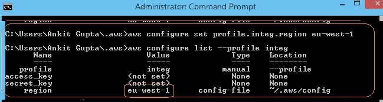

图片来源:[安基特·古普塔](/@ankitgupta_974)

```
**3.** **aws configure set aws_access_key_id aaaa --profile integ
4\. aws configure set aws_secret_access_key aaaa --profile integ**
```

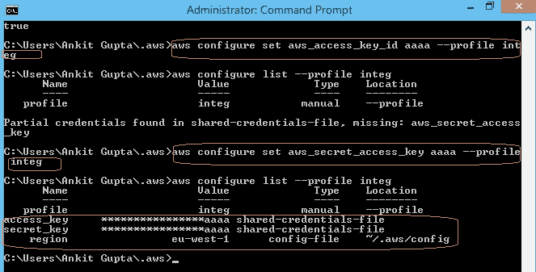

图片来源:[安基特·古普塔](/@ankitgupta_974)

**——————**

# 获取:

**剧情简介—**

```
**aws configure get varname [--profile profile-name]**
```

示例:

```
1\. **aws configure get aws_access_key_id --profile integ**
```

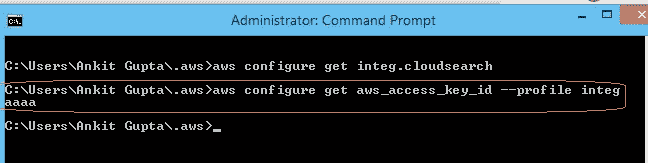

图片来源:[安基特·古普塔](/@ankitgupta_974)

```
2\. **aws configure get aws_secret_access_key --profile integ**
```

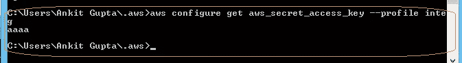

图片来源:[安基特·古普塔](/@ankitgupta_974)

```
**3\. aws configure get profile.integ.aws_access_key_id**
```

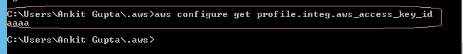

图片来源:[安基特·古普塔](/@ankitgupta_974)

```
**4\. aws configure get aws_access_key_id**
```

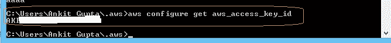

图片来源:[安基特·古普塔](/@ankitgupta_974)

**—————**

## 结论:

我希望这个博客能帮你节省时间和金钱，这样你就可以和你爱的人一起度过了。保持微笑，展现爱心！

**—————**

## 给我买杯咖啡:

[](https://www.buymeacoffee.com/AnkitGupta1) [## Ankit Gupta 是一名技术作家，他喜欢写关于 Python、ML 和云计算的文章..

### 嘿👋我刚刚在这里创建了一个页面。你现在可以给我买杯咖啡了！给我买一杯咖啡，给我发一个你会…

www.buymeacoffee.com](https://www.buymeacoffee.com/AnkitGupta1) 

## 在 Linkedin 上联系我:

[](https://www.linkedin.com/in/ankit-gupta2/) [## 印度马哈拉施特拉邦 ankit Gupta-Pune |职业简介| LinkedIn

### 我是深度学习爱好者/学习者，正在寻找一个可以贡献和提高技能的机会…

www.linkedin.com](https://www.linkedin.com/in/ankit-gupta2/) 

## 参考资料:

[http://D1 . AWS static . com/whites/AWS _ pricing _ overview . pdf](http://d1.awsstatic.com/whitepapers/aws_pricing_overview.pdf)

**—————**

## 其他博客:

[](https://aws.plainenglish.io/how-to-configure-aws-cli-aws-command-line-interface-77d321a9ba4b) [## 如何配置 AWS CLI (AWS 命令行界面)

### 第 2 部分:AWS CLI 配置指南。

aws .平原英语. io](https://aws.plainenglish.io/how-to-configure-aws-cli-aws-command-line-interface-77d321a9ba4b) [](https://aws.plainenglish.io/how-to-install-aws-cli-aws-command-line-interface-a19c4b91571e) [## 如何安装 AWS CLI (AWS 命令行界面)

### 安装 AWS CLI 的分步指南，包括错误处理和详细说明。

aws .平原英语. io](https://aws.plainenglish.io/how-to-install-aws-cli-aws-command-line-interface-a19c4b91571e) [](https://aws.plainenglish.io/how-to-configure-aws-account-and-set-up-billing-alarm-8b8c34929395) [## 如何配置 AWS 帐户和设置计费警报

### 配置 AWS 帐户和设置账单报警以管理账单的教程。

aws .平原英语. io](https://aws.plainenglish.io/how-to-configure-aws-account-and-set-up-billing-alarm-8b8c34929395) [](/nerd-for-tech/amazon-launched-re-skill-program-2021-free-amazon-t-shirts-free-amazon-courses-88c4b95c9752) [## 亚马逊推出 Re:Skill Program 2021 |免费亚马逊 t 恤|免费亚马逊课程

### AWS re:技能——赚取奖励。

medium.com](/nerd-for-tech/amazon-launched-re-skill-program-2021-free-amazon-t-shirts-free-amazon-courses-88c4b95c9752) 

**—————**

感谢您的阅读，如果您喜欢，请点击“鼓掌”按钮。

关注我们了解更多内容。

**查看更多与 AWS 相关的内容。**

***更多内容看*** [书呆子看理工](https://medium.com/nerd-for-tech) ***。***