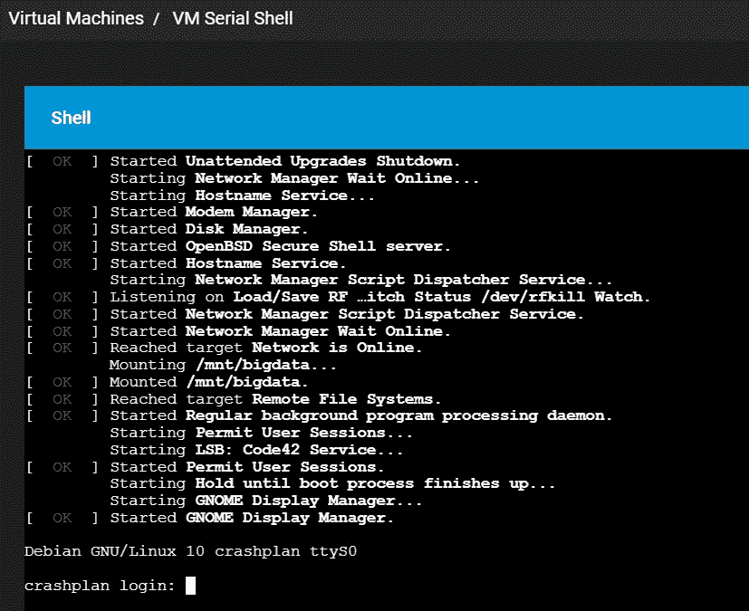

# 在 TrueNAS 上配置对 CrashPlan 虚拟机的串行访问

> 原文：<https://medium.com/nerd-for-tech/configure-serial-access-to-crashplan-vm-on-truenas-e03d4a01e0c7?source=collection_archive---------10----------------------->



串行控制台访问

继续我以前关于 TrueNAS 的教程。在本文中，我将快速解释如何设置串行控制台以提供命令行访问。

我之前介绍了如何配置 CrashPlan 以在 TrueNAS 上的虚拟机中工作，这里:[https://medium . com/nerd-for-tech/setting-up-TrueNAS-with-crash plan-pro-backup-8707 CB 1 f 6 E8 b](/nerd-for-tech/setting-up-truenas-with-crashplan-pro-backup-8707cb1f6e8b)

在这里，我说一下在 TrueNAS 中启用预约提醒:[https://medium . com/nerd-for-tech/TrueNAS-bespoke-alerts-e 8 f 91 e 3 de 5c 1](/nerd-for-tech/truenas-bespoke-alerts-e8f91e3de5c1)

要开始本教程，请确保在 CrashPlan VM 中的根 shell 处进行设置，然后运行以下命令:

```
# export PATH=$PATH:/sbin:/usr/sbin
# vim /etc/default/grub
```

现在编辑或插入以下行:

```
GRUB_CMDLINE_LINUX="console=tty0 console=ttyS0,19200n8"
GRUB_TERMINAL=serial
GRUB_SERIAL_COMMAND="serial --speed=19200 --unit=0 --word=8 --parity=no --stop=1"
```

现在保存文件，然后运行:

```
# update-grub
```

完成上述步骤并重新启动后，您应该会发现串行控制台访问现在可以工作了。