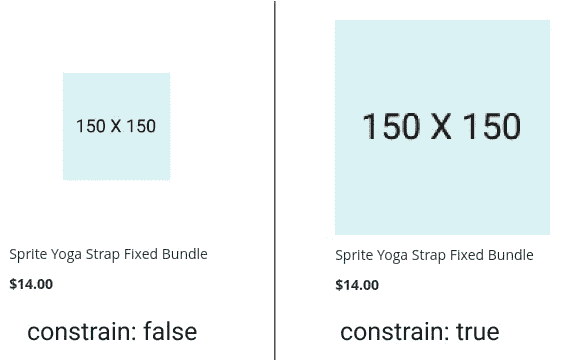
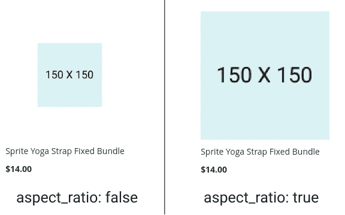
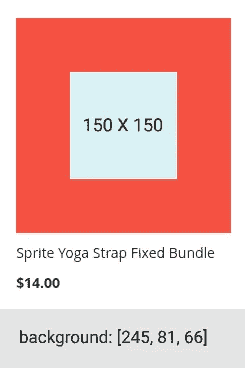

# 在 Magento 2 中配置主题属性

> 原文：<https://medium.com/nerd-for-tech/configure-theme-properties-in-magento-2-cf668d762654?source=collection_archive---------12----------------------->


在 Magento 2 中配置主题属性

现在，图片在影响在线顾客和鼓励他们购买产品方面发挥着非常重要的作用。对于一个电子商务商店的参与，图像是基本因素。在 Magento 2 中，我们可以通过 view.xml 文件配置店面图像。

如果你不知道主题概念和布局概述，我建议你访问我以前的文章:

[Magento 2 中的主题概念](/nerd-for-tech/theme-concept-magento-2-b9a1fafc3590)

[Magento 2 中的布局概述](https://aryansrivastavadesssigner.medium.com/layout-overview-in-magento-2-9d4739ee4254)

在今天的文章中，我将解释 view.xml 文件。

# 什么是 view.xml 文件？

图像是在 storefront 的 view.xml 文件中配置的，可以根据我们的要求在我们的主题中进行更改。

主题文件夹中的位置:

```
app/design/frontend/<vendor_name>/
├── <theme_name>/
│ ├── etc/
│ │ ├── view.xml
```

默认情况下，Luma 的 view.xml 属于 vendor/magento/theme-frontend-Luma/etc/view . XML。

## 在 view.xml 中配置图像属性

```
<media>
    <images module="Magento_Catalog">
    ...
    </images>
</media>
```

**使用的属性:**

1.  **id**:id 是任何主题范围内唯一的图像标识符。id 用于。phtml 模板，用于定义在特定页面的每个特定位置显示的图像的类型和属性
2.  **类型**:在此定义图像的类型。它可以是，

`image` -对应基本图像角色。

`small_image` -对应小形象角色。

`swatch_image` -对应于样本图像角色。

`swatch_thumb` -对应样本图像角色。

`thumbnail` -对应于缩略图角色。

让我们举一个例子来改变产品详情页面的主图像尺寸:

```
<media>
    <images module="Magento_Catalog">
        <image id="product_page_image_medium" type="image_type">
             <width>650</width> <!-- Image width in px -->
             <height>650</height> <!-- Image height in px -->
         </image>
     </images>
</media>
```

图像使用的参数很少:

1.  **height** :指定图像的像素高度，用于调整图像的大小。
2.  **宽度**:指定图像的像素宽度，用于调整图像的大小
3.  **约束**:如果设置为真，小于配置要求的图像不会被放大。*默认值:真，类型:布尔*
4.  **aspect_ratio** :如果设置为 true，在没有图像碎片的情况下，图像的宽高比不变。*默认值:真，类型:布尔*
5.  **帧**:如果设置为 true，图像不会被裁剪。该属性仅在 aspect_ratio 设置为 true 时应用。*默认值:真，类型:布尔*
6.  **透明**:如果设置为 true，则保存图像的透明背景。如果设置为 false，则图像具有白色背景(默认情况下)。您可以使用 background 参数设定背景的颜色。默认值:true。*默认值:真，类型:布尔*
7.  **背景**:图像背景的颜色。如果“透明度”设定为 true，则不适用于具有透明度的图像。格式:“[，，]”，如:“[255，255，255]”。*默认值:[255，255，255]，类型:字符串*



强迫



纵横比



背景

> **注意**:在应用背景色之前，需要将透明值改为 false。

举个例子，

```
<image id="category_page_grid" type="small_image">
   <width>300</width>
   <height>300</height>
   <transparency>false</transparency>
   <background>[245, 81, 66]</background>
</image>
```

配置后，我们需要调整图像的大小:

```
$ php bin/magento catalog:images:resize$ php bin/magento cache:flush
```

## 以下是预定义的变量:

```
<vars module="Magento_Catalog">
    <!-- Gallery and magnifier theme settings. Start -->
    <var name="gallery">
        <var name="nav">thumbs</var> <!-- Gallery navigation style (false/thumbs/dots) -->
        <var name="loop">true</var> <!-- Gallery navigation loop (true/false) -->
        <var name="keyboard">true</var> <!-- Turn on/off keyboard arrows navigation (true/false) -->
        <var name="arrows">true</var> <!-- Turn on/off arrows on the sides preview (true/false) -->
        <var name="caption">false</var> <!-- Display alt text as image title (true/false) -->
        <var name="allowfullscreen">true</var> <!-- Turn on/off fullscreen (true/false) -->
        <var name="navdir">horizontal</var> <!-- Sliding direction of thumbnails (horizontal/vertical) -->
        <var name="navarrows">true</var> <!-- Turn on/off on the thumbs navigation sides arrows(true/false) -->
        <var name="navtype">slides</var> <!-- Sliding type of thumbnails (slides/thumbs) -->
        <var name="transition">
            <var name="effect">slide</var> <!-- Sets transition effect for slides changing (slide/crossfade/dissolve) -->
            <var name="duration">500</var> <!-- Sets transition duration in ms -->
        </var>
        <var name="fullscreen">
            <var name="nav">thumbs</var> <!-- Fullscreen navigation style (false/thumbs/dots) -->
            <var name="loop">true</var> <!-- Fullscreen navigation loop (true/false/null) -->
            <var name="arrows">true</var> <!-- Turn on/off arrows on the sides preview in fullscreen (true/false/null) -->
            <var name="caption">false</var> <!-- Display alt text as image title in fullscreen(true/false) -->
            <var name="navdir">horizontal</var> <!--Sliding direction of thumbnails in fullscreen(horizontal/vertical)  -->
            <var name="navarrows">false</var> <!-- Turn on/off on the thumbs navigation sides arrows(true/false) -->
            <var name="navtype">slides</var> <!-- Sliding type of thumbnails (slides/thumbs) -->
            <var name="transition">
                <var name="effect">slide</var> <!-- Sets transition effect for slides changing (slide/crossfade/dissolve) -->
                <var name="duration">500</var> <!-- Sets transition duration in ms -->
            </var>
        </var>
    </var>
    <var name="magnifier">
        <var name="fullscreenzoom">20</var>  <!-- Zoom for fullscreen (integer)-->
        <var name="top"></var> <!-- Top position of magnifier -->
        <var name="left"></var> <!-- Left position of magnifier -->
        <var name="width"></var> <!-- Width of magnifier block -->
        <var name="height"></var> <!-- Height of magnifier block -->
        <var name="eventType">hover</var> <!-- Action that atcivates zoom (hover/click) -->
        <var name="enabled">false</var> <!-- Turn on/off magnifier (true/false) -->
        <var name="mode">outside</var> <!-- Zoom type (outside/inside) -->
    </var>
    <var name="breakpoints">
        <var name="mobile">
            <var name="conditions">
                <var name="max-width">767px</var>
            </var>
            <var name="options">
                <var name="options">
                    <var name="nav">dots</var>
                </var>
            </var>
        </var>
    </var>
    <!-- end. Gallery and magnifier theme settings -->
    <var name="product_small_image_sidebar_size">100</var>  <!-- Override for small product image -->
    <var name="product_base_image_size">275</var>           <!-- Override for base product image -->
    <var name="product_base_image_icon_size">48</var>       <!-- Base product image icon size -->
    <var name="product_list_image_size">166</var>           <!-- New Product image size used in product list -->
    <var name="product_zoom_image_size">370</var>           <!-- New Product image size used for zooming -->
    <var name="product_image_white_borders">1</var>
</vars>
```

## <exclude>:</exclude>

exclude 标记用于列出需要从应用的 HTML 页面中排除的浏览器资源。

它通常用于从 JavaScript 绑定过程中删除文件。

```
<exclude>
    <item type="file">Lib::jquery/jquery.min.js</item>
    <item type="file">Lib::jquery/jquery-ui-1.9.2.js</item>
    <item type="file">Lib::jquery/jquery.details.js</item>
    <item type="file">Lib::jquery/jquery.hoverIntent.js</item>
    <item type="file">Lib::jquery/colorpicker/js/colorpicker.js</item>
    <item type="file">Lib::requirejs/require.js</item>
    <item type="file">Lib::requirejs/text.js</item>
    <item type="file">Lib::legacy-build.min.js</item>
    <item type="file">Lib::mage/captcha.js</item>
    <item type="file">Lib::mage/dropdown_old.js</item>
    <item type="file">Lib::mage/list.js</item>
    <item type="file">Lib::mage/loader_old.js</item>
    <item type="file">Lib::mage/webapi.js</item>
    <item type="file">Lib::mage/zoom.js</item>
    <item type="file">Lib::mage/translate-inline-vde.js</item>
    <item type="file">Lib::mage/requirejs/mixins.js</item>
    <item type="file">Lib::mage/requirejs/static.js</item>
    <item type="file">Magento_Customer::js/zxcvbn.js</item>
    <item type="file">Magento_Catalog::js/zoom.js</item>
    <item type="file">Magento_Ui::js/lib/step-wizard.js</item>
    <item type="file">Magento_Ui::js/form/element/ui-select.js</item>
    <item type="file">Magento_Ui::js/form/element/file-uploader.js</item>
    <item type="file">Magento_Ui::js/form/components/insert.js</item>
    <item type="file">Magento_Ui::js/form/components/insert-listing.js</item>
    <item type="directory">Magento_Ui::js/timeline</item>
    <item type="directory">Magento_Ui::js/grid</item>
    <item type="directory">Magento_Ui::js/dynamic-rows</item>
    <item type="directory">Magento_Ui::templates/timeline</item>
    <item type="directory">Magento_Ui::templates/grid</item>
    <item type="directory">Magento_Ui::templates/dynamic-rows</item>
    <item type="directory">Magento_Swagger::swagger-ui</item>
    <item type="directory">Magento_Tinymce3::tiny_mce</item>
    <item type="directory">Lib::modernizr</item>
    <item type="directory">Lib::tiny_mce</item>
    <item type="directory">Lib::varien</item>
    <item type="directory">Lib::jquery/editableMultiselect</item>
    <item type="directory">Lib::jquery/jstree</item>
    <item type="directory">Lib::jquery/fileUploader</item>
    <item type="directory">Lib::css</item>
    <item type="directory">Lib::lib</item>
    <item type="directory">Lib::extjs</item>
    <item type="directory">Lib::prototype</item>
    <item type="directory">Lib::scriptaculous</item>
    <item type="directory">Lib::less</item>
    <item type="directory">Lib::mage/adminhtml</item>
    <item type="directory">Lib::mage/backend</item>
</exclude>
```

在另一篇文章中，我将解释如何创建自定义 id 并在自定义模块中使用。

希望这篇文章能帮助你理解 view.xml 的概念。如果你有任何疑问，请在[**aryansrivastavadesssigner@gmail.com**](mailto:aryansrivastavadesssigner@gmail.com)问我。

如果您想要现场会议，请通过上述电子邮件地址发送邮件。

如果你喜欢这篇文章，你可以给我买杯咖啡 [**给我买杯咖啡**](https://www.buymeacoffee.com/aryansrivastava) **。**

## 跟我来:

[领英](https://www.linkedin.com/in/er-aryan-srivastava-0b9576170/) [推特](https://twitter.com/AryanSr11861551)

**参考链接:**

1.  [https://devdocs.magento.com](https://devdocs.magento.com/)