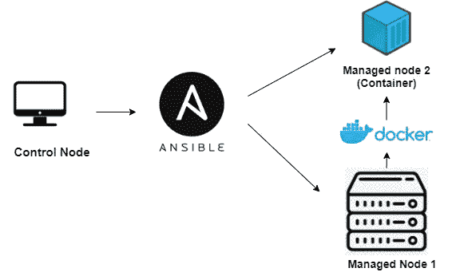
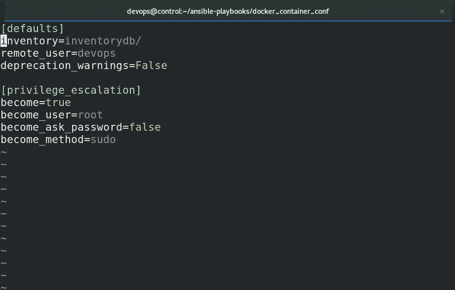
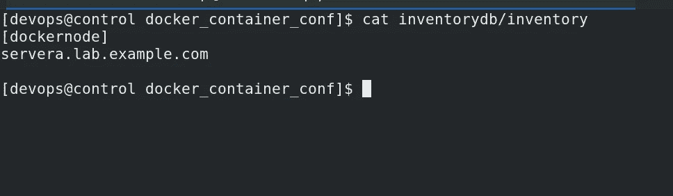
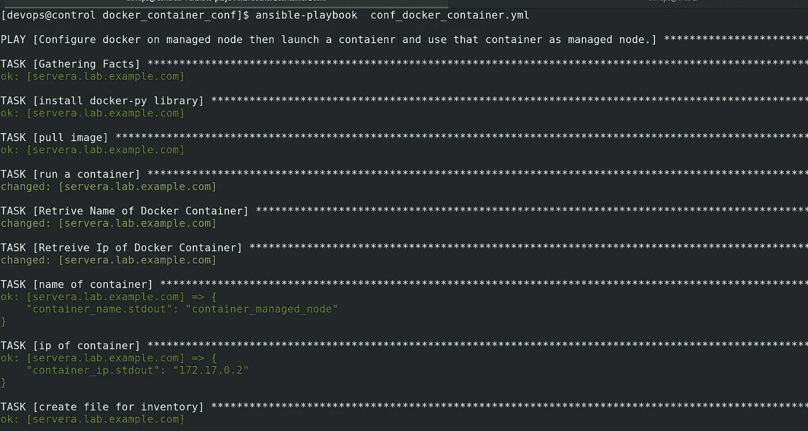
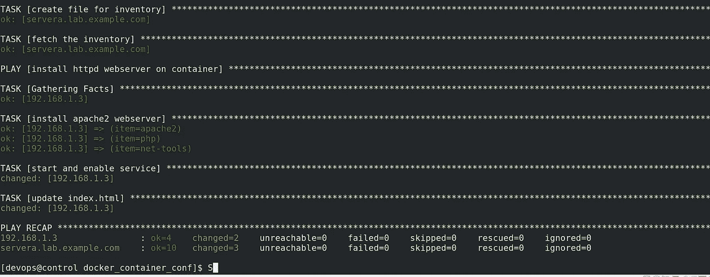
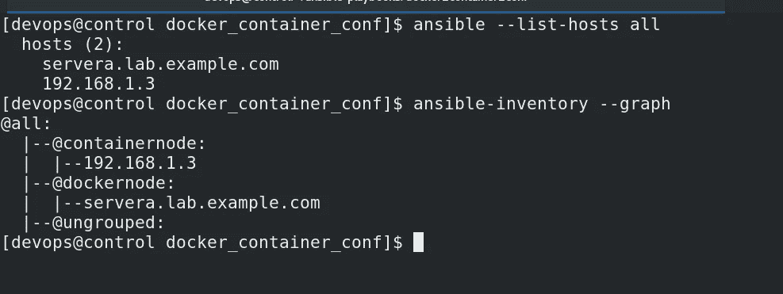
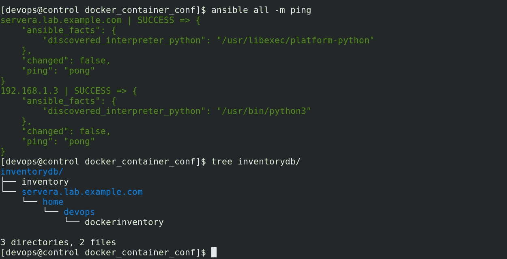
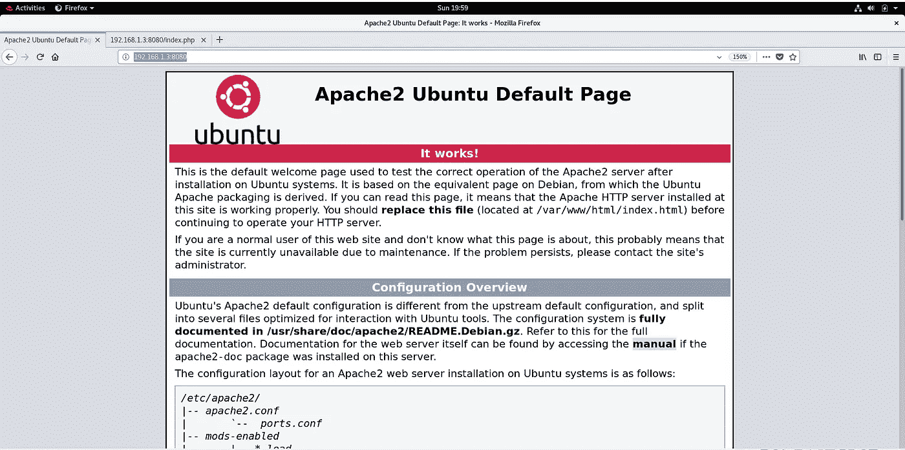
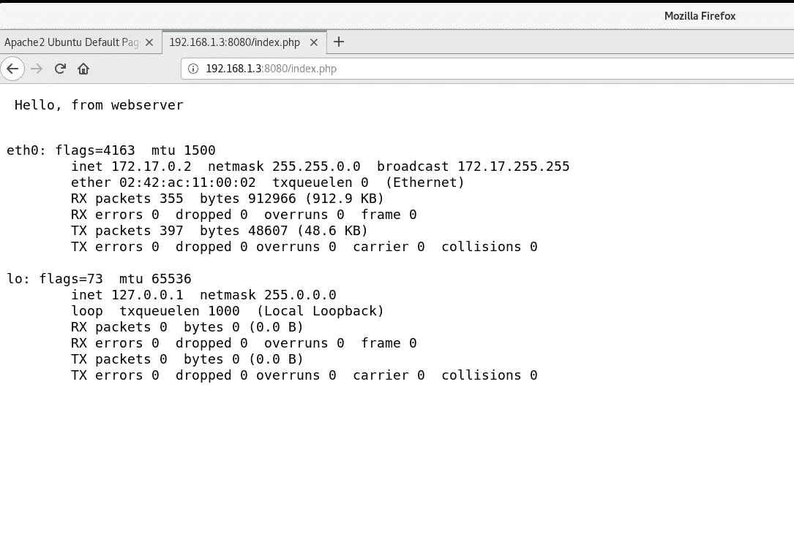

# 使用 Ansible 配置 Docker 容器

> 原文：<https://medium.com/nerd-for-tech/configuring-docker-containers-using-ansible-a2073ab8e2de?source=collection_archive---------0----------------------->

在这篇博客中，我将演示如何使用 Ansible 执行以下操作:

1.  在 Centos 8 或 RedHat 8 上配置 Docker
2.  启动并启用 Docker 服务
3.  从 GitHub 中提取 Docker 图像
4.  运行 Docker 容器
5.  将此新容器用作受管主机。
6.  在容器管理的主机中配置 apache2 web 服务器，并将其公开。

# 步骤 1:为 ansible 控件节点创建工作区

**$ mkdir ansible-ws**

**$ cd ansible-ws**

**$ mkdir inventorydb/**

创建 ansible.cfg 文件并将这些值添加到其中

**$ vim ansible.cfg**

现在，为我们的托管节点创建一个静态清单文件

**$ vim 库存数据库/库存**

# 步骤 2:创建一个可行的剧本，用于在受管节点上配置 Docker。

**$ vim docker _ configure . yml**

运行本行动手册:

**$ ansi ble-playbook docker _ configure . yml**

# 步骤 2:创建一个运行一个容器的 Ansible 剧本，然后用该容器动态更新库存，然后用 Apache2 webserver 配置该容器

**$ vim container _ configure . yml**

运行本行动手册:

**$ ansi ble-playbook container _ configure . yml**

让我们检查托管主机和我们的清单:

您可以清楚地看到，一个新的受管节点被添加到清单中。这是我们在本行动手册中配置的 Docker 容器。

现在，让我们检查 Docker 容器中运行的 web 服务器是否正在运行:

它工作得非常好…

**GitHub:**[https://GitHub . com/mtabishk/ansi ble-playbooks/tree/main/docker _ container _ conf](https://github.com/mtabishk/ansible-playbooks/tree/main/docker_container_conf)

今天就到这里吧！我很快会带一些新文章回来，谢谢！🤗

穆罕默德·塔比什·坎戴

领英:[https://www.linkedin.com/in/mtabishk/](https://www.linkedin.com/in/mtabishk/)