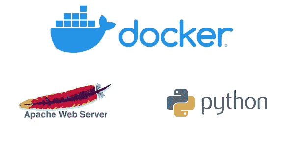
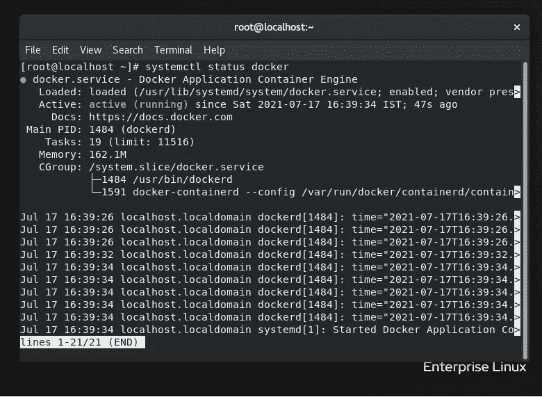
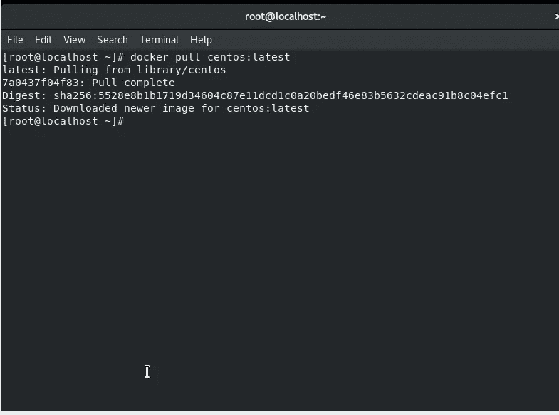
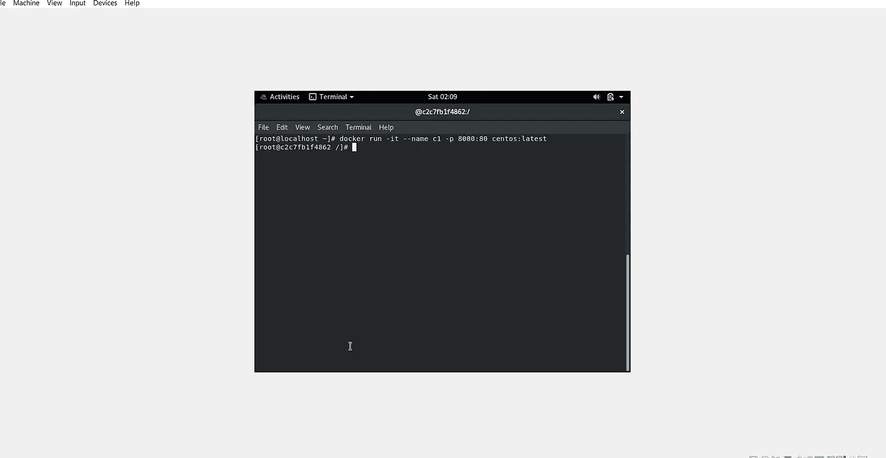
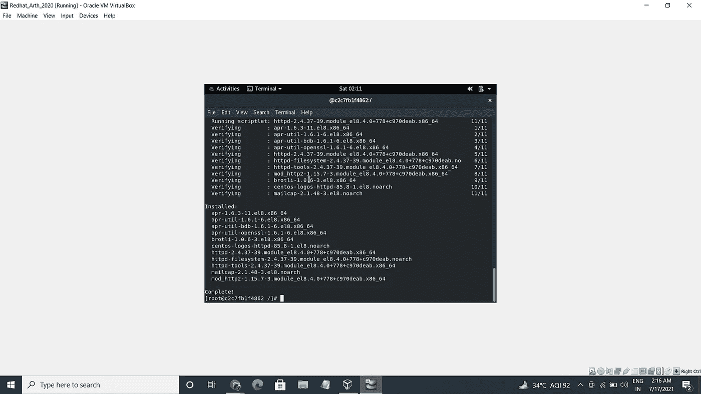
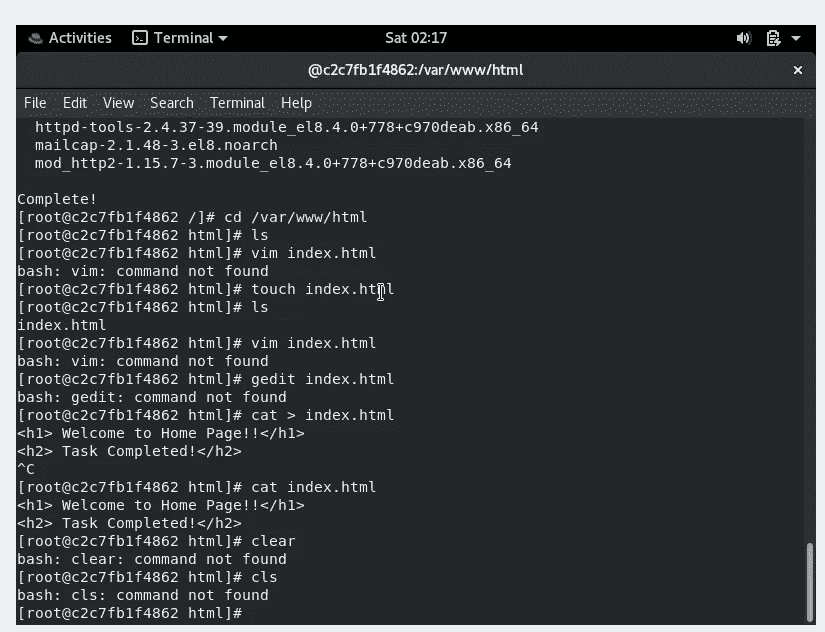
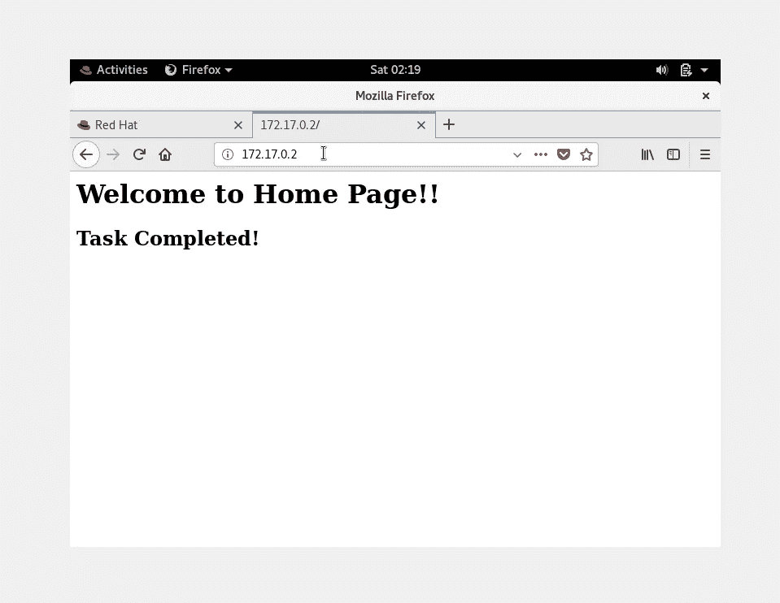
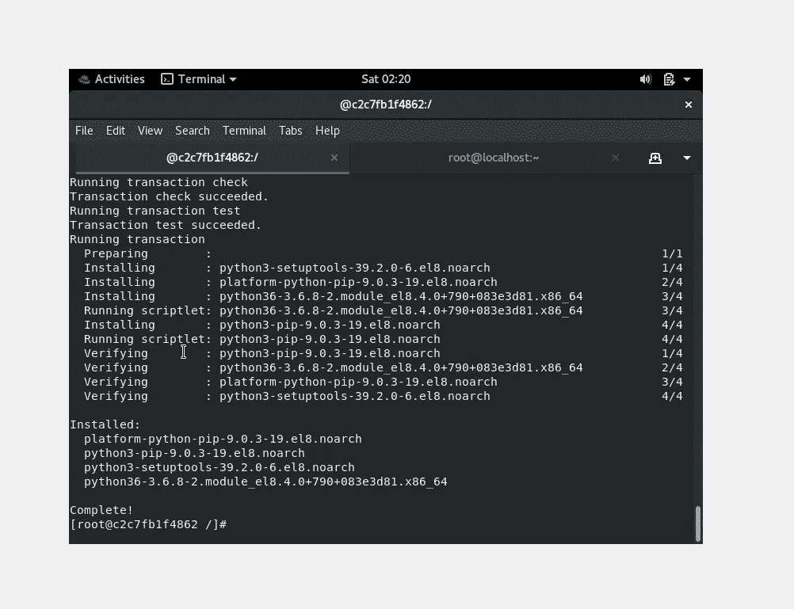
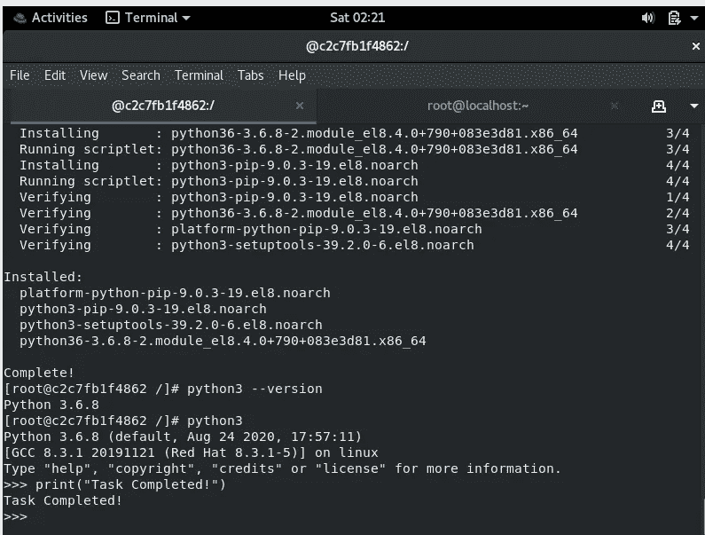

# 在 Docker 容器上配置 HTTPD 服务器和设置 Python 解释器

> 原文：<https://medium.com/nerd-for-tech/configuring-httpd-server-and-setting-up-python-interpreter-on-docker-container-d2a4dc308a43?source=collection_archive---------16----------------------->

(A) —在 Docker 容器上配置 HTTPD 服务器
(B) —在 Docker 容器上设置 Python 解释器并运行 Python 代码

让我们从**码头工人**开始:

Docker 是一组平台即服务产品，使用操作系统级虚拟化来交付称为容器的软件包中的软件。容器是相互隔离的，捆绑了它们自己的软件、库和配置文件。

1.  首先，我们必须在我们的系统上安装 docker，为此，请转到:/etc/yum/repos.d (Yum Repo 目录)并运行以下命令:

> *wget*

这个命令会将 docker 的 repo 文件下载到操作系统的特定目录中。

2.现在，要安装 Docker，运行以下命令:

> *yum install docker-ce-nobest*

3.我们将使用以下命令启动 docker:

> *systemctl 开始停靠*

要检查 Docker 服务的状态，请运行命令:

> 系统状态记录

# 在 Docker 容器上配置 HTTPD 服务器

现在，我们需要一个 docker 映像来启动容器，要从 Docker Hub 下载 Centos Docker 映像，请使用以下命令:

> *docker pull centos:最新*

现在我们有了 Docker 映像，我们将使用命令启动容器:

> docker run-it-name C1-p 8080:80 centos:最新

命令解释:

-i:-它创建了与 Conatiner 的交互连接。

-t:-在 Docker 容器中创建终端。

-p:-用 Docker 容器的 8080 端口公开主机的 80 端口。我们将主机的 80 端口映射到容器的 8080 端口，以便使用主机的公共 IP 和 8080 端口，后者将这个请求转发到运行在 docker 容器内端口号 80 上的 Apache Webserver。

现在，首先我们必须安装 Web 服务器。使用命令:-

> yum 安装 httpd

我们知道…在 Apache Httpd 服务器中，我们必须将文件保存在/var/www/html，所以我们将在那里创建一个 index.html 文件。

由于我们无法访问容器中的 systemctl 命令，要运行 web 服务器，我们将使用:

> /usr/sbin/httpd

这个命令将为我们提供本地主机 IP，我们可以在浏览器中运行它，并检查我们的 web 服务器是否工作正常，我们也可以使用 curl 命令。

因此，在容器中配置 Apache Web 服务器的第一个任务就完成了。

# 在 Docker 容器中设置 Python 解释器

由于我们的系统中已经运行了一个 docker 容器，我们只需安装 Python 来运行 Python 代码，命令为:

> yum 安装 python3

要查看软件是否成功安装，请使用命令进行检查；

> python 版本

要启动动态 python 解释器，请使用命令

> python3

至此，我们成功地完成了我们的两项任务！！！

如果您有任何反馈或疑问，请在下面留言或通过以下方式联系我:

 [## Prakash Agarwal -联合创始人- Nanhe Munne Kalakaar | LinkedIn

### 我是一个敏锐的学习者，对生活和世界充满好奇。我总是督促自己去做和学习新的东西。我是…

www.linkedin.com](https://www.linkedin.com/in/prakashag/) 

感谢阅读这篇文章，如果你喜欢这篇文章，你可以为文章鼓掌，并关注我更多这样的文章。

结束！！！