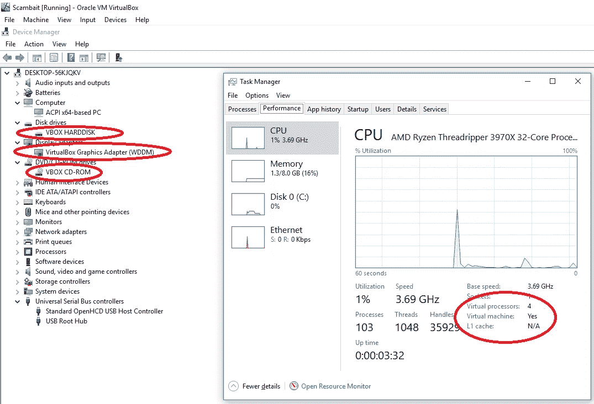
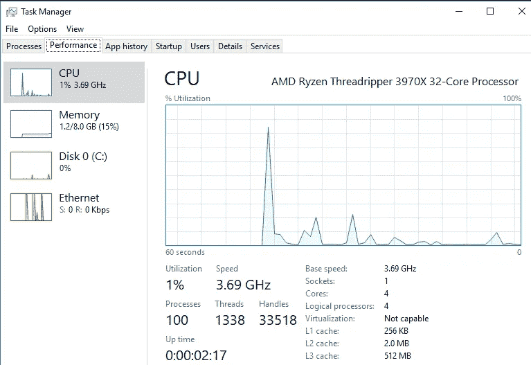
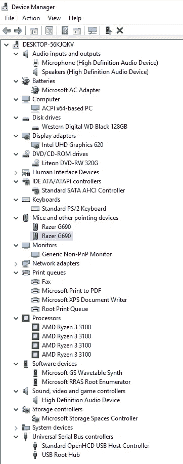

# 为诈骗配置 VirtualBox:第 1 部分

> 原文：<https://medium.com/nerd-for-tech/configuring-virtualbox-for-scambaiting-part-1-15da011adea0?source=collection_archive---------2----------------------->

诈骗是一种浪费骗子时间的艺术/爱好，通过假装受害者，让他们在你身上浪费宝贵的资源，而不是真正的弱势群体。一些著名的诈骗者的例子有:Kitboga，ScammerPayback (Peirogi)和 Jim Browning，他们都以诈骗为职业，同时告诉公众这些类型的诈骗。

这些骗局的一个组成部分是，骗子通过一个或多个远程访问工具连接到受害者的计算机，以使受害者相信他们已经收到了“退款”。这些骗子可能会额外掠夺计算机中有价值的东西，如密码，出售访问其他骗子，或僵尸网络控制器等。因此，要非常成功地进行诈骗，需要有一个连接到 VPN 的虚拟机来隐藏诈骗者的真实位置并保护他们的真实计算机。

设置虚拟机进行诈骗的行为比听起来要困难得多，因为大多数虚拟化软件都很容易被发现，如果狡猾的骗子发现他们正在访问虚拟机，他们会立即断开连接。许多专业诈骗者使用 VmWare，因为它更容易隐藏。另一方面，VirtualBox 是免费的，是一种很棒的虚拟化技术，但是很难完全隐藏操作系统正在其中运行的事实，特别是在维护像调整大小、拖放和共享剪贴板这样的来宾添加功能时。

在这一系列文章中，我将提供在 VirtualBox VM 中隐藏虚拟化的分步说明。这将包括我在互联网上找到的现有工具和技术，以及我编写的自定义 rootkit 和其他软件，以超越目前公开可用的内容。一旦您应用完本系列中的工具和技术，您将拥有一个 Windows 10 VirtualBox 虚拟机，该虚拟机带有功能齐全的 VirtualBox 来宾附件，这些附件:

1)托盘中不会有任何 VirtualBox 通知。2)不会显示任何 VirtualBox 服务(在任何工具中)。
3)不会在任务管理器、任务列表或任何其他进程列表工具中显示任何 VirtualBox 进程。
4)在注册表中不会有任何可见的 VirtualBox 软件。
5)不会有任何 VirtualBox 的东西列在“卸载应用”里。
6)不会有任何 VirtualBox 的东西出现在网络连接中。
7)硬盘上不会有任何可见的 VirtualBox 文件。在设备管理器中不会显示任何明显的与 VirtualBox 相关的硬件。不会有任何与 VirtualBox 相关的硬件出现在 msinfo32.exe。10)将不会有任何与 VirtualBox 相关的硬件出现在 dxdiag.exe。

在我们开始之前，不言而喻，诈骗是有潜在危险的，如果你不小心，可能会进入法律的灰色地带，除非你既有技术能力，又知道管理这类事情的相关法律，否则不应该参与。我对你的行为不负任何责任，如果你搞砸了，我也不负任何责任。

这第一期的其余部分将首先致力于最简单的东西。首先，您需要设置一个基本的 VirtualBox Windows 10 虚拟机。虽然这些设置并不是唯一有效的设置，但我推荐大约以下规格的设置:128GB 硬盘，8gigs ram，4 个 CPU 处理器内核。我不会描述在 VirtualBox 虚拟机中安装 Windows 10 或安装 VirtualBox 访客插件的过程，因为在网上的其他地方有大量的信息，如果你在技术上没有能力做到这一点，本指南肯定不适合你。

请记住，您的最终目标是复制一台可以想象是老年人或“低于平均水平”的计算机用户的计算机。记住这一点，选择一个有意义的用户名。我推荐一个男女通用的名字，可以是男的也可以是女的，这样你就有角色选择了。我建议将主帐户设置为无密码，并配置自动登录(这当然是我唯一一次推荐这样的配置)。将该帐户设置为“普通”帐户，然后创建第二个特权帐户，其名称听起来像孙子/儿子的名字。这将使骗子更难四处窥探，然后如果骗子要求特权帐户的密码，将允许你的受害者角色“装傻”。最后，我建议不要注册你的 Windows。在我们完成之前，我们将会对“硬件”进行重大改动，如果在完成之前就让你的许可证失效，那将是一种耻辱。

完成上述步骤后，您应该关闭虚拟机。接下来，你会想从 GitHub 克隆或者下载这个优秀的工具到你的主机(安装了 VirtualBox 的那台):[https://github.com/JayMontana36/vBoxSysInfoMod](https://github.com/JayMontana36/vBoxSysInfoMod)

上述工具将允许您更改虚拟机的基本 VirtualBox BIOS 设置，以帮助隐藏该机器是虚拟机的一些明显迹象。克隆文件后，打开文件夹并双击“vBox 系统信息 Mod.bat”文件。

读完提示后，点击“回车”，然后输入“ModifyVM”，再次点击“回车”。在 VirtualBox 中，会提示您一个虚拟机列表，键入您的诈骗虚拟机的名称，然后按回车键。现在，您将看到一系列提示，要求您提供计算机制造商、型号、BIOS 版本等。我强烈建议研究一台使用 3-5 年的低端计算机的有效、真实的配置，并提供这些信息。一个很好的地方是去易贝搜索类似“戴尔塔”的东西，并查看出售的旧型号。确保跟踪这些信息，因为为了保持一致性，您将在本系列的后面需要这些信息。

该工具完成后，您可以重新启动虚拟机，并使用特权帐户登录 Window。如果您转到 PC 属性或设备管理器，您现在会看到您的更改存在，此外，任务管理器将不再显示系统已虚拟化。但是，很多信息还是会有明显的疑点。我们将在下一步修复一些最令人震惊的东西。

在任何修改之前，这里有一些我们需要克服的事情。

在 vBox 系统信息之后，虚拟化不再显示在任务管理器中

现在是拍摄虚拟机快照的最佳时机。在下一步，我们将改变一堆注册表设置，这很容易打破东西。现在拍摄快照将允许您回滚任何坏的更改并重试。

你拍快照了吗？我没开玩笑。你会希望你做了…

好了，到我的 GitHub 下载这个 repo 中的 PowerShell 脚本:[https://github.com/shellster/VBoxRegistryHide](https://github.com/shellster/VBoxRegistryHide)
你会想把它复制到你的恶意虚拟机中，然后在提升的 PowerShell 提示符下运行它。会提示你提供一堆假硬件的信息。您应该提供与之前工具中的值一致的值。一旦你提供了所有的信息，这个工具就会用假的硬件配置文件覆盖一堆注册表设置。

修改后

此时，如果骗子对设备管理器进行了相当彻底的检查，您的虚拟机将不会被检测到。深入查看显卡的驱动程序文件仍然会泄露你的身份，但是我相信这足以防止一般的骗子检测到这个程序中存在 VM。然而，我们仍然有几个问题。首先是与 VirtualBox 相关的服务、文件和进程。此外，MSINFO32 会很快在多个面板上告诉你，dxdiag 会放弃图形页面上的夹具，VirtualBox tools 会在你的托盘通知区域显示一个图标。我们将在下一篇文章中处理 MSINFO32，其余的将在后续文章中讨论。

第二部分上线:[https://the shellster . medium . com/configuring-virtualbox-for-scambaiting-part-2-d 075598 a27d](https://theshellster.medium.com/configuring-virtualbox-for-scambaiting-part-2-d075598a27d)