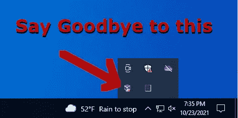

# 为诈骗配置 VirtualBox:第 3 部分

> 原文：<https://medium.com/nerd-for-tech/configuring-virtualbox-for-scambaiting-part-3-c5213c31c64d?source=collection_archive---------6----------------------->

VBoxTray.exe 永远隐藏着！

在上一篇文章([https://medium . com/nerd-for-tech/configuring-virtualbox-for-scambaiting-part-1-15da 011 adea 0](https://theshellster.medium.com/configuring-virtualbox-for-scambaiting-part-2-d075598a27d))中，我们继续了伪装 VirtualBox 硬件配置文件和欺骗 MSINFO32 结果的过程。

先说坏消息，我在之前的文章里撒了谎。我不会像我承诺的那样涵盖太多的信息，因为我还在开发一些软件，而且这篇文章也太长了。现在，我们将集中于隐藏虚拟框托盘图标。

使用 VirtualBox 进行诈骗的最大痛苦之一是，你要么不能安装访客插件，要么必须确保“VBoxTray.exe”程序没有运行，因为它会在任务栏中显示一个 VirtualBox 图标，作为骗子的巨大红旗。不幸的是，通过终止此应用程序，您必须牺牲许多来宾添加功能，如主机/虚拟机剪贴板共享和主机/虚拟机文件拖放，因为如果没有此应用程序运行，它们将不再起作用。我们将解决这个问题。

我将在最后一集讲述我的 rootkit 时隐藏 VBoxTray.exe 进程，但现在，我们将简单地隐藏图标，同时允许 VBoxTray.exe 程序继续运行，否则功能完全正常。

我们将使用上一篇文章中类似的技术。通过使用注册表修改劫持和“调试”VBoxTray.exe，然后我们可以挂钩通常负责创建和显示托盘图标的 Windows API 调用。通过这样做，我们可以取消任务栏图标。因为我在上一篇文章中简要介绍了注册表项，所以在这篇文章中我将跳过它们，转而进入挂钩过程。我们将把我们的挂钩 DLL 加载到 VBoxTray.exe 的可执行文件中(完整的源代码在这里:[https://github . com/shellster/hidevbox tray/blob/main/hidevbox tray/main . CPP](https://github.com/shellster/HideVBoxTray/blob/main/HideVBoxTray/main.cpp)

第一步是通过“CreateProcess”Windows API 方法启动真正的 VBoxTray.exe 可执行文件，但我们希望传递“CREATE_SUSPENDED”标志以“暂停”模式启动该进程，以便我们可以在它做任何事情之前挂钩它。我们还传递了“DEBUG_PROCESS”标志，这阻止了我们对 VboxTray.exe 的新调用无限期地产生新的调试器【T4:】

接下来，我们通过 VirtualAllocEx 在这个挂起的进程中分配空间，以保存我们的挂钩 DLL 的路径，并通过“WriteProcessMemory”将其写入远程进程。

我们还获得了“kernel32.dll”和“LoadLibraryW”方法在该 dll 中的位置。因为这对于 Windows 中的所有进程都是一样的，所以我们可以通过“GetModuleHandle”和随后对“GetProcAddress”的调用从我们的进程中获取内存地址:

最后，我们使用“CreateRemoteThread”来调用远程进程中的“LoadLibraryW”以及我们的注入 DLL。这将导致我们的挂钩 DLL 被加载到 VBoxTray.exe 应用程序。然后，我们休眠一秒钟，让我们的远程 DLL 完全加载并完成它的设置，然后我们用“ResumeThread”取消挂起 VboxTray.exe 进程。

最后，因为 VBoxTray.exe 进程是在调试模式下启动的，所以我们需要调用“DebugActiveProcessStop”来允许程序正常运行，而不是单步执行并等待批准才能继续。之后，我们进行清理:

这样，动作转移到我们的注入 DLL。如果你感兴趣的话，这个 DLL 的代码就在这里(在更下面的一个片段中发布):[https://github . com/shellster/hidevbox tray/blob/main/hidevbox tray inject/dllmain . CPP](https://github.com/shellster/HideVBoxTray/blob/main/HideVBoxTrayInject/dllmain.cpp)

对于挂钩，我使用了非常棒并且相当轻量级的 MinHook 库(【https://github.com/TsudaKageyu/minhook】T2)。对于后面几集的 rootkit，我使用了微软的 Detours(部分原因是我从其他开源代码开始工作)，但是对于小而简单的挂钩 MinHook 就足够了，我发现它比 Detours 更直接。

我们的 DLL 必须被设计成当它被加载时，它自动执行它的挂钩魔术。如果你熟悉用 C/C++编写 DLL，你会知道这可以通过创建一个“DllMain”方法并在“DLL_PROCESS_ATTACH”阶段运行挂钩代码来实现。

我们想要拦截的 Windows API 调用是“SHELL_NOTIFYICONA”和“SHELL_NOTIFYICONW”，因为这些是 VBoxTray.exe 用来显示托盘图标的方法。为了防止这些调用，我们简单地创建具有相同指纹的存根方法，这些方法只返回“TRUE”。剩下的魔术就交给 MinHook 了。整个过程如下图所示:

当然，还有许多小细节我没有涉及，比如找到 dll 的路径，为我正在使用的 C 运行时版本编译 MinHook 库，但是以上是对这个过程的一个相当全面的概述。

# TLDR:我如何使用它？

我知道许多阅读这篇文章的人并不真正关心实现细节，他们只想知道如何使用这个工具:

1.  从这里下载最新的版本(HideVBoxTray.zip)(或者你也可以获得源代码并在 Visual Studio 的最新版本中自己编译):[https://github.com/shellster/HideVBoxTray/releases](https://github.com/shellster/HideVBoxTray/releases)
2.  将发布归档文件解压缩到“C:\mykit”(正如前面的文章中提到的，您将需要创建此文件夹，并将您想要对骗子隐藏的文件放在此目录中，因为它最终会被 my rootkit 隐藏)。你最终应该得到以下文件:
    C:\ mykit \ hidevboxtray . exe
    C:\ mykit \ hidevboxtrayinjet . dll
    C:\ mykit \ install . reg
3.  一旦上述文件都准备好了，双击“install.reg ”,按照提示安装调试器密钥。
4.  重新启动，然后运行任务管理器，以确保 VBoxTray.exe 确实在运行，并观察你的任务栏中不再有图标。

在本系列的下一篇文章中，我们将讨论在 DxDiag 中隐藏信息，如果我完成了代码，或者如果没有，我将最终停止戏弄我的 rootkit 并释放它。敬请关注…