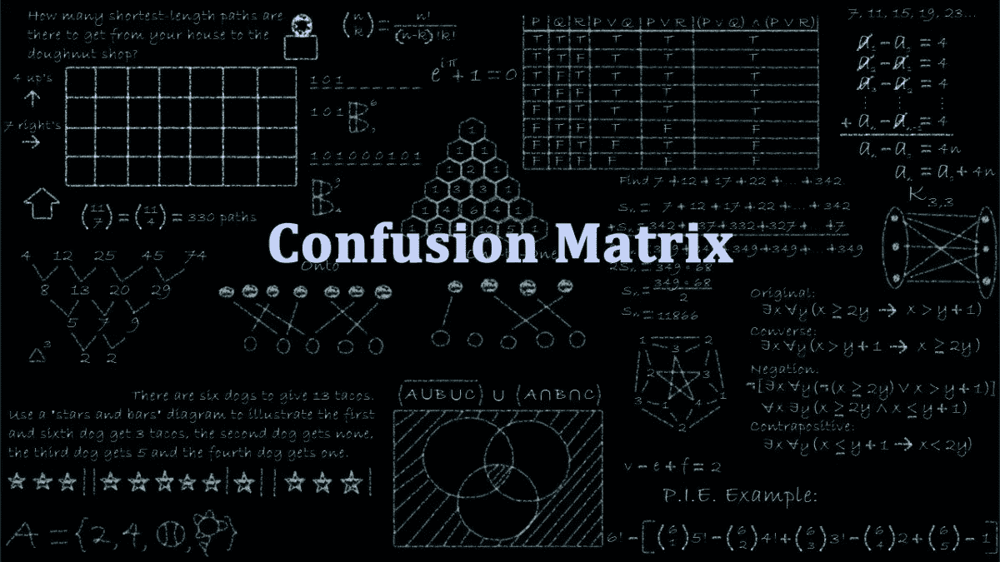
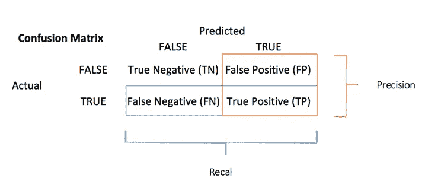
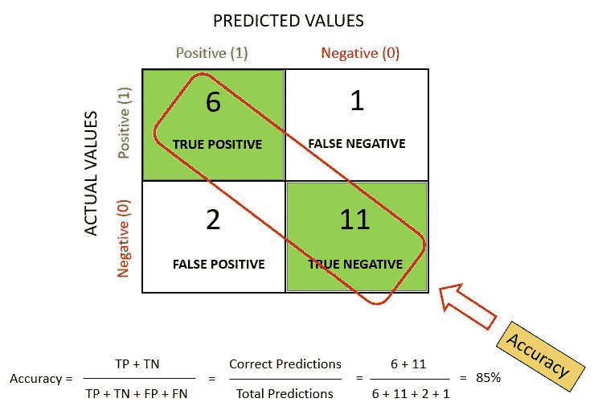
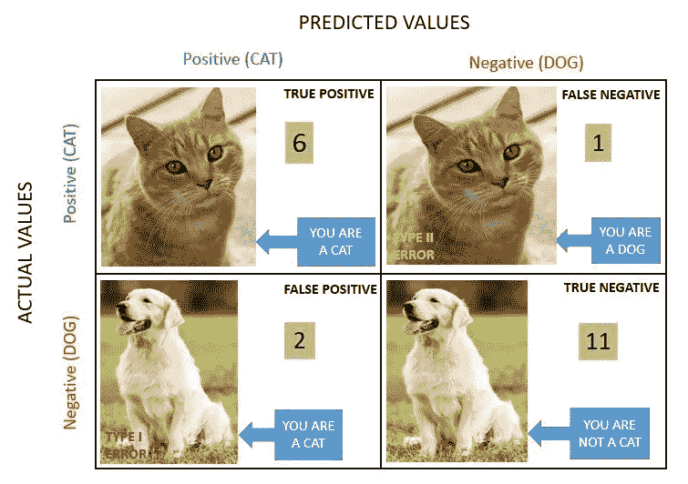
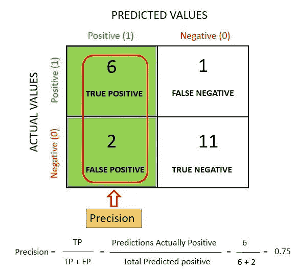
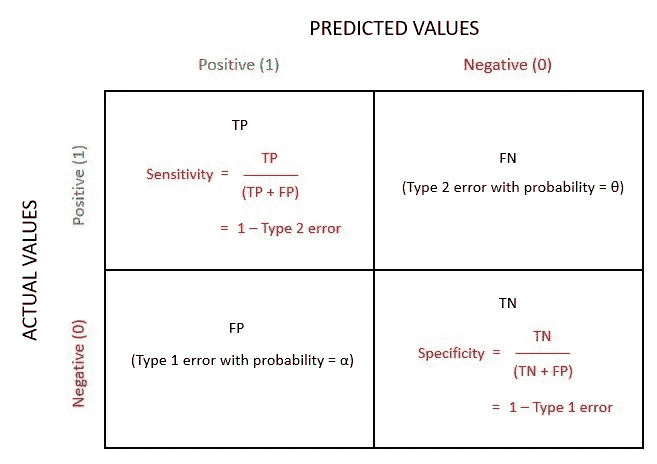
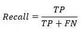
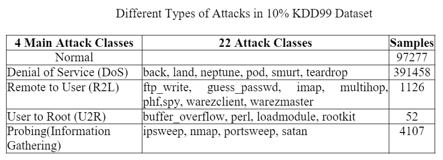
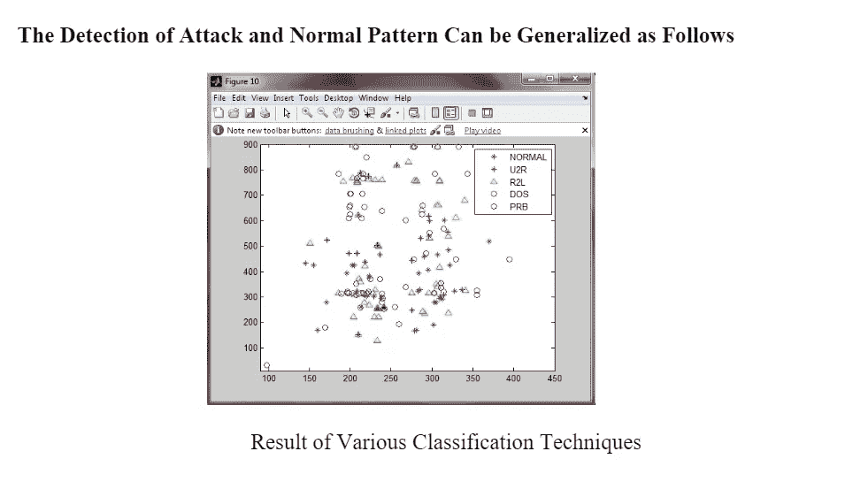
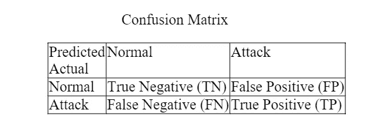

# 混淆矩阵与网络安全

> 原文：<https://medium.com/nerd-for-tech/confusion-matrix-and-cyber-security-62da9afb6eff?source=collection_archive---------4----------------------->

预测建模的完整生命周期包括数据清理、预处理和数据争论。现在到了我们尝试适应模型的阶段，最终目标是实现低偏差和低方差。最重要的步骤是模型创建后的模型评估。我们经常无法理解由此产生的绩效评估指标。

# 理解混淆矩阵

当我们得到数据，经过数据清洗、预处理和争论后，我们做的第一步是将它输入到一个优秀的模型中，当然，还要得到概率输出。但是我们如何衡量我们的模型的有效性呢？效果越好，性能越好，这就是我们想要的。这也是混淆矩阵引人注目的地方。混淆矩阵是机器学习分类的性能度量。

有多种方法可以在机器学习模型中找到错误。平均绝对误差(误差/成本)函数通过尝试使实际值和预测值之间的距离为 0，来帮助模型在正确的方向上进行训练。我们通过“y — y^".”发现机器学习模型预测中的错误

均方误差(MSE):从数据集中取点，首先将它们平方，然后取平均值来克服误差。

在二元分类模型中，借助混淆矩阵来检测错误。

混淆矩阵是机器学习分类问题的性能度量，其中输出可以是两个或更多个类别。这是一个包含预测值和实际值的 4 种不同组合的表格。

这是非常有用的测量召回，精度，特异性，准确性，最重要的是 AUC-ROC 曲线。

# 混淆矩阵的四个结果

混淆矩阵通过比较实际类别和预测类别来可视化分类器的准确性。二进制混淆矩阵由正方形组成:

*   TP:真阳性:预测值被正确预测为实际阳性
*   FP:预测值错误地预测了实际的正值。即负值被预测为正值。也被称为**类型 1 错误**
*   FN:假阴性:预测为阴性的正值。也被称为**2 型错误**
*   TN:真负值:预测值被正确预测为实际负值

模型的精确度(通过混淆矩阵)使用下面给出的公式计算。

准确度= TN+TP / TN+FP+FN+TP

如果用于不平衡的数据集，准确性可能会产生误导，因此有其他基于混淆矩阵的度量标准可用于评估性能。在 Python 中，混淆矩阵可以通过使用*“混淆 _ 矩阵*()*“*函数获得，该函数是*“sk learn”*库的一部分。这个函数可以使用 sk learn . metrics import confusion _ matrix 中的*导入到 Python 中。*为了获得混淆矩阵，用户需要向函数提供实际值和预测值。**

## *以更简单的方式理解混淆矩阵:*

*让我们举个例子:*

*我们总共有 **20 只猫和狗**，我们的模型预测它是否是一只猫。*

*   *实际值= ['狗'、'猫'、'狗'、'猫'、'狗'、'猫'、'狗'、'狗'、'狗'、'狗'、'狗'、'猫'、'狗'、'狗'、'狗'、'猫'、'狗'、'猫']*
*   *预测值= ['狗'、'狗'、'狗'、'猫'、'狗'、'猫'、'猫'、'狗'、'狗'、'狗'、'猫'、'狗'、'狗'、'狗'、'猫'、'狗'、'狗'、'猫'、'狗']*

**

*   **真阳性(TP) = 6**

*你预测是肯定的，这是真的。你预言一种动物是猫，它确实是。*

*   **真负值(TN) = 11**

*你预测是负面的，这是真的。你预测动物不是猫，它实际上也不是(它是一只狗)。*

*   **假阳性(1 型错误)(FP) = 2**

*你预测是积极的，但它是错误的。你预测动物是猫，但它实际上不是(它是狗)。*

*   **假阴性(2 型错误)(FN) = 1**

*你预测是负面的，这是错误的。你预测那种动物不是猫，但它实际上是。*

*   ***阳性预测值(PVV):** 这非常接近精度。这两个术语之间的一个显著区别是，PVV 考虑的是患病率。在类别完全平衡的情况下，阳性预测值与精度相同。*
*   ***空错误率:**这个术语用来定义如果你能预测多数类，你的预测会错多少次。您可以将它视为比较分类器的基线度量。*
*   ***F-measure/F1-Score:** 精度低召回率高的两个模型很难比较或者反之。所以为了使它们具有可比性，我们使用 F-Score。F-score 有助于同时衡量查全率和查准率。它用调和平均值代替算术平均值，更多地惩罚极值。*

**

*   ***Roc 曲线:** Roc 曲线显示不同切点的真阳性率对假阳性率。它还证明了敏感性(回忆和特异性或真正的阴性率)之间的权衡。*
*   ***精度:**精度度量显示了正类的精度。它衡量正类的预测正确的可能性。*

**

*当分类器完美地将所有正值分类时，最高分是 1。精度本身并没有太大的帮助，因为它忽略了负类。该指标通常与召回指标成对出现。回忆也称为敏感度或真阳性率。*

*   ***灵敏度**:灵敏度计算正确检测到的阳性类别的比率。该度量给出了模型识别一个肯定类的好坏程度。*

**

## *如果已经有了很高的准确率，还有必要检查召回(或)精度吗？*

*当类别不平衡时，我们不能依赖单一的分类精度值。例如，我们有一个 100 名患者的数据集，其中 5 名患有糖尿病，95 名健康。然而，如果我们的模型仅预测大多数类别，即所有 100 个人都是健康的，即使我们具有 95%的分类准确度。*

**

## *何时使用准确度/精确度/召回率/ F1 评分？*

*   *当真阳性和真阴性更重要时，使用准确度。准确性是衡量平衡数据的更好标准。*
*   *当假阳性更重要时，使用精度。*
*   *当假阴性更重要时，使用回忆。*
*   *当假阴性和假阳性很重要时，使用 F1 分数。F1-Score 是不平衡数据的更好指标。*

## *为什么我们需要混淆矩阵？*

*以下是使用混淆矩阵的优点/好处。*

*   *它显示了任何分类模型在进行预测时是如何被混淆的。*
*   *混淆矩阵不仅能让你洞察分类器所犯的错误，还能让你了解所犯错误的类型。*
*   *这个分类帮助你克服单独使用分类准确度的限制。*
*   *混淆矩阵的每一列都代表该预测类的实例。*
*   *混淆矩阵的每一行代表实际类的实例。*
*   *它不仅能洞察分类器产生的错误，还能洞察正在产生的错误。*

# *基于并行支持向量机的网络攻击检测和分类*

*网络攻击正在成为组织信息系统的一个关键问题。已经引入了许多网络攻击检测和分类方法，并取得了不同程度的成功，这些方法被用作保护数据完整性和系统可用性免受攻击的对策。计算机网络攻击的分类是网络安全领域中一个难以解决的问题。*

*计算机系统的连通性和可访问性的快速增长导致了网络攻击的频繁发生。对计算机基础设施的攻击正成为一个日益严重的问题。基本上，网络攻击检测是一个分类问题，其中我们从系统的异常模式(攻击)中分类出正常模式。子集选择决策融合方法在网络攻击检测中起着关键作用。已经表明，冗余和/或不相关的特征可能严重影响学习算法的准确性。SDF 是用于决策和分类问题的非常强大和流行的数据挖掘算法。它已经在许多实际应用中使用，如医疗诊断、雷达信号分类、天气预报、信用审批和欺诈检测等。*

## *KDD 杯’99 数据集描述*

*为了检验所提出的分布式网络攻击检测和分类算法的性能，我们可以使用 KDD 99 入侵检测数据集对其进行实际评估。在 KDD99 数据集中，这四种攻击类别(DoS、U2R、R2L 和 probe)被分为 22 种不同的攻击类别，如表 1 所示。1999 年 KDD 数据集被分为两部分:训练数据集和测试数据集。测试数据集不仅包含来自训练数据的已知攻击，还包含未知攻击。自 1999 年以来，KDD 99 数据集一直是评估异常检测方法最广泛使用的数据集。这个数据集是由 Stolfo 等人准备的，是基于 DARPA'98 IDS 评估计划中捕获的数据建立的。DARPA'98 大约是 7 周网络流量的 4 千兆字节压缩原始(二进制)tcpdump 数据，可以处理成大约 500 万条连接记录，每条大约 100 字节。对于每个 TCP/IP 连接，在 41 个特征、34 个特征(数字)和 7 个特征(符号)中提取 41 个不同的定量(连续数据类型)和定性(离散数据类型)特征。为了分析不同的结果，已经开发了用于评估网络入侵检测的标准度量。检测率(DR)和虚警率是已经使用的两个最著名的指标。DR 计算为正确检测到的攻击数与攻击总数的比率，而误报率计算为被错误分类为攻击的正常连接数与正常连接数的比率。*

**

*在 KDD 杯 99 中，用于评估参与者条目的标准是使用混淆矩阵和给定的成本矩阵计算的每次测试的成本(CPT)。混淆矩阵(CM)是一个正方形矩阵，其中每一列对应于预测的类别，而行对应于实际的类别。第 I 行第 j 列的条目 CM (i，j)表示最初属于类别 I 的错误分类实例的数量，尽管被错误地标识为类别 j 的成员。主对角线的条目 CM (i，I)表示正确检测的实例的数量。成本矩阵也有类似的定义，条目 C (i，j)表示将属于类 I 的实例错误分类到类 j 的成本惩罚。*

**

*   *真阳性(TP):实际攻击时检测到的攻击数量。*
*   *真阴性(TN):实际正常时检测到的正常量。*
*   *误报(FP):实际正常时检测到的攻击量(虚警)。*
*   *假阴性(FN):当正常攻击时检测到的数量。*

*在上面的混淆矩阵中，行对应预测类别，列对应实际类别。*

*混淆矩阵包含由分类器完成的实际和预测分类的信息。网络攻击检测系统的性能通常使用矩阵中的数据进行评估。*

**