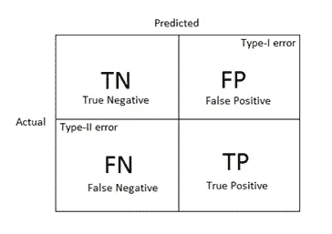
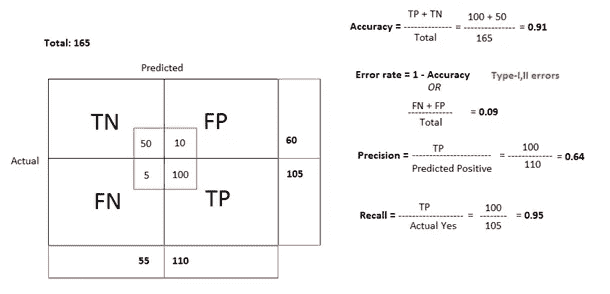

# 混淆矩阵

> 原文：<https://medium.com/nerd-for-tech/confusion-matrix-fd24496cec96?source=collection_archive---------6----------------------->

带有误差细化的混淆矩阵

这是统计矩阵的基本结构。如果实际与预测不符，我们称之为第一类和第二类误差。如果 actual 为真，但我们的预测出错了，我们就遇到了第二类错误，如果 actual 不为真，但我们的预测宣称它为真，我们就进入了第一类错误。

让我们用一个例子来理解混淆矩阵:

我们有病人的报告。让我们看看，我们收集到的实际值和预测值。

因子和混淆矩阵的计算

上面我们展示的只是机器学习中混淆矩阵最简单的解释，加上适当的公式和计算。现在我们讨论关于机器学习方面的上述现象。

最重要的是我们应用一种算法来预测我们的目标。假设我们有一个人的数据集，我们必须预测这个人是否患有心脏病。比方说，我们将**随机森林**的算法用于测试数据。该算法预测我们的假设是正确的 150 倍，错误的 15 倍。

注意:我们这样做是基于分类假设，因此在分类 ML 问题下它是假的。

比方说，如果我们应用另一种算法，如 **K-最近邻**，我们会得到不同的精度。现在，我们的目标是找出分类问题的最佳模型，我们将接近这些值，哪一个为我们的假设提供了良好的准确性。如果假设**的 K-最近邻**给出了很好的准确度，我们就用它，否则，我们就接近**随机森林**。我们的数据预测有多种算法；为了举例，这里我只定义了两个。

我必须详细说明的最重要的一点是，混淆矩阵的维数完全取决于我们将要处理的预测类别。在上面的例子中，我们只有两个类别，**是/否**。因此我们得到了一个 2x2 的混淆矩阵形式。

让我们说，如果我们有一个多类别的例子，例如:如果我们已经得到了关于市场商品的数据，我们必须预测客户将出售哪些商品，那么我们的混淆矩阵将基于我们在数据中获得的所有种类的商品。*这里的数据无非是我们的店铺*。

我想说的只是一个简单的结构，矩阵的所有对角线都是数据，机器预测正确无误，剩下的所有非对角线都是 I/ II 类错误。

**混淆矩阵被更精确地定义为针对特定分类问题的机器算法的准确性阐述。**