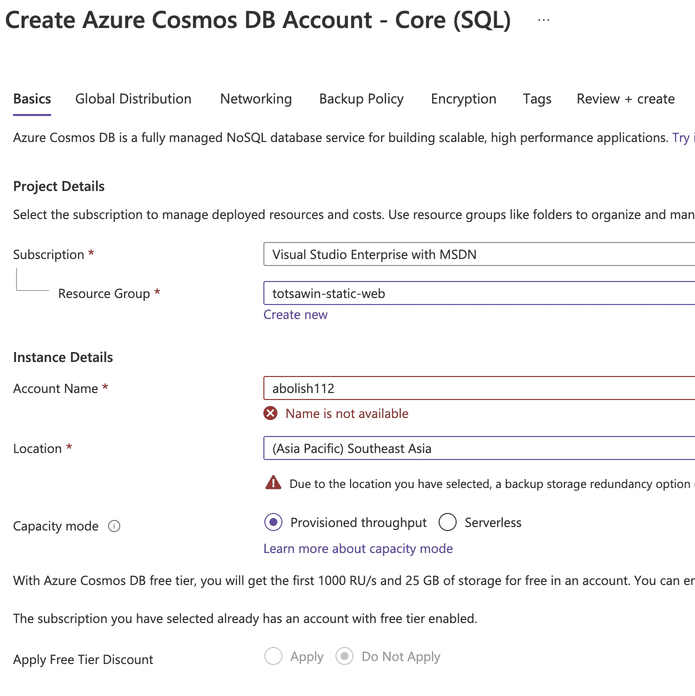
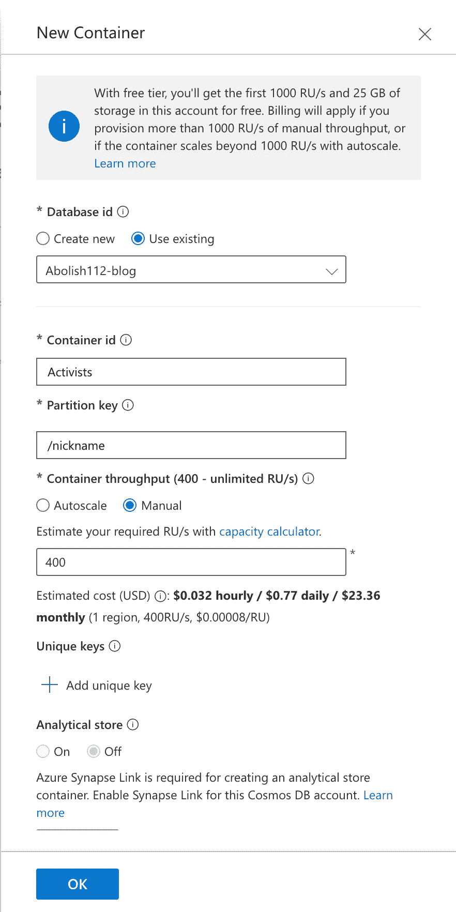
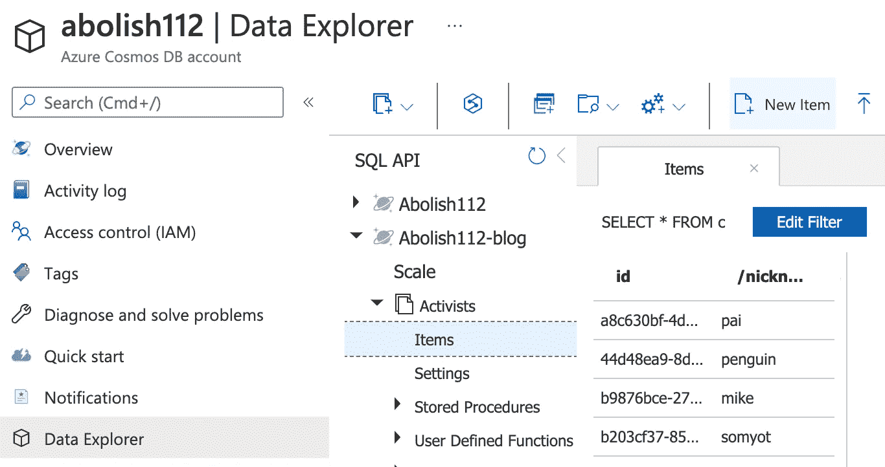
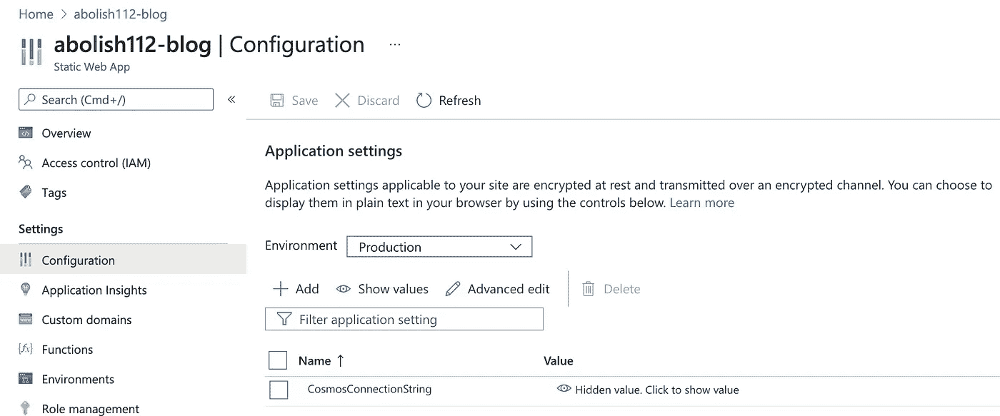

# 将 Azure 函数连接到 Azure Cosmos DB SQL API

> 原文：<https://medium.com/nerd-for-tech/connect-azure-functions-to-azure-cosmos-db-sql-api-18ce6192a807?source=collection_archive---------1----------------------->

演示如何在 [Azure Cosmos DB](https://azure.microsoft.com/services/cosmos-db/) 中存储数据，并将 Azure 函数连接到 Cosmos DB 以公开这些数据


这张图片改编自文件:2021 年 8 月 15 日，曼谷示威游行期间，抗议者燃放的烟花在防暴警察上方爆炸。图片来源:法新社

在[我之前的博客](/nerd-for-tech/add-an-api-to-azure-static-web-apps-with-azure-functions-dbf0dd3fce0a)中，我已经向您展示了如何从前端迁移模拟数据，以供 API 存储和公开。

现在我正在演示如何在 [Azure Cosmos DB](https://azure.microsoft.com/services/cosmos-db/) 中存储数据，并将 API 连接到 Cosmos DB 以公开这些数据。

Azure Cosmos DB 是一个完全托管的 NoSQL 数据库，提供多种数据库 API，即 Core (SQL) API、MongoDB API、Cassandra API、Gremlin API 和 Table API。在本教程中，我选择核心(SQL) API，因为它是 Azure Cosmos DB 的原生 API，并声称提供了最新的特性。对于其他 API，它可能适用于现有的应用程序— *并且您不想重写数据访问层* —或者您的团队已经熟悉了其中一个数据库。

# 概观

重写后的流程将是:在 API(*/API/activities*)被触发时，例如通过 HTTP 调用，API 从 Azure Cosmos DB 读取数据并将数据返回。


来源:[https://docs . Microsoft . com/en-us/azure/cosmos-db/server less-computing-database # why-choose-azure-functions-integration-for-server less-computing](https://docs.microsoft.com/en-us/azure/cosmos-db/serverless-computing-database#why-choose-azure-functions-integration-for-serverless-computing)

这篇博客分两个部分演示了如何实现上述流程:

1.  创建 Azure Cosmos DB 帐户、数据库和容器，并添加示例数据
2.  创建**输入绑定**将 Azure 函数绑定到 Azure Cosmos DB 容器，这样，当函数执行时，输入绑定将从容器中读取数据并返回给调用者

# 创建 Azure Cosmos DB 帐户、数据库和容器，并添加示例数据

## 创建一个 Azure Cosmos DB 帐户

1.  转到 [*微软 Azure 门户*](https://portal.azure.com/)
2.  选择*蔚蓝宇宙数据库*

3.选择*创建*

4.选择 API 选项[ *核心(SQL)*

5.在*创建 Azure Cosmos DB 帐户*页面中，输入新 Azure Cosmos DB 帐户的基本设置。

*   *订阅*:选择您的 *Azure 订阅*
*   *资源组*:选择你的资源组，如果有的话，或者选择*新建—* 你可以把*资源组*当做一个文件夹来包含这个 app
*   *帐户名称*:输入一个唯一的名称来标识您的 Azure Cosmos DB 帐户。
*   *位置*:选择一个地理位置来托管您的 Azure Cosmos DB 帐户。使用离用户最近的位置，让他们能够最快地访问数据。
*   *容量模式*:在[配置吞吐量](https://docs.microsoft.com/en-us/azure/cosmos-db/set-throughput)模式下选择*配置吞吐量*创建账户，或者在[无服务器](https://docs.microsoft.com/en-us/azure/cosmos-db/serverless)模式下选择*无服务器*创建账户。
*   *应用自由层折扣*:应用*自由层*。



输入新 Azure Cosmos 帐户的基本设置

6.选择*审核+创建*。

7.查看帐户设置，然后选择*创建*。创建帐户需要几分钟时间。等待门户页面显示*您的部署已完成*。

8.选择*转到资源*转到 Azure Cosmos DB 帐户页面。

## 创建 Azure Cosmos DB 数据库和容器

创建帐户后，您现在可以使用 [*Azure 门户*](https://portal.azure.com/) 中的*数据浏览器*工具来创建数据库和容器。

1.  选择*数据浏览器*，然后点击*添加容器*
2.  在“新建容器”页面中，输入新容器的设置。

*   *数据库 ID* :输入 *Abolish112-blog* 作为新数据库的名称。
*   *容器 ID* :输入*活动分子*作为您收集的名称。
*   *分区键*:输入*/昵称*作为分区键。
*   *数据库吞吐量:*您可以提供*自动缩放*或*手动*吞吐量。*手动*吞吐量允许您自己扩展 RU/s，而*自动扩展*吞吐量允许系统根据使用情况扩展 RU/s。本例中选择*手动*。



输入新容器的设置

## 添加示例数据

现在，您可以使用数据资源管理器向新容器中添加数据。

1.  从*数据浏览器*，展开*废除博客*数据库，展开*活动家*容器。选择*项目*，然后选择*新项目*。



2.将文档添加到容器中。

```
{
  "name": "Arnon Nampa",
  "nickname": "arnon",
  "detainedDuration": [
    {
      "detainedDate": { "year": 2021, "month": 2, "day": 9 },
      "releasedDate": { "year": 2021, "month": 6, "day": 1 }
    },
    {
      "detainedDate": { "year": 2021, "month": 8, "day": 11 }
    }
  ]
}
```

3.将 json 添加到文档选项卡后，选择*保存*。

4.如果你不提供，Azure 会自动生成一些字段，包括 *id —* 。

5.创建并保存另一个文档。你的新文档可以有你想要的任何结构，因为 Azure Cosmos DB 不会对你的数据强加任何模式。

# 创建**输入绑定**将 Azure 函数绑定到 Azure Cosmos DB 容器

为了允许静态 Web 应用程序中的 Azure 函数与数据库通信，我们需要将数据库连接字符串存储在应用程序设置中。这将使部署的应用程序能够连接到 Azure Cosmos DB。另一方面，我们需要创建文件 *local.settings.json* ，来存储相同的连接字符串，以便让它在本地开发中工作。

## 从 Azure Cosmos DB 复制数据库连接字符串

1.  前往 [*微软 Azure 门户*](https://portal.azure.com/)
2.  选择 *Azure Cosmos DB 账号* — *废除 112* 。
3.  在*设置下，*选择*键*
4.  复制*主连接字符串*下列出的连接字符串

## 在 Azure static Web Apps 中创建应用程序设置以存储连接字符串

1.  转到 [*微软 Azure 门户*](https://portal.azure.com/)
2.  选择*静态网页应用* — *取消 112-博客*
3.  在*设置*下点击*配置*
4.  单击添加，并使用以下值创建新的应用程序设置:

*   名称:*宇宙连接字符串*
*   值:<*粘贴 _ 连接 _ 字符串 _ 复制 _ 早先*

5.点击*确定*

6.点击*保存*

完成后，您应该会看到类似下面的屏幕:



## 更新 *local.settings.json 使其在本地开发中工作*

在本地开发期间，应用程序设置被添加到 local.settings.json 文件中的`Values`对象。这将由 Azure 函数在本地运行时使用。

文件:local.settings.json

```
{
  "IsEncrypted": false,
  "Values": {
    **"CosmosConnectionString":
"AccountEndpoint=https://abolish112.documents.azure.com:443/;AccountKey=__some_value__;"**
  }
}
```

## 为 Azure 函数创建 Azure Cosmos DB 输入绑定

Azure Cosmos DB 输入绑定使用 SQL API 来检索由 SQL 查询指定的文档，并将它们传递给函数的输入参数。

在本例中，通过填充以下配置来创建 Azure Cosmos DB 输入绑定:

*   *类型*:必须设置为`cosmosDB`
*   *方向*:必须设置为`in`
*   *name* :绑定参数的名称，在本例中为`activistsData`，表示函数中的文档
*   *数据库名*:包含文档的数据库`Abolish112-blog`
*   *集合名称*:包含文档的集合名称`Activists`
*   *connectionStringSetting*:包含你的 Azure Cosmos DB 连接字符串的应用设置名称，`CosmosConnectionString`
*   *SQL query*:Azure Cosmos DB SQL 查询，用于检索多个文档。在这种情况下，`select * from c`检索整个集合

文件:function.json

```
{
  "bindings": [
    ...
    {
      "type": "cosmosDB",
      "direction": "in",
      "name": "activistsData",
      "databaseName": "Abolish112-blog",
      "collectionName": "Activists",
      "connectionStringSetting": "CosmosConnectionString",
      "sqlQuery": "select * from c"
    }
  ]
}
```

添加使用`activistsData`输入绑定对象并作为响应返回的代码。

文件:index.js

```
module.exports = async function (context, req, activistsData) {
  context.log('JavaScript HTTP trigger function processed a request.');
  try {
    context.res.status(200).json(activistsData);
  } catch (error) {
    context.res.status(500).json(error);
}}
```

# 在本地运行该功能

运行静态 Web Apps CLI，并提供包含前端应用程序和 API 后端的文件夹:

```
swa start ./public --api api
```


# 重新部署并验证更新的应用程序

将新代码推送到*主*(或任何指定分支)，将自动触发新部署。


# 参考

*   [使用 Azure Cosmos DB 和 Azure 函数的无服务器数据库计算](https://docs.microsoft.com/en-us/azure/cosmos-db/sql/serverless-computing-database#why-choose-azure-functions-integration-for-serverless-computing)
*   [使用 Azure 函数和 Azure Cosmos DB 存储非结构化数据](https://docs.microsoft.com/en-us/azure/azure-functions/functions-integrate-store-unstructured-data-cosmosdb?tabs=javascript)
*   [快速入门:使用 Node.js 连接并查询 Azure Cosmos DB SQL API 帐户的数据](https://docs.microsoft.com/en-us/azure/cosmos-db/sql/create-sql-api-nodejs)
*   [Azure Functions 2 . x 及更高版本的 Azure Cosmos DB 输入绑定](https://docs.microsoft.com/en-us/azure/azure-functions/functions-bindings-cosmosdb-v2-input?tabs=javascript)
*   [Azure Functions JavaScript 开发者指南](https://docs.microsoft.com/en-us/azure/azure-functions/functions-reference-node?tabs=v2)