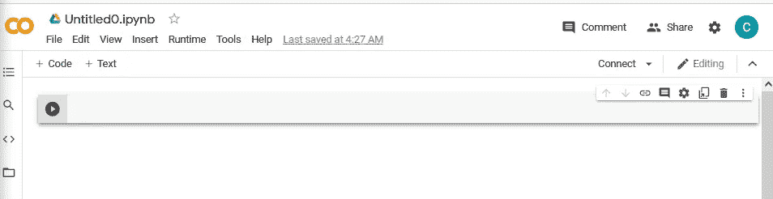
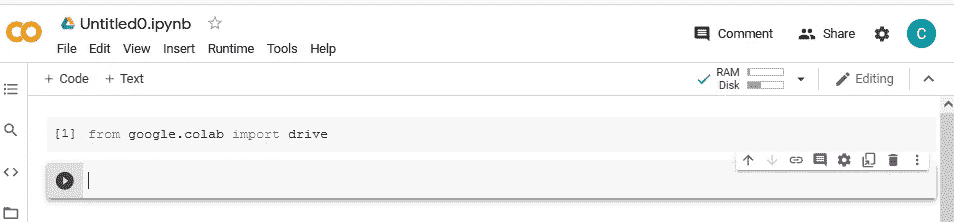
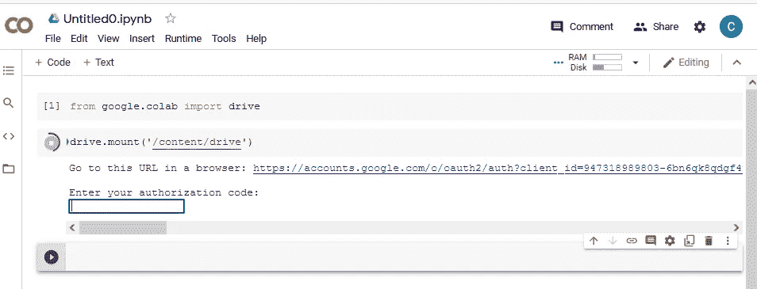
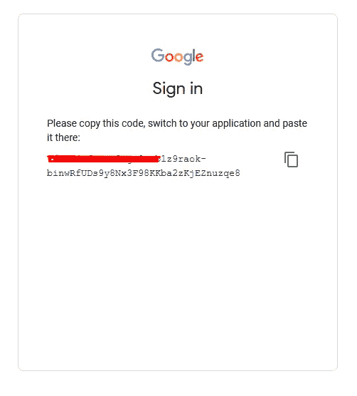
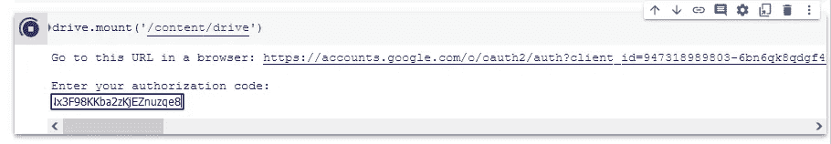
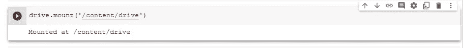
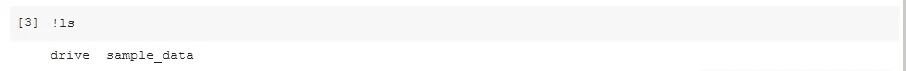
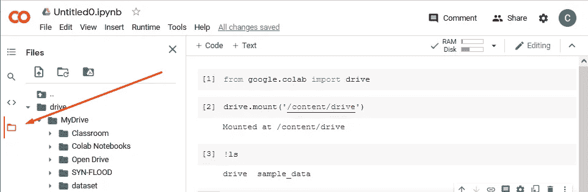
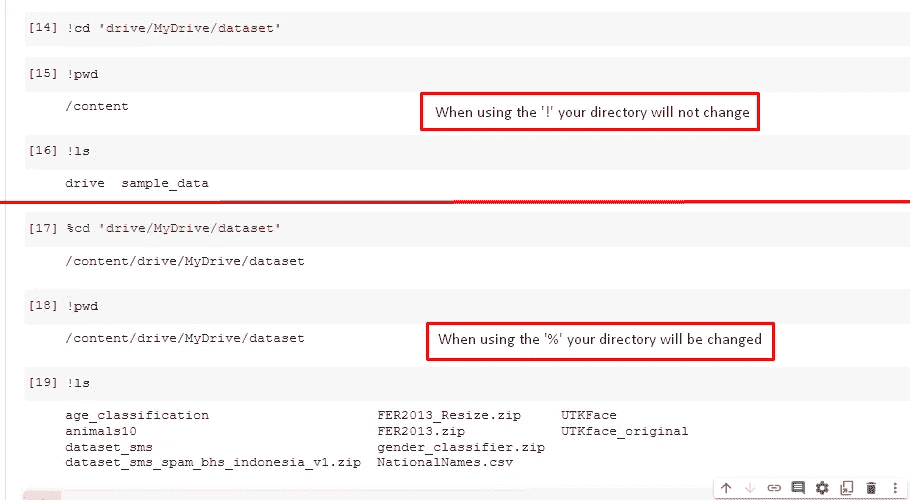
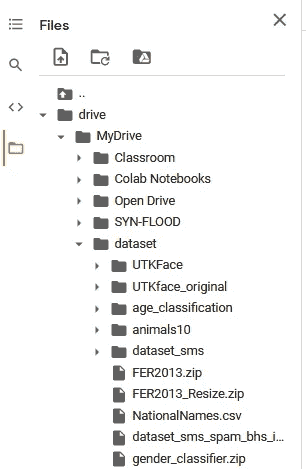

# 连接 Google Colab 和 Google Drive

> 原文：<https://medium.com/nerd-for-tech/connecting-your-google-colab-and-google-drive-b9bccb31e47c?source=collection_archive---------3----------------------->


由 [Toa Heftiba](https://unsplash.com/@heftiba?utm_source=unsplash&utm_medium=referral&utm_content=creditCopyText) 在 [Unsplash](https://unsplash.com/s/photos/connection?utm_source=unsplash&utm_medium=referral&utm_content=creditCopyText) 上拍摄

连接 google drive 和 google colab 是简单却必要的知识。但是有时候我们想不通该怎么做。让我们从在 google colab 中打开新笔记本开始。



之后，你需要把这个功能从谷歌 colab，以连接到你的驱动器



接下来，您需要在您的 colab 环境中挂载这个驱动器。它会要求你像这样打开新的链接



只要打开链接，复制验证码



将验证码粘贴到 google colab 内的框中，然后按 enter 键



如果您验证成功，输出将是这样的



所以每当你在笔记本上输入`!ls`，你就会得到一个名为 drive 的新目录。



此外，如果你想使用图形用户界面模式，只需按下左面板中的目录，你会得到你之前安装的驱动器



# 奖金

仅供参考，我认为谷歌 colab 是基于 Linux 的系统，所以你可以在那里输入 Linux 的任何命令。在我的例子中，我想进入我的驱动器中的数据集目录。要通过笔记本访问它，你应该使用`%`而不是`!`，因为功能不同。`!`是暂时的，但`%`将是持久的。这是一个例子



如果你是那种不相信 CLI 命令的人，你可以检查一下 GUI 版本，看看这个目录'/content/drive/MyDrive/dataset '里面有什么



现在，如果你想解压 zip 文件，你可以使用如下命令

```
!unzip '{ZIP Files}' -d '/new_directory/{ZIP Files}'
```

试试吧，看看你会得到什么！！！

感谢阅读

## 注意

*   挂载点绝对是你的，但是很多人使用像'/content/drive '这样的公共目录，让它与人相同是很好的，因为无论何时你作为团队工作，你的团队都不会混淆。
*   验证码实际上每次都会改变，所以你不需要担心代码被共享。我只是喜欢把它变成那样，变成一种习惯。
*   “%”命令对于在目录中移动非常有用，它实际上可以给你更干净的代码
*   unzip 中的命令'-d '用于提取新目录中的数据，而不创建新目录