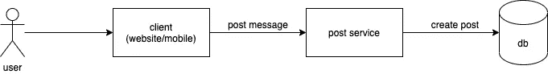
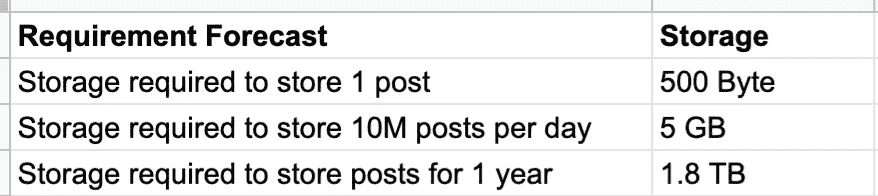
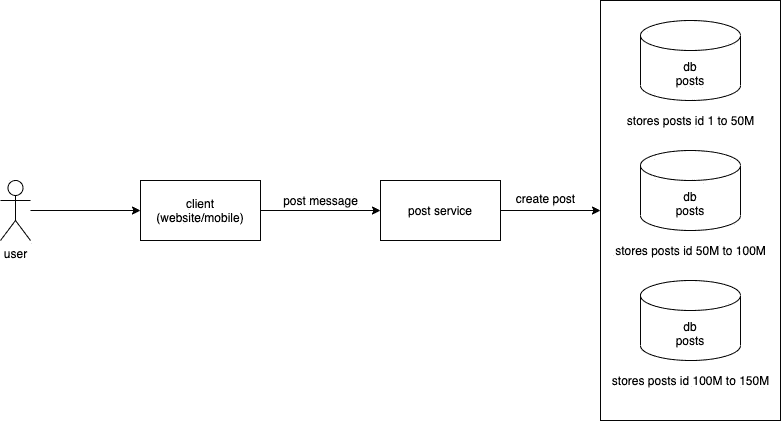
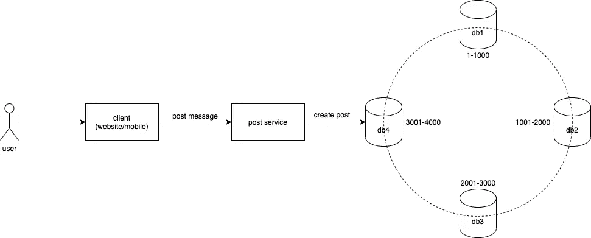
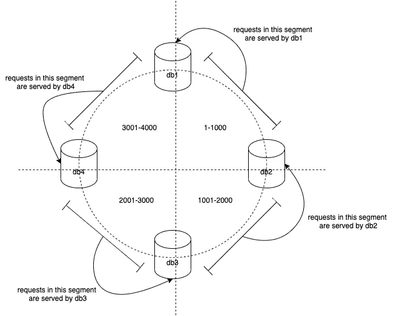
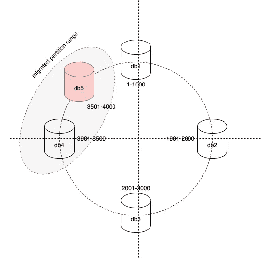
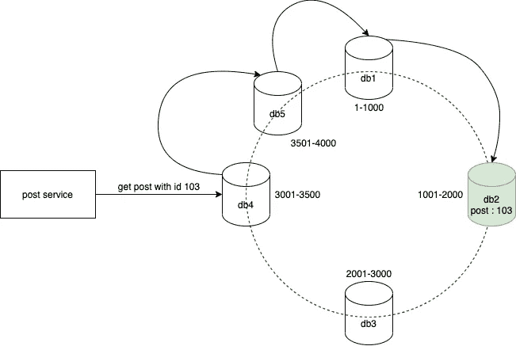
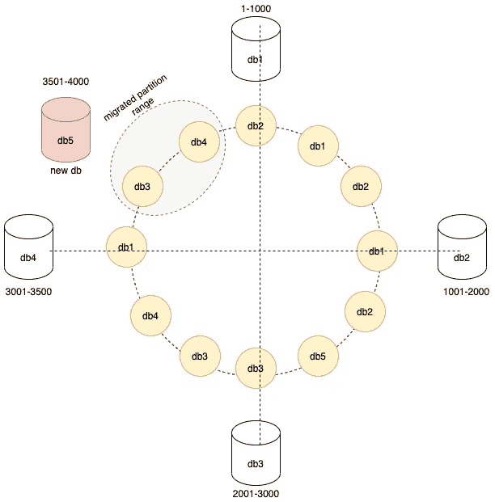

# 一致散列法

> 原文：<https://medium.com/nerd-for-tech/consistent-hashing-6524e48ac648?source=collection_archive---------6----------------------->

> 在计算机科学中，一致散列是一种特殊的散列，使得当调整散列表大小时，平均只需要重新映射 n/m 个键，其中 n 是键的数量，m 是槽的数量

这就是维基百科对一致性哈希的定义！首先，谁理解维基百科的定义？不多吧？所以让我们试着打破这个定义，看看有什么值得我们学习的。

假设我们想要创建一个允许用户分享帖子的社交媒体网站。现在让我们把这篇文章作为一个简单的消息。那么这个系统的架构会是什么样的呢？停下来思考几分钟。

如下图所示，用户使用客户端(也称为网站/移动设备)创建并共享随机帖子，该客户端将请求转发给我们的后端服务，即 post 服务，后者立即向 db 发出创建帖子条目的请求。



我们社交媒体应用的系统架构

这一流程目前运作良好，因为我们的社交媒体网站现在还不出名，也没有多少帖子被创建。最近，我们的网站获得了用户的关注，我们开始每天收到 1000 万个帖子请求。你认为我们现有的系统会发生什么变化？

下面给出了每天 1000 万次 post 请求的存储需求预测。



存储需求预测

我们将需要 5 GB 的磁盘存储来存储一天的帖子。这是海量的数据！如果我们试图在我们可怜的单机数据库实例中存储如此巨大的数据，会发生什么？

简单的回答——它会崩溃。

长回答—在某些时候，我们可能需要为帖子添加搜索功能，在这种情况下，我们需要为数据库添加某种索引。大多数索引都存储在数据库机的 RAM 中，以便快速访问。但是在我们的例子中，索引会很大(由于大量的数据，感谢我们网站的流行),很难将索引完全放入 RAM 中。这可能会影响我们的数据库性能，降低我们的搜索速度。因此，将我们的数据存储在单一数据库中可能不再有效。

假设我们已经理解了这个问题，让我们试着找到一个解决办法。

我们创建多个数据库实例，每个实例只存储数据的一个子集，怎么样？

如下图所示，我们创建了 3 db 机器，只存储下图所示的文章 id 范围。我们的后端服务基于 post id 将 post create 请求路由到正确的 db 机器。这种技术会将我们的写入吞吐量提高 3 倍，并将写入分布在 3 台机器上。问题解决了！恭喜你。



数据库分区

但是这种方法有一些问题，

*   我们需要通过对数据进行大量假设来预先手动定义分区范围。这真的很糟糕，因为我们可能会得到偏斜。
*   在我们的示例中，数据可能不会均匀分布在 3 db 机器上。为什么这是个问题？假设我们网站的大部分阅读请求来自 id 在 50 米到 100 米之间的帖子，会发生什么呢？与其他数据库相比，在我们的示例中只有第二个数据库可以获得大多数请求，对吗？这称为热点，在我们的示例中，数据库机 2 将成为热点。
*   当我们想要添加更多的数据库机器或者将一个热点机器分成子机器时会发生什么？我们将如何处理分区范围的重新平衡？难题本身！

# 一致哈希到救援

一致散列法解决了上述所有问题。即

*   热点
*   扭曲的数据
*   重新平衡分区



一致散列法

一致散列是如何做到的？让我们来看看。

通过 post id 进行分区的思想保持不变。但是，我们可以通过散列函数传递 post id，并使用输出编号来查找 db 机器，而不是盲目地根据 post id 将创建 post 请求转发到特定的分区。迷茫？让我解释一下。

哈希函数接收数据，可以是字符串、数字或任何东西，然后输出一个数字。哈希函数的重要特性是，对于给定的输入，输出总是相同的。此外，来自哈希函数的数字将均匀分布，因此没有偏斜分布。

```
// hash functions take anything and return a number 
h(anything) -> number // Hash function return the same number for same input 
h(abc) -> 3241 
h(abc) -> 3241
```

例如，让我们看看当我们试图创建一个 id 为 101 的帖子时会发生什么。

1.  用户创建了 id 为 101 的帖子
2.  客户端将帖子转发到我们的后端服务
3.  后端服务使用散列函数并为给定的帖子 id 101 生成一个数字 2002
4.  数据存储在 db3 中，因为它包含分区范围 2001–3000，如上图所示

```
post 101 -> h(101) -> 2002 -> store in db3
```

让我们用许多帖子来推断这个想法，

```
post 101 -> h(101) -> 2002 -> store in db3 
post 102 -> h(102) -> 98 -> store in db1 
post 103 -> h(103) -> 1987 -> store in db2 
post 104 -> h(104) -> 3444 -> store in db4 
post 105 -> h(105) -> 44 -> store in db1 
get post 101 -> h(101) -> 2002 -> get from db3
```

所以散列函数确保将帖子均匀地分布在我们拥有的所有数据库机器上。该函数通过将分区分割成围绕一个圆的虚拟段来实现这一点，其中落入该段的任何键都将由负责该分区的特定机器来服务。下图很好地说明了这个想法。



一致散列分区

在上图中，范围为 1–1000 的分区将由 db1 提供服务，范围为 1001–2000 的分区将由 db2 提供服务，依此类推。

我们最初提到的两个问题使用一致散列法解决了，

*   热点(已解决)
*   倾斜数据(已解决)

让我们解决最后一个问题，即当添加或删除新节点时，如何正确地重新平衡分区？

当我们向集群添加一个新的数据库机器时，假设在 db4 的分区范围(即 3001–4000)之间，将会发生以下变化:

1.  db4 将使用缩小的范围重新划分，例如，eg 的范围为 3001–3500。
2.  db5 将从 d4 获得剩余的分区范围，即 eg 的 3501–4000。
3.  数据需要从 db4 移动到 db5(注意，剩余的 db1、db2 和 db3 不受影响)
4.  最后，我们的群集重新平衡到 5 db 机器，没有任何停机时间，并且可以获得 5X 写入吞吐量。



一致性哈希重新平衡

删除节点的逻辑也以类似的方式工作。你可以试着把它作为一个练习来解决。

这就是我们如何使用一致散列法有效地对数据库集群(多个数据库的组合)进行分区。现在，我们的社交媒体网站可以毫无问题地扩展许多倍。

但是如果你很好奇，你可能会有一个问题——我们需要在后端服务中自己计算散列吗？

好问题。

答案是，我们不需要计算任何哈希值。Apache Cassandra 等生产数据库将自动计算散列，并跟踪每台数据库机器中分区范围到数据库的映射。与 dbs 中的实际数据相比，该元信息相对较小。然后，我们的后端服务可以连接到任何数据库机器获取数据，如果没有找到数据，请求将自动重新路由到包含数据的正确机器。这种技术是通过一个叫做流言协议的概念实现的。以下是代表这一想法的图表。



请求路由

如果一致散列的初始定义现在没有什么意义，请在评论中告诉我。

> 在计算机科学中，一致散列是一种特殊的散列，使得当调整散列表大小时，平均只需要重新映射 n/m 个键，其中 n 是键的数量，m 是槽的数量

# 奖金概念

我们的社交媒体网站能够很好地适应大负载，我们很高兴，我们的客户也很高兴。很好，但是很快我们可能会在重新平衡期间面临数据库机器停机。为什么？如果您还记得，当我们向集群中添加一台新机器 db5 时，我们需要重新平衡 db4 和 db5 之间的分区，对吗？这需要将键的子集从 db4 移动到 db5。如果子集很大，可能会使 db4 负担过重，导致失败。

如何克服这一点？智能和简单，我们可以引入许多虚拟节点(在下图中显示为黄色),这些虚拟节点代表实际的数据库并分布在不同的部分。它们不是真正的机器，只是为了在集群中均匀分布数据。

例如，在下图中，我们可以看到每个段中的数据分布在多个数据库中，即段 1 数据现在分布在 db2 和 db1 机器上，段 2 数据分布在 db1、db2 和 db5 上，依此类推。在重新平衡期间，即添加 db5 时，仅灰色标记的虚拟节点(即 db3 和 db4)表示的数据需要进行数据迁移。因此，从技术上来说，我们没有给 db4 增加负担，而是在一小部分 db3 和 db4 机器之间分担迁移负载。随着虚拟节点数量的增加，这种重新平衡过程会变得更加高效。



一致散列虚拟节点

本帖到此为止，感谢阅读。我们下次再见，在那之前保重，继续学习:)