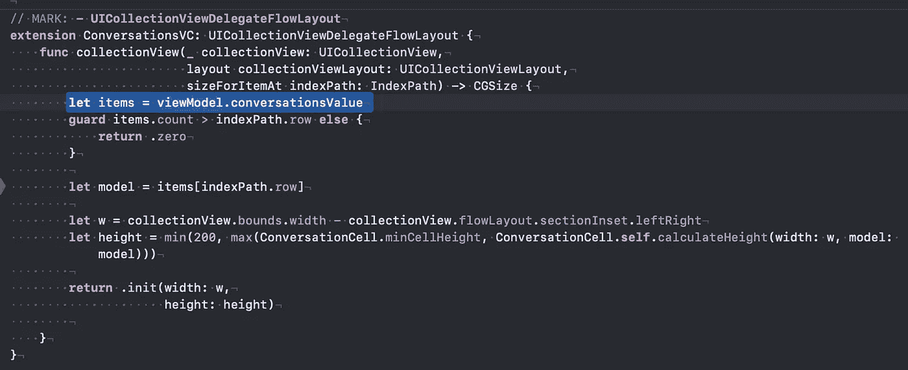
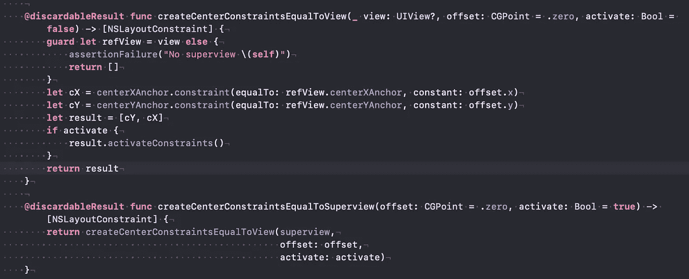
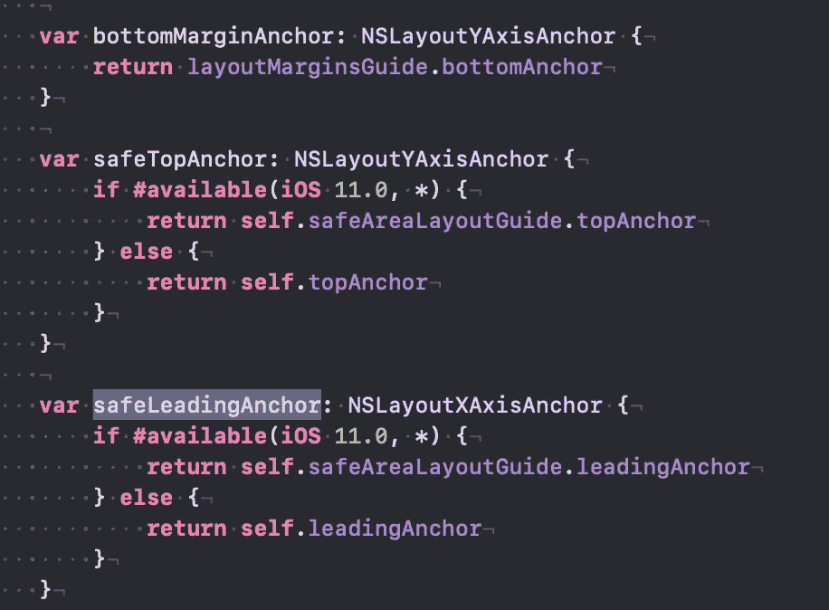
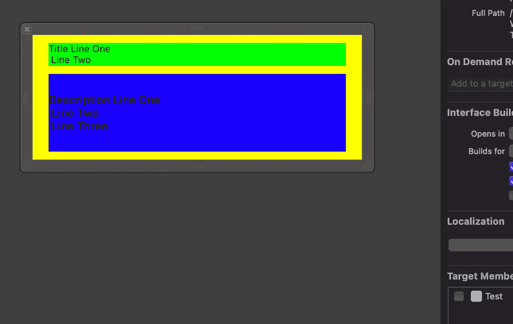

# 约束:在代码中创建(II)

> 原文：<https://medium.com/nerd-for-tech/constraints-creation-in-code-ii-68ec2bf7505d?source=collection_archive---------13----------------------->

在之前的[文章](/nerd-for-tech/constraints-introduction-part-i-5f6fb459704e)中，我们谈到了约束，考虑了它们的属性。让我们揭示用代码创建它们的不同方法。

就个人而言，我更喜欢在代码中创建约束，而不是在 IB 中构造或使用 XIB 文件。特别是，如果你有一些“助手”来创建约束。对于复杂的 UI，可视化地创建约束可能比在代码中创建更容易。然而，即使在代码中也有一些技巧，我将在文章中演示…

## 我是如何开始并喜欢在代码中进行约束的:)

最初，我用视觉来创造它们。但是很久以前没有(故事板)SB 的参考，如果它们被不同的开发者改变，合并 SB 会有问题。我开始使用 **SnapKit** ，但是在那些日子里你必须写一些额外的，有点难看的代码来修改约束的*常量*值。我相信事情已经改变，但我的习惯“留”在我身边:)该库基于块的使用，不允许在不重新创建或重新激活它们的情况下激活约束，这是相当繁重的操作。另外，对于自定义大小的{Collection}ViewCell ，您必须返回单元格的预期高度(通常从静态高度开始)。所以同步调用应该返回 height，而不是在主线程上异步执行:



数据源的预期单元格高度。

我的意思是 **calculateHeight** 应该是同步的，它内部的异步调用可能会影响单元格的返回高度。

这就是我开始为约束创建自己的“助手”的方式…在简单关系的情况下，可以直接使用“锚”。例如:

```
view.topAnchor.constraint(equalTo:**self**.collectionView.bottomAnchor).isActive = **true**
```

不要忘记约束的**标识符**和视图的**可访问性标识符**

在 Xcode 的控制台中跟踪约束会容易得多，否则你必须打印对象( **po** )，将其转换为某种类型等等。

与其复制约束，不如使用扩展来“锚定”这个和“锚定”那个。例如，让我们创建一个子视图，将它放置在父视图的中心:



中心约束



不同种类的布局锚点

锚点可以相对于视图，或者可以考虑视图周围的**方向布局边距**或**安全区域**。

**边距**可以在不激活、取消激活约束的情况下移动视图，非常方便，加上属性*preserveparentlayyoumargin*可以确保内容放在父级的边距内。

## 更新约束

批量更改、创建约束要高效得多。在视图中有一个 **updateConstraints** 方法，您可以在其中添加约束。(例如，如果约束数组为空，则填充它)

```
**override** **func** updateConstraints() { 
     **super**.updateConstraints()  
     **guard** rtcRendererConstraints.first?.isActive == **false** **else** { **return** }
     rtcRendererConstraints.activateConstraints()
}
```

顺便说一句，因为有 forceLayout，所以也有 force update 约束，请参见下面的要点:)

# 细胞的特性

如果我们有表格或集合视图，它在单元格中的初始框架由布局的**项大小决定。因此，当在代码中创建约束时，不要忘记默认情况下为(50，50)的框架可能会导致违反约束。如果没有足够的空间或大小大于 50，则在计算大小之前，将验证约束。**

```
**override** **init**(frame: CGRect) {
   **super**.init(frame: frame)
   setup()
}func setup() {
  // don't forget about initial, when you define vertical margins, otherwise constraints activation might lead to their violation... }
```

# 视觉格式语言

可视格式还允许在另一个方向添加约束。例如，不仅要水平排列元素，还要定义项目的垂直方向(例如，将它们放在中间或顶部)。如果失败，你将得到*运行时*异常。让我们在代码中创建一种垂直堆栈视图，然后在不执行的情况下可视化它。

这里，我们从设置方法添加 2 个标签，并强制更新约束。我们对齐标签的前导锚和尾随锚，并考虑**方向布局边距。**描述标签也可以在垂直方向上扩展和压缩(内容抱紧&抗压)。

为了可视化视图，我们需要使它成为可设计的，并覆盖 prepareForInterfaceBuilder 方法。上面我们定义了背景颜色(黄色，绿色&蓝色)并提供了一些文本。之后只需为 **VerticalStackView** 创建一个 XIB，但是**不要将它包含到目标**中:



假 XIB，不纳入目标

对于定位视图，验证约束系统，即求解方程组。即使没有违反约束，它们也会被“检查”。因此，在单元格中，通过直接设置其框架来调整视图可能更容易。

当在代码**中创建视图时，translatesAutoresizingMaskIntoConstraints**为**真，自动调整掩码**不会添加额外的约束。因此，如果需要，可以在**布局子视图**方法**、**内“调整”子视图的框架，而不是依赖约束:

```
**override** **func** layoutSubviews() {
  **super**.layoutSubviews()
  assert(lblDescr.translatesAutoresizingMaskIntoConstraints)
  assert(lblDescr.autoresizingMask.isEmpty)
  // set frame w/o constraints, it might be faster especially in  //Collection(table) view cells 
  //lblDescr.frame = ...
}
```

另外，不要忘记 **hasAmbiguousLayout** 属性，这可能揭示一些约束的问题。另一个问题是，我们不能在基于 **traitCollection，**的约束中添加“变化”，这在 **Interface Builder 中是可能的。我们必须处理尺寸变化(旋转)和激活，去激活不同的约束。**

在本文中，我们检查了在代码中创建约束的可能方式。谈到不运行应用程序的布局可视化，只是通过使用“假”的 xib。