# 约束条件:简介(第一部分)

> 原文：<https://medium.com/nerd-for-tech/constraints-introduction-part-i-5f6fb459704e?source=collection_archive---------19----------------------->

在这一系列文章中，我们将考虑定位子视图的约束。考虑它们的一些属性和特性。

# 什么是约束？

简而言之，这是一种线性依赖:一种将一个元素的参考点锚定到另一个元素或其自身的方法。约束定位视图，它们定义线性方程组。为了不产生歧义，应该有一个解决方案。

每个约束可以由以下公式表示:

```
**y {relation} a * x + b // for example y >= a * x + b**
```

其中一个视图的 y 锚点(中心、前导、高度)，相对于另一个视图的适当锚点和{关系}可以是 **=、> =、或=<= T3。约束的最佳表示可以通过 **NSLayoutConstraint** init(构造函数)方法来演示。让我们创建一些纵横比的依赖关系:**

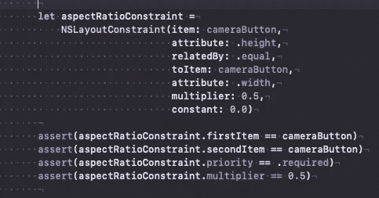

高度=宽度* 0.5 + 0.0

要激活约束，只需将其' **isActive** 属性或调用 static**nslayoutconstraint . activate**方法。始终可以修改常量值，但修改优先级和乘数约束**不应激活。**否则你会得到运行时异常。

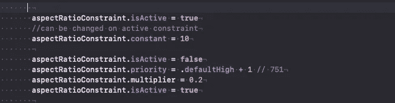

更改非活动约束中的优先级

如果视图没有被添加到 superview 中，也会发生另一个异常&您试图激活约束，即下面的断言将会失败:**assert(**aspectrationconstraint . is active = = camerabutton . superview！=零 **)**

通常使用 **PropertyAnimator** 或调用静态方法**ui view . animate(with duration..**

```
 **let** newValue: CGFloat = 200.0
 //UIViewPropertyAnimator
 UIView.animate(withDuration: 0.5, 
               delay: 0.1, 
               options:    .curveEaseInOut.union(.beginFromCurrentState)) {
      constr?.constant = newValue
 } completion: { finished **in** // }
```

# UIView 内部:

每个视图应该有 4 个约束(记住**帧**)。2 个 x 相关，2 个 y 相关。它可以居中&大小。可以是左上约束&右下约束。

但是等等，你可能会说，我只是拖放了“Hello World”标签放在中间，然后我只添加了 2 个约束，而不是 4 个。额外的 2 是从**固有内容大小生成的。**(2 NSContentSizeLayoutConstraint 约束)**约束保存在视图中。每个视图都有约束数组属性，添加&移除方法。**

让我们假设在一个视图中有 2 个标签容器，其中有额外的标签:(lbl1 包含 lbl2 & lbl3 包含 lbl4)。

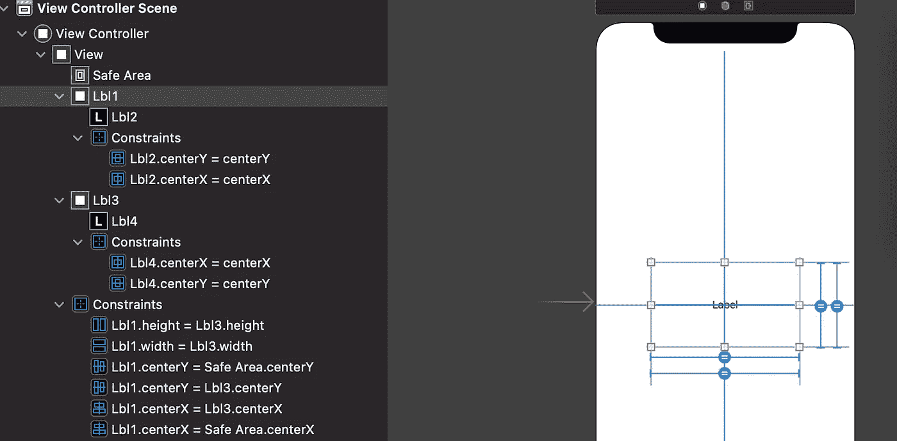

两个带有子标签的容器(标签)

请注意，相对于 lbl1{3}定位 lbl2{4}中心的约束条件位于 lbl1{3}内部。定位 lb3{1}的约束存储在它们的超级视图中，即视图控制者的视图中。此外，在故事板中，假尺寸约束(占位符约束)只是为了正确显示内容。这里(在 SB 中)没有显示所有的约束。尤其是视图控制器的视图约束，因为它将被添加到窗口中，并且将有视图的超级视图。

让我们在代码中创建一些标签:

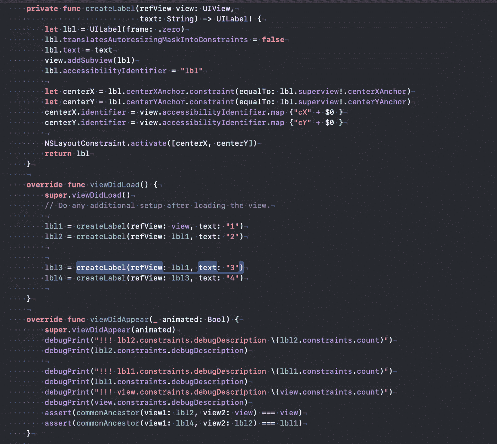

**注意:**注意，子视图(lbl)可以有可访问性标识符(可以用于单元测试&调试)，约束也可以有 id。检查控制台的输出，我们可以看到 vc 的视图有 4 个约束，但我们没有在 sb 或代码中添加任何约束:

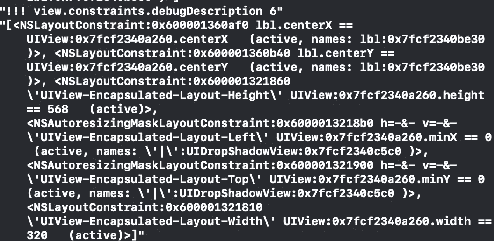

这是因为视图被添加到了窗口中，该窗口显示在应用程序的屏幕(主屏幕)上。

就个人而言，为了添加将与父视图匹配的子视图，而不是创建至少两个约束，我使用了**自动调整大小掩码**和**translatesAutoresizingMaskIntoConstraints(默认为 true** )。

```
**//extension** UIView {**func** makeFlexibleSizeUsingAutoresizingMask() {
  translatesAutoresizingMaskIntoConstraints = **true** autoresizingMask = [.flexibleWidth, .flexibleHeight]
}**// add subview and match it is size with parent
func** addAndMatchSize(subview refView: UIView) {
  addSubview(refView)
  refView.frame = bounds // define initial frame   
  refView.makeFlexibleSizeUsingAutoresizingMask()
}
```

为了找到一个视图(约束容器),在其中放置约束(包含第一和第二项),我们必须遍历视图的层次结构。

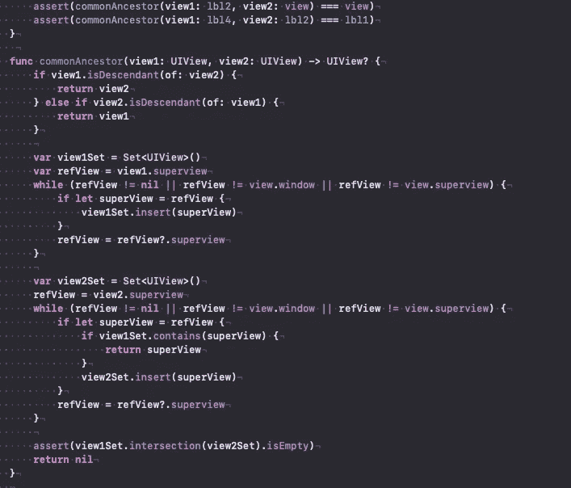

找到要放置约束的视图。

这里我们检查视图是否直接相互连接，如果不是，我们创建一组父视图并找到第一个交集。视图应该有一些共同的祖先，并且应该有 superview，否则将会引发运行时异常。

为了从一侧访问约束，我们可以在其上使用引用，或者从另一侧我们可以使用**constraintsAffectingLayout(for**:)方法，指定适当的轴(垂直或水平)。我们可以遍历它们的集合，甚至通过标识符找到约束。让我们看看如何访问高度约束(假设它有“高度”标识符):

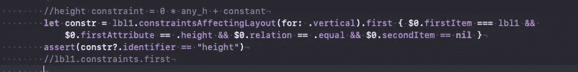

访问高度约束

在这种情况下，高度约束的乘数为零，只是一些常量值。

# 违反约束:

通常我们通过使用弱引用或弱出口来访问约束。约束是有优先级的，如果有一个优先级较高的约束，它将优先于另一个优先级较低的约束。最新的约束将被“停用”，但它将被保留在原始的约束数组中。然而，在违反约束的情况下，违反的约束不仅会被“停用”，而且会从包含的数组中删除。至少我能回忆起老版本操作系统(早于 iOS 13)上的这种行为。那么约束上弱引用可以被无效。在这种情况下，你必须保持对约束的强引用，否则有可能得到 **NullReference** 异常。在装有 iOS 14.5 的模拟器上快速播放高度限制演示了**逻辑已经改变**:限制被保留，并处于活动状态，但是我们会看到违反限制的调试消息…

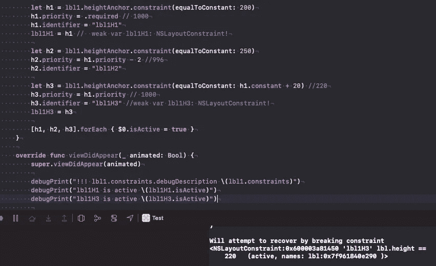

违反了最新的约束

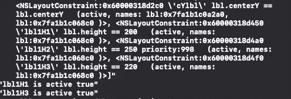

冲突的约束都保存在 lbl1 的约束数组中。

让我们回到固有的内容大小。

# 内在内容大小

根据官方文档:“这是接收视图的自然大小，仅考虑视图本身的属性”。所以 **UILabels，UIButtons** 和其他大多数提供的控件都有默认大小。要在自定义视图中添加类似的行为，必须覆盖父方法:

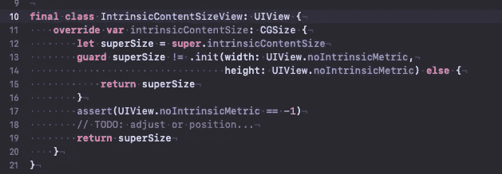

重写方法以返回隐式大小

默认情况下，当没有内部内容大小时，返回 **noIntrinsicMetric(-1)** 。

# 内容拥抱，抗压:

**内容拥抱**优先级定义视图在多大程度上限制其内容的伸展，即视图拥抱自己的程度。默认优先级是 250。(较低)

**压缩阻力**表示视图抵抗压缩的程度。默认优先级是 750。低优先级的约束可能会受到压缩阻力&内容拥抱的影响，因为基本上它们的优先级可能高于或低于上述属性。

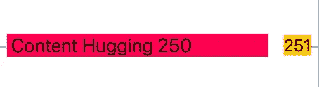

带 2 个标签的水平堆栈视图

让我们考虑具有两个标签的水平堆栈视图:第一个标签具有较低的内容拥抱，因此如果堆栈视图完全填充 superview，则可以扩展。

在第一篇文章中，我们考虑了约束、它们的属性、描述的内容拥抱和压缩阻力、固有内容大小。在下面的文章中，我们将考虑创建约束和调试约束的不同方法。