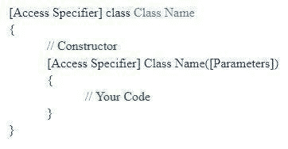
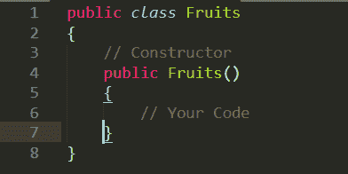
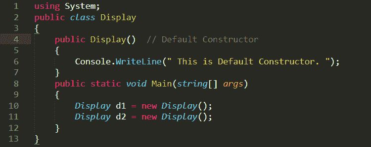
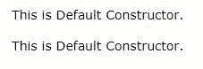
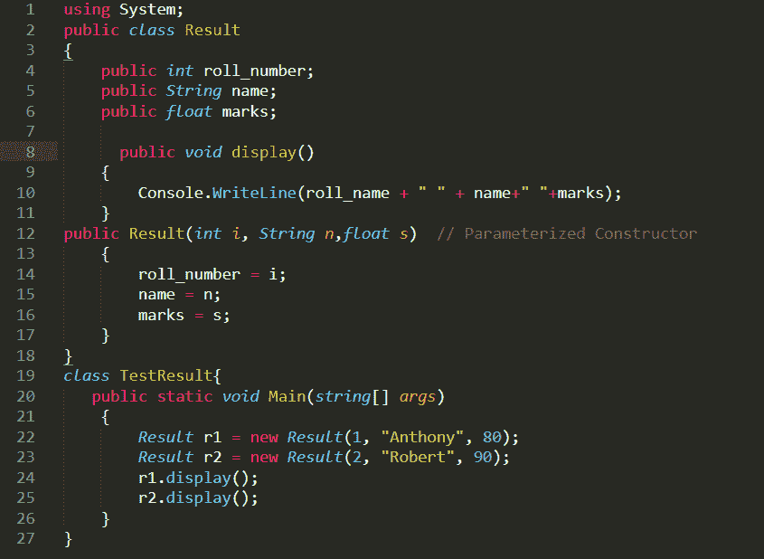
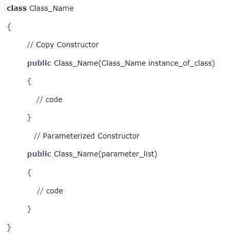
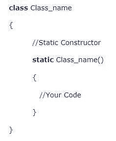
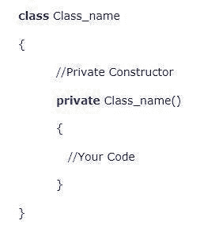

# 升 C 调的构造函数

> 原文：<https://medium.com/nerd-for-tech/constructors-in-c-sharp-74751cfb0543?source=collection_archive---------16----------------------->

要开发任何应用程序，定义变量是过程中非常关键的一部分。在。Net framework 中，简单数据类型到其默认值的定义是由 C#完成的。然而，在创建特定的类或结构时，必须决定默认值，这可以通过使用构造函数来实现。

构造函数通常用于初始化类的属性。它还在初始化类的数据成员时为类分配内存。

在这篇文章中，我们将了解什么是 C#中的构造函数，以及如何在 C #中定义不同类型的构造函数。

**目录**

●什么是建造师？

●构造函数的语法

●构造者的显著特征

●构造函数的类型有哪些？

●结论

# C#中什么是构造函数？

构造函数是在创建类或结构的实例时调用的方法。构造函数通常用于在创建类的实例时初始化类或结构中的私有字段。当程序员没有显式定义构造函数时，为类创建默认构造函数。因此，每个类总是至少有一个构造函数，即使程序员没有创建任何构造函数。这个默认的构造函数会将所有的数字数据值初始化为零，将对象和字符串初始化为 null。

# 构造函数的语法

以下是构造函数的一般语法:-

以上是构造函数的一般语法，访问说明符根据程序的需要有所不同。

示例:-

在上图中，你可以看到 Fruits 是一个类，在这个类中创建了一个与类名同名的构造函数。构造函数是公共的，所以对它的访问没有限制。因此，当创建类的对象时，这个构造函数的数据成员在子类中也是可访问的。

# 构造函数的显著特征

构造函数的主要特征是:

*   一个类可以有任意数量的构造函数。
*   它没有返回类型。这甚至包括无效。
*   静态类的构造函数永远不能参数化。
*   一个类中只能创建一个静态构造函数。
*   构造函数可以被重写。

# 构造函数的类型有哪些？

# 默认构造函数

当没有参数传递给构造函数时，该构造函数被称为默认构造函数。默认构造函数的主要缺点是我们不能用不同的值初始化类的不同实例，因为所有的实例都将使用默认构造函数中定义的相同值来创建。这个默认的构造函数会将所有的数字数据值初始化为零，将对象和字符串初始化为 null。

以下是默认构造函数的示例-

**

输出:

# 参数化构造函数

当一个构造函数接受至少一个参数时，它被称为参数化构造函数。参数化构造函数相对于默认构造函数的优势在于，我们可以用不同的值初始化一个类的不同实例，从而使它更加动态和健壮。

以下是参数化构造函数的示例:-

输出:-

# 复制构造函数

复制构造函数是在创建新对象时从另一个对象复制变量的构造函数。复制构造函数主要用于用前一个实例的值初始化新的实例。

复制构造函数的语法如下

在上图中，使用现有实例创建了一个复制构造函数。复制构造函数复制该现有实例的所有数据成员。

# 静态构造函数

当使用 static 关键字定义构造函数时，对于所有实例，它只被调用一次，也就是说，当类的第一个实例被创建时。在 C#中使用静态构造函数是为了初始化应用程序的静态字段，对于所有实例只需要执行一次。

静态构造函数的主要特性:-

*   静态构造函数没有访问说明符，也没有任何参数。
*   只有在创建类的第一个实例时，才会调用静态构造函数。
*   不能直接调用静态构造函数。
*   用户不能控制程序中静态构造函数的执行。

静态构造函数的语法如下

**

在上图中，我们可以看到一个静态关键字被用来创建一个静态构造函数。在静态构造函数中，只能有在程序执行期间只初始化一次的数据成员。

# 私有构造函数

当用私有访问说明符创建构造函数时，它被称为私有构造函数。只有当类的所有成员都是静态的时，才能使用这种类型的构造函数。

私有构造函数的语法如下

**

在上图中，我们可以看到 private 关键字被用来创建私有构造函数。任何实例都不能调用私有构造函数。私有构造函数只包含静态数据成员。

# 结论

这篇文章介绍了构造函数的一些关键概念及其用法。在下一个 C#应用程序中，当创建类的实例时，只要在类或结构中定义私有字段，就要使用构造函数。

*原载于*[*https://www . partech . nl*](https://www.partech.nl/nl/publicaties/2021/03/constructors-in-c-sharp)*。*