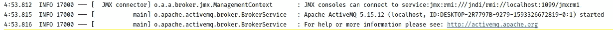
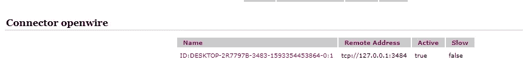
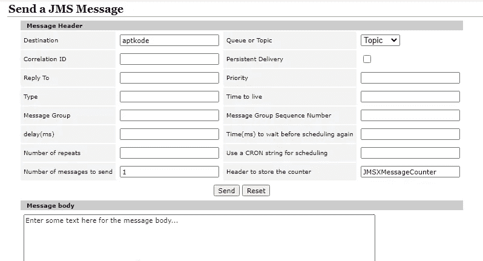
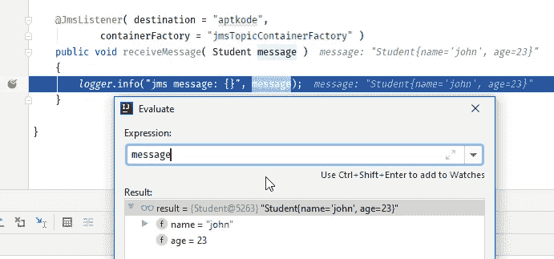

# 使用 ActiveMQ 和 SpringBoot 立即消费 JMS 消息

> 原文：<https://medium.com/nerd-for-tech/consume-jms-messages-with-activemq-and-springboot-in-no-time-41cf413eac3a?source=collection_archive---------2----------------------->

我希望你很清楚什么是 ActiveMQ 和 SpringBoot，那么这篇文章可能对你有用。我想在一个 spring boot 应用程序中使用一些 ActiveMQ 消息，但是我从来没有想到会这么容易。正如你可能已经体验过的，spring boot 有一些黑魔法(是的，它有它的理由，我们可以破解它)。既然它是神奇的，我们应该正确地了解它，以便在更短的时间内启动和运行。所以根据我的经验，这是食谱。注意，我不会把它和 Artemis(ActiveMQ 的后继者)混为一谈。

# 项目设置

前往 https://start.spring.io/的。选择您的构建风格和运行时设置。然后添加 ActiveMQ5 和 Web 依赖项，如果你想跟着做[抓住我的](https://start.spring.io/#!type=maven-project&language=java&platformVersion=2.3.1.RELEASE&packaging=jar&jvmVersion=1.8&groupId=com.aptkode&artifactId=spring-boot-activemq-demo&name=spring-boot-activemq-demo&description=Demo%20project%20for%20Spring%20Boot%20and%20ActiveMQ&packageName=com.aptkode.&dependencies=web,activemq)。

# 我们需要的豆子

我们需要提供一个名为 **MessageListenerContainer** 的接口来实现 spring boot。不要担心，spring-jms 构件中有一个默认的实现。但是我们需要配置它(目的地、qos、主题/队列等)。不是直接创建`MessageListnerContainer`，我们必须用特定的配置创建**JMS listenercontainerfactory**的实现。此外，对于这个接口，它有默认的实现，我们可以使用没有任何麻烦。这是我们唯一需要启动并运行的 bean。下面是最终的引导应用程序类的样子。

看看我用来创建容器工厂的方法。参数配置器负责该容器工厂的自动布线。

在这个设置和第一次运行之后，我对日志感到有点惊讶。

嵌入式 ActiveMQ 代理日志

是因为我没有在 application.properties(你的情况下可能是 yml)文件中添加`spring.activemq.broker-url`属性。一旦我添加了属性，日志就消失了，这意味着没有嵌入式代理。

# 消费话题

虽然我之前没有提到，但在`jmsTopicContainerFactory`方法中，我设置了`factory.setPubSubDomain(true);`，它让容器消费主题。如果你想听队列，就避开这个。

现在我们来看看`receiveMessage`方法。它用`@JmsListner`注释进行了注释，并使该方法被发送到 destination 属性中指定的主题的消息触发。还要注意，containerFactory 属性值应该是 containerFactory bean 名称(这里是方法名称)。

现在获取您的 ActiveMQ 代理 url，并将其添加到 application.properties 中。

设置并启动应用程序后，它将显示在 activemq broker ui 的 connections 选项卡中，如下所示(默认情况下，webui 在 activemq 主机上的端口 8161 上运行，默认用户名/密码是 admin/admin)。

openwire 协议连接到 spring boot 应用程序

这里我用的是 openwire 协议，如果你用的是不同的协议，设置会有很大的不同。我创建了一个名为`aptkode`的主题，并通过 web ui 发送了一条消息。

ActiveMQ Broker Web UI 发送 JMS 消息

这是应用程序日志。

应用程序日志中的 jms 消息

这意味着文本类型的消息转换器正在开箱即用。

# 将 JSON 消息作为类型使用

有一个名为`MappingJackson2MessageConverter`的类，在包括官方教程在内的大多数教程中都有使用。但是我花了很长时间才弄明白它是如何工作的。如果你在 spring 中使用`JmsTemplate`并使用它发送消息，那么使用上面提到的类并让它工作会很容易。但在我的情况下，它是由一个我无法控制的不同应用程序发送的。所以下面的方法工作得很好。

首先我们需要实现`MessageConverter`类。因为我正在读取消息，所以我不打算实现`toMessage`方法。

剩下的唯一一件事就是将`@JmsListener`注释方法的类型改为`Student`或任何你想要的类。

试一试，它开始工作了。

已将邮件转换为 pojo

但是请注意，您不能添加新的转换器并期望它转换另一种类型。如果你想转换多种类型，你必须配置工厂。它将产生新的`MessageListnerContainer`，并使用`factory.setMessageConverter(MessageConverter converter);`方法中已配置的转换器进行转换。

就这样，我们很快就消费了 ActiveMQ 消息。感谢阅读。