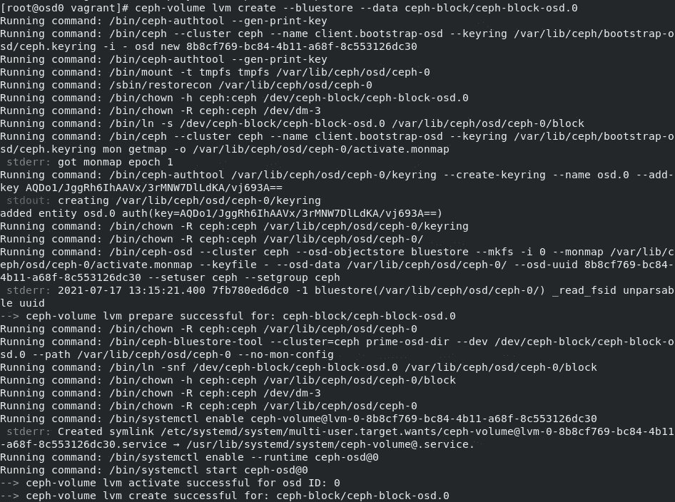
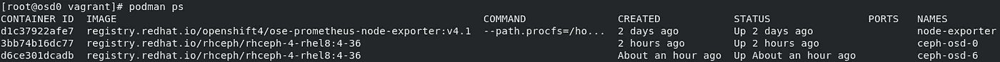

# 集装箱化 Ceph OSD 更换

> 原文：<https://medium.com/nerd-for-tech/containerized-ceph-osd-replacement-744918b7417a?source=collection_archive---------7----------------------->

如今，随着每项服务都迁移到微服务，我们认为是时候在我们的 Ceph 集群上以 SDS 的形式进行迁移了。当从恶魔化的 Ceph 集群迁移到容器化的存储守护进程(CSD)时，我确保我们在容器化的方法中为每种情况设置了一个过程。

在这个过程中，我将演示如何删除和添加一个新的 OSD 磁盘，同时模拟一个失败的磁盘 OSD。这个过程包括诊断集群的状态、故障磁盘&最终替换磁盘模拟。

在投入时间和精力后，我认为与社区分享这个过程会很棒。

## **要求**

*   Ceph 星团
*   已安装“ceph-common”软件包
*   已安装“ceph-osd”软件包

## **程序**

首先，我们安装了一个“健康的”容器化 Ceph 集群。

```
[root@mon0 vagrant]# ceph -s
 cluster:
 id: 38456c75–20b5–4fac-81d7–228f89eb3255
 health: HEALTH_OK

 services:
 mon: 3 daemons, quorum mon0,mon1,mon2 (age 112m)
 mgr: mon1(active, since 2d), standbys: mon2, mon0
 osd: 8 osds: 8 up (since 3m), 8 in (since 3m)
 rgw: 6 daemons active (mon0.rgw0, mon0.rgw1, mon1.rgw0, mon1.rgw1, mon2.rgw0, mon2.rgw1)

 task status:

 data:
 pools: 11 pools, 256 pgs
 objects: 407 objects, 16 KiB
 usage: 8.3 GiB used, 78 GiB / 86 GiB avail
 pgs: 256 active+clean
```

假设我们在主机“OSD0”上有一个有故障的 OSD 磁盘，我们想要替换该磁盘。

首先，通过运行“ceph osd 树”来确定发出的磁盘主机位置

```
[root@mon0 vagrant]# ceph osd tree
ID CLASS WEIGHT  TYPE NAME     STATUS REWEIGHT PRI-AFF 
-1       0.08398 root default                          
-3       0.02100     host osd0                         
 0   hdd 0.01050         osd.0   down  1.00000 1.00000 
 6   hdd 0.01050         osd.6     up  1.00000 1.00000 
-5       0.03149     host osd1                         
 2   hdd 0.01050         osd.2     up  1.00000 1.00000 
 4   hdd 0.01050         osd.4     up  1.00000 1.00000 
 7   hdd 0.01050         osd.7     up  1.00000 1.00000 
-7       0.03149     host osd2                         
 1   hdd 0.01050         osd.1     up  1.00000 1.00000 
 5   hdd 0.01050         osd.5     up  1.00000 1.00000 
 8   hdd 0.01050         osd.8     up  1.00000 1.00000
```

> ceph osd tree cmd 将显示所有参与的集群 osd 以及它们在一个漂亮的树形结构中的挤压位置

您还可以通过使用 grep“down”来缩小搜索范围，如下所示。

```
[root@mon0 vagrant]# ceph osd tree | grep down
 0 hdd 0.01050 osd.0 down 1.00000 1.00000
```

很好，我们发现磁盘“osd.0”有问题，现在我们可以使用“ceph OSD find”cmd 后跟 osd id 来搜索问题磁盘的主机。

```
[root@mon0 vagrant]# ceph osd find osd.0
{
    "osd": 0,
    "addrs": {
        "addrvec": [
            {
                "type": "v2",
                "addr": "192.168.42.13:6800",
                "nonce": 49383
            },
            {
                "type": "v1",
                "addr": "192.168.42.13:6801",
                "nonce": 49383
            }
        ]
    },
    "osd_fsid": "8b8cf769-bc84-4b11-a68f-8c553126dc30",
    "host": "osd0",
    "crush_location": {
        "host": "osd0",
        "root": "default"
    }
}
```

现在我们可以继续这个过程，并访问发出的磁盘主机，在本例中是“osd0”。

最棘手的是，在访问 osd 磁盘主机后，通过执行以下命令删除发出的 osd:

> 请记住，在运行一个命令到另一个命令时，执行“ceph -w”来观察 Ceph 的健康状况，以实现数据完整性。

```
[root@osd0 vagrant]# ceph osd out osd.0
[root@osd0 vagrant]# ceph osd down osd.0
[root@osd0 vagrant]# systemctl stop ceph-osd@0.service
[root@osd0 vagrant]# ceph osd rm osd.0
[root@osd0 vagrant]# ceph auth del osd.0
[root@osd0 vagrant]# ceph osd crush rm osd.0
```

更换物理磁盘之前，执行下一个命令以防止回填:

```
[root@osd0 vagrant]# ceph osd set noout
```

在从发布的磁盘中删除我们的集群的任何踪迹之后，使用“lslbk”cmd 来标识托管 OSD 的磁盘，以便在磁盘上删除卷组和逻辑卷。


使用“ceph-volume”实用程序删除磁盘的 VG 和 LV，同时指定发布的磁盘路径，如下所示:

```
[root@osd0 vagrant]# ceph-volume lvm zap /dev/sdd
```

我们现在可以在激励新磁盘进入集群后取消设置“noout”选项。

```
[root@osd0 vagrant]# ceph osd unset noout
```

现在，磁盘应该是没有 LVM 的裸磁盘，这样我们就可以模拟一个新的磁盘附加场景。

让我们按照我们的命名约定，在新设备上配置一个新的 PV、VG 和 LV，为新磁盘进入我们的集群做准备。

```
[root@osd0 vagrant]# pvcreate /dev/sdc
[root@osd0 vagrant]# vgcreate ceph-block-osd.0 /dev/sdc
[root@osd0 vagrant]# lvcreate -L 10.70g -n ceph-block-osd.0 ceph-block-osd.0 /dev/sdc
```

我们准备使用“ceph-volume”实用程序将这个新磁盘添加到我们的集群中，如下所示:

```
[root@osd0 vagrant]# ceph-volume lvm create --bluestore --data ceph-block-osd.0/ceph-block-osd.0
```

该命令将以容器化的方式创建一个新的 OSD 层。该命令还打包了多个操作来配置新的 OSD，例如将磁盘配置为其存储后端的“bluestore ”,以处理其所有数据。



由“ceph-volume”执行的命令

正如您所看到的，在运行这个命令之后，我们为新磁盘创建了一个新的 osd 容器，这个容器安装在它的上面。



我们可以运行“ceph -s”和“ceph osd tree”命令来检查配置新磁盘后集群的状态。

```
[root@osd0 vagrant]# ceph -s
  cluster:
    id:     38456c75-20b5-4fac-81d7-228f89eb3255
    health: HEALTH_OK

  services:
    mon: 3 daemons, quorum mon0,mon1,mon2 (age 5h)
    mgr: mon1(active, since 2d), standbys: mon2, mon0
    osd: 8 osds: 8 up (since 88m), 8 in (since 88m)
    rgw: 6 daemons active (mon0.rgw0, mon0.rgw1, mon1.rgw0, mon1.rgw1, mon2.rgw0, mon2.rgw1)

  task status:

  data:
    pools:   11 pools, 256 pgs
    objects: 407 objects, 16 KiB
    usage:   8.5 GiB used, 77 GiB / 86 GiB avail
    pgs:     256 active+clean

  io:
    client:   4.0 KiB/s rd, 0 B/s wr, 3 op/s rd, 2 op/s wr
```

```
[root@osd0 vagrant]# ceph osd tree
ID CLASS WEIGHT  TYPE NAME     STATUS REWEIGHT PRI-AFF 
-1       0.08398 root default                          
-3       0.02100     host osd0                         
 0   hdd 0.01050         osd.0     up  1.00000 1.00000 
 6   hdd 0.01050         osd.6     up  1.00000 1.00000 
-5       0.03149     host osd1                         
 2   hdd 0.01050         osd.2     up  1.00000 1.00000 
 4   hdd 0.01050         osd.4     up  1.00000 1.00000 
 7   hdd 0.01050         osd.7     up  1.00000 1.00000 
-7       0.03149     host osd2                         
 1   hdd 0.01050         osd.1     up  1.00000 1.00000 
 5   hdd 0.01050         osd.5     up  1.00000 1.00000 
 8   hdd 0.01050         osd.8     up  1.00000 1.00000
```

```
[root@osd0 vagrant]# ceph auth list
installed auth entries:osd.0
 key: AQDo1/JggRh6IhAAVx/3rMNW7DlLdKA/vj693A==
 caps: [mgr] allow profile osd
 caps: [mon] allow profile osd
 caps: [osd] allow *
```

我们成功地用“HEALTH_OK”作为指标替换了 OSD。此外，我们确保该磁盘是 crush 层次结构的一部分，并且列在 Ceph 的身份验证列表中。

我希望这个过程对您有所帮助，并使迁移到容器环境变得更加容易。感谢观看，我说你在下一个。