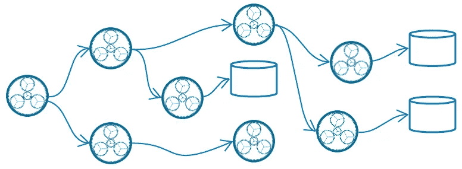

# 集装箱化微服务

> 原文：<https://medium.com/nerd-for-tech/containerized-microservices-a5dce87fab82?source=collection_archive---------5----------------------->

## 对性能有什么影响？

> 许多有经验的软件工程师都担心容器化的微服务。让我们来解决工程师最担心的一个最常见的微服务误解——性能差。

微服务架构模式的许多好处来自于它的组件可以被实现和部署的细粒度。实际上，部署和管理真正的微服务(相对于 Spring Boot SOA 服务)需要 [**容器化**](/nerd-for-tech/designing-microservices-4130bc41c046#ff29) 和容器编排( [**Kubernetes**](https://kubernetes.io/docs/tutorials/kubernetes-basics/) )的力量。

*Kubernetes 可以部署在云和本地数据中心，也可以部署在 Linux、Windows 和 Mac 电脑上。*

简单来说，*容器*是一个虚拟化的可执行映像。该映像可以被推送到一个集中的容器注册中心，Kubernetes 使用该注册中心将容器实例部署到集群的 pod。

一个 *pod* 可以被看作是容器实例的一种包装器。每个 pod 都有自己的 IP 地址，通过该地址它可以与群集中的其他 pod 进行交互。通常，一个 pod 只包含一个容器。但是如果容器需要共享资源，一个 pod 可以包含多个容器。如果一个 pod 中有多个容器，这些容器通过 *localhost* IP 地址相互通信。

**图 1:典型的微服务吊舱组成**

在实现微服务架构模式时，一个 pod 至少包含一个应用程序容器和一个 [*消息代理代理*](/nerd-for-tech/designing-microservices-4130bc41c046#126e) 边车容器(将它连接到其余的应用程序微服务)。通常，主微服务容器将与它直接发送消息的任何从属微服务容器一起打包在一个 pod 中。

> 术语 ***容器*** 不应与术语 **W *eb 容器*** (也称为 ***servlet 容器*** )混淆，后者是与 Jakarta Servlets 交互的 Web 服务器的组件。Web 容器创建 servlet 实例，加载和卸载 servlet，创建和管理请求和响应对象，并执行其他 servlet 管理任务。

关于微服务的一个常见问题是多个容器的运行时开销以及它们之间连接的延迟。实际上，对于设计合理的微服务来说，这很少是个问题。

这里是众多 [**基准**](https://drive.google.com/file/d/1ImWL0y-ZT7_oIALw69wJAn-yB94u_g3W/view?usp=sharing) 中的一个，表明容器在 CPU 性能、内存吞吐量、磁盘 I/O、负载测试和操作速度方面比虚拟机表现更好。容器针对快速启动小型可执行文件进行了优化。同一集群内的微服务之间的消息传递延迟可以忽略不计。

## 包扎

单个微服务:

*   在单个**域有界上下文**中实现一个**任务**(或一组密切相关的任务)。这是微服务的一个基本特征，它促进了高层次的*粒度*和*关注点分离*，从而保持了微服务*的自主性*和*的独立可部署性*。
*   **是松耦合的**，通过消息传递或事件进行通信，并且很少或不需要了解其他微服务的定义——强制*关注点分离*。
*   是**自治的**，并且可以在相关开发团队之间较少协调的情况下进行开发和修改——促进良好的*敏捷开发实践*。
*   **可独立部署**，并且可以单独测试、部署和回滚，而不会影响其他微服务——支持基于云的*自动化部署、扩展和故障转移*。

如果没有容器和容器编排，部署、管理和运行许多微服务所需的开销甚至会高得令人望而却步。如果不是因为容器和容器编排，对微服务架构模式的许多批评都是合理的。

> 微服务旨在水平扩展，以满足性能目标。对于某些应用程序用例来说，这不是一个选项，在这些用例中，直接优化 CPU、内存、I/O 或网络资源的使用是满足性能要求的唯一方法。这些用例可能不适合微服务架构模式。

为了设计和实现有效的微服务，我们必须了解和使用这种使能技术。容器化和容器编排正是为此而优化的。它们不是性能和操作问题。

## 推荐阅读

*   [设计微服务](/nerd-for-tech/designing-microservices-4130bc41c046)
*   [微服务架构](/nerd-for-tech/microservice-architecture-622e4148f1)
*   [云软件架构](/nerd-for-tech/software-architecture-for-the-cloud-c9226150c1f3)