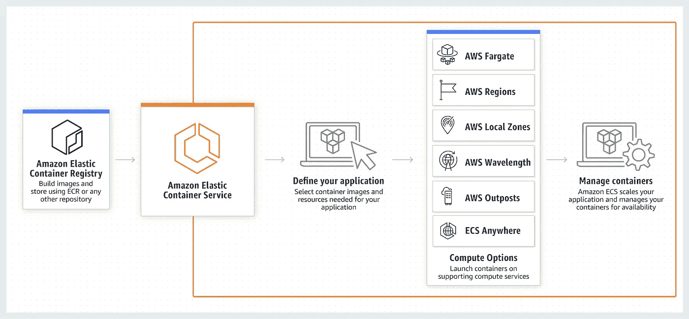

# AWS 中的容器(亚马逊网络服务)

> 原文：<https://medium.com/nerd-for-tech/containers-in-aws-amazon-web-services-fcc329342135?source=collection_archive---------10----------------------->

# 什么是容器？🤔

容器是一个标准的软件单元，它将代码及其所有依赖关系打包在一起，因此应用程序可以快速可靠地从一个计算环境运行到另一个计算环境。

简而言之，容器可以想象成一个包，它将把应用程序的所有代码、配置和依赖项都包含在一个对象中。通过这种方式，容器虚拟化了操作系统，可以在任何地方运行，从私有数据中心到公共云，甚至是在开发人员的个人笔记本电脑上。

容器使用/共享安装在您希望运行该容器的特定服务器上的操作系统。它作为资源隔离的流程运行，确保快速、可靠和一致的部署，不受环境影响。

# 为什么我们需要容器？

对于开发人员来说，容器确实是一个强大的解决方案，可以打包和部署他们的应用程序，在从一个计算环境转移到另一个计算环境时可靠地运行。

假设，你在 Debian 上开发了一个应用程序并运行了你的测试，使用了特定版本的编程语言、特定的网络拓扑、安全策略和存储，但是你知道生产环境与你的工作环境并不相同。它将在不同版本的编程语言、Red Hat 操作系统、不同的网络拓扑和安全设置上运行。那么在这种情况下，如果你试图运行你的应用程序，那么你的应用程序很有可能会崩溃或者发生一些奇怪的事情。

## 为了解决这类问题，我们使用了**容器。**

如前所述，Container 将包含所有完整的应用程序代码、其运行时环境、库、依赖项和运行它所需的其他必要配置文件，打包成一个包。

通过容器化应用程序平台及其依赖项，操作系统分布和底层基础设施的差异被抽象出来。👍

# 容器的用例:-

1.  **微服务:-** 容器提供了进程隔离，这使得应用程序可以很容易地分解并作为称为微服务的独立组件运行。
2.  **批处理:-** 将批处理和 ETL 作业打包到容器中，以快速启动作业并根据需求动态扩展它们。
3.  **机器学习:-** 使用容器快速扩展用于训练和推理的机器学习模型，并在任何平台上靠近您的数据源运行它们。
4.  **混合应用:-** 容器让您可以标准化代码的部署方式，从而轻松地为在内部和云环境之间运行的应用构建工作流。
5.  **应用程序向云的迁移:-** 容器使得打包整个应用程序并将其迁移到云变得容易，而无需进行任何代码更改。
6.  **平台即服务:-** 使用容器来构建平台，使开发者不再需要管理基础设施，并标准化应用的部署和管理方式。

# AWS 上的集装箱:-

它可以分为三类:-

1.  注册处
2.  编排(ECS，EKS)
3.  计算(EC2)

## 书记官处(E **CR) :-**

ECR Eelastic**C**ontainer**R**registry 是一个完全托管的容器注册中心，可以轻松地在任何地方存储、管理、共享和部署您的容器映像和工件。Amazon ECR 消除了操作自己的容器存储库的需要，也不用担心底层基础设施的扩展。

ECR 在一个高可用性和高性能的架构中托管您的映像，允许您为您的容器应用程序可靠地部署映像。您可以在组织内部私下共享容器软件，也可以在全球范围内公开共享容器软件，供任何人发现和下载。

> **亚马逊 ECR 的工作:-**

## ECR 的好处:-

1.  使用完全托管的注册表减少您的工作量。
2.  安全地共享和下载容器图像。
3.  提供快速且高度可用的访问。
4.  简化您的部署工作流程

## 编排:-

1.  **ECS** 代表**E**elastic**C**computer**S**service，这是一种高度可伸缩的容器管理服务，可以轻松运行、停止和管理集群上的容器

**在学习 ECS 之前，必须了解 Docker 的概念，并在[***Docker***](https://amanchopra-atg.medium.com/docker-a-beginners-guide-338f20f5f113)上查看我的博客

> **亚马逊 ECS 的工作:-**

ECS 在预装 Docker 的 Amazon EC2(弹性计算云)虚拟机实例集群上运行**您的容器。它通过 API 和 AWS 管理控制台处理容器的安装、伸缩、监控和管理。**

## ECS 的使用案例

**ECS** 主要用于:-

**微服务**

微服务是用软件架构方法构建的，这种方法将复杂的应用程序分解成更小的独立服务。

在设计微服务架构时，请务必考虑**自动扩展、服务发现、授权和秘密管理、日志记录、持续集成和持续部署**

**批处理作业**

**EKS** 代表 **E** 塑料 **C** 容器 **S** 服务对于 **K** ubernetes 来说，使用 AWS 上的 Kubernetes 可以轻松部署、管理和扩展容器化的应用程序。

Kubernetes 多样化的工具生态系统包括，例如，模板部署工具 Helm(及其大型公共图表库)、Istio、Envoy 和各种服务网格、证书管理工具(如 Jetstack 的 cert-manager)以及大量跟踪、监控和指标报告解决方案(Prometheus、Grafana、Jaeger 等)。尽管 ECS 支持一些相同的工具集，如 Prometheus 和 Grafana，但它并没有从这种大范围的增强中受益。

> **亚马逊 EKS 的工作:-**

EKS **跨多个可用性区域运行 Kubernetes 控制平面**，自动检测和替换不正常的控制平面节点，并提供按需、零停机升级和修补。EKS 提供 99.95%的正常运行时间 SLA

## EKS 的使用案例

1.  混合部署
2.  机器学习
3.  成批处理
4.  网络应用
5.  大数据

## 计算(EC2) :-

EC2 代表**E**elastic**C**loud**C**compute 是一个 web 服务，它在云中提供安全的、可调整大小的计算能力。它旨在使开发人员更容易进行网络规模的云计算。

Amazon EC2 的简单 web 服务接口允许您以最小的摩擦获得和配置容量。它为您提供对计算资源的完全控制，并让您在 Amazon 成熟的计算环境中运行。

**EC2 的特性:-**

Amazon EC2 为构建可伸缩、故障恢复的企业级应用程序提供了许多强大的特性，但是其中一些特性是:-

1.  响应不断变化的容量需求
2.  配置的灵活性
3.  精确控制
4.  与其他 AWS 服务的集成，如 RDS、SimpleDB 和 SQS。
5.  安全性
6.  EC2 提供负担得起的小时费率。

如果你想了解更多关于云计算和 AWS 的基础知识，请登录我的博客 [***查看 AWS 终极指南或简介***](https://amanchopra-atg.medium.com/aws-amazon-web-services-41fc7e59fc27)

请务必与我联系👇👇

1.  [***LinkedIn***](https://www.linkedin.com/in/aman-chopra-375a81171)
2.  [***Github***](https://github.com/Aman1905)
3.  [***推特***](https://twitter.com/iam_chopra_aman?s=09)