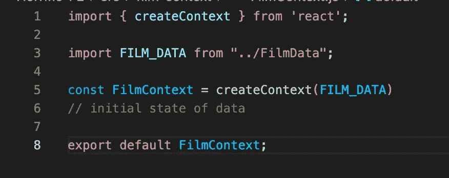
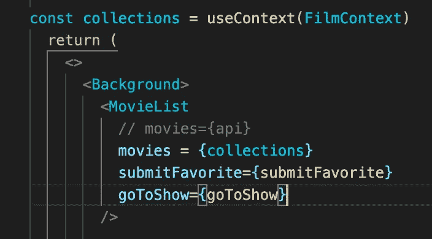

# 对于较小的 React 项目，使用 ContextAPI 和 useContext vs Redux

> 原文：<https://medium.com/nerd-for-tech/contextapi-and-usecontext-vs-redux-for-smaller-react-projects-8ee31b79fdc9?source=collection_archive---------9----------------------->

在创建 React 应用程序时，状态管理是最重要的考虑因素之一。根据项目的大小，您可能希望实现一个像 Redux 这样的库，以便在一个地方(即存储区)收集状态。

问题是设置 Redux 需要大量的工作和大量的文件，对于一个中小型项目来说，这种麻烦和复杂并不总是值得的。介于两者之间吗？是的，输入 Context API 来存储数据，并使用 Context 钩子来检索数据。

根据反应文件，

> “上下文提供了一种通过组件树传递数据的方式，而不必在每一级手动向下传递属性。”

文档解释说，这对于您可能希望保留在“全局”状态的某些信息特别有用，包括 UI 主题、语言首选项和当前用户。

为了在我自己的环境中进行测试，我将大量数据转移到上下文中。

作为一点参考，我正在部分重构的项目是一个以恐怖电影为中心的社交媒体网站，一个供恐怖电影粉丝搜索、分类和评论他们最喜欢的作品并与视频参考一起讨论这些作品的平台。

整个项目实现了一个 Rails 后端作为 API，它允许在特定的路由中内置很多特性。我不会改变这一切。现在，我将简单地重新定位数据，并以不同的方式访问它。

我没有调用 OMDB API，而是将来自 OMDB 的特定 JSON 数据保存到一个文件中，我称之为 FILM_DATA。它只是一个电影对象的集合，每个对象都包含标题、发行年份、海报图像 url 和电影描述等信息。

除了组件之外，我还创建了一个上下文文件，就像您创建一个单独的 redux 文件一样。我在里面放了一个 FilmContext 文件。

以上是访问信息并在应用程序中传递信息所需的全部内容。

从 React 导入的 createContext 方法可以接受字符串、对象、数组等，它是我们将从其他地方提取我们想要的电影值 FILM_DATA 的来源。

我在上面的代码中放置了一个注释，FilmContext 表示 FILM_DATA 对象的初始状态。我有意使用这种语言，因为上下文 API 就像一个 Redux reducer，其中您总是引用 INITIAL_STATE。通过上下文提供者，我可以跟踪并实现对这个初始状态的任何上下文更改。

现在，在最初调用外部 API 的电影容器组件中，我导入 FilmContext 文件并从 React 导入 useContext。我不再需要 useEffect，因为我不再获取数据。

useContext 挂钩允许我们获取上下文中的值，并将其存储为常量。所以现在，在容器组件内部，我可以说 const collection = useContext，并传入我想使用的上下文，在本例中是 FilmContext。

我现在可以访问所有相同的电影数据。您可以看到，我已经注释掉了之前保存在 state 中并作为道具传递的 API 数据。我现在正在做同样的事情，除了从上下文 API 访问数据。这并不是一个完美的例子，因为我仍然将数据作为一个道具传递下去，但是这显示了实现 useContext 挂钩是多么容易，以及在许多组件中访问这些信息是多么容易，而不需要 Redux。

上下文并不是 React 的新特性，但是 useContext 钩子提供了很多独立于 Redux 和其他状态管理库的功能。值得注意的是，像 React- Redux 这样的库在幕后使用上下文 API。这就是商店和所有与 Redux 实现相关的东西(如分派和将状态匹配到道具)如何到达应用程序的其余部分。

最终，上下文 API 看起来不像是一个完全的 Redux 替代。随着您的应用程序规模的增长，您可能会有许多上下文提供程序(允许您动态地利用除初始状态之外的上下文)，您需要将这些提供程序包装在应用程序周围，以便广泛访问。但是，使用 Redux，您只需要一个提供者，它传递存储，然后存储被分解成多个 reducers。基本上，坚持使用 Redux，你会得到一个更整洁的 index.js 文件。

因此，如果您的应用程序非常大，有很多可重用的组件和特性，您可能希望坚持使用 Redux。否则，上下文 API 和 useContext 挂钩可能是一个不错的折中解决方案。