# 持续部署:Azure DevOps 上 iOS 的 CI/CD(第 2 部分)

> 原文：<https://medium.com/nerd-for-tech/continuous-deployment-ci-cd-for-ios-on-azure-devops-part-2-a95983db0475?source=collection_archive---------3----------------------->

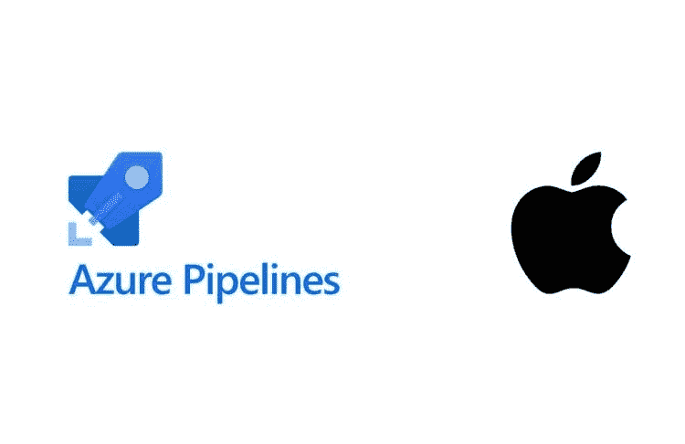

在最后一部分中，我们使用 [Azure DevOps](https://dev.azure.com/) 的管道特性创建了一个版本。在本教程中，我们将使用 Azure 的发布管道将版本推送到应用商店。这是 CI/CD 的持续部署部分。

在 DevOps 上打开您的项目，并在左侧面板的“Pipelines”部分中选择“Releases”。选择“新管道”,这将打开一个用于选择模板的对话框。

# 模板选择和设置

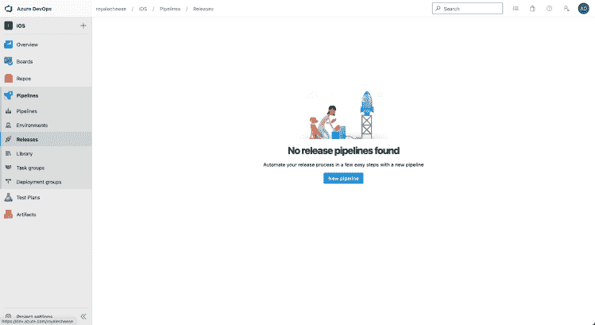

我们将选择一个空作业，因为没有用于将构建上传到 App Store 的预定义模板。

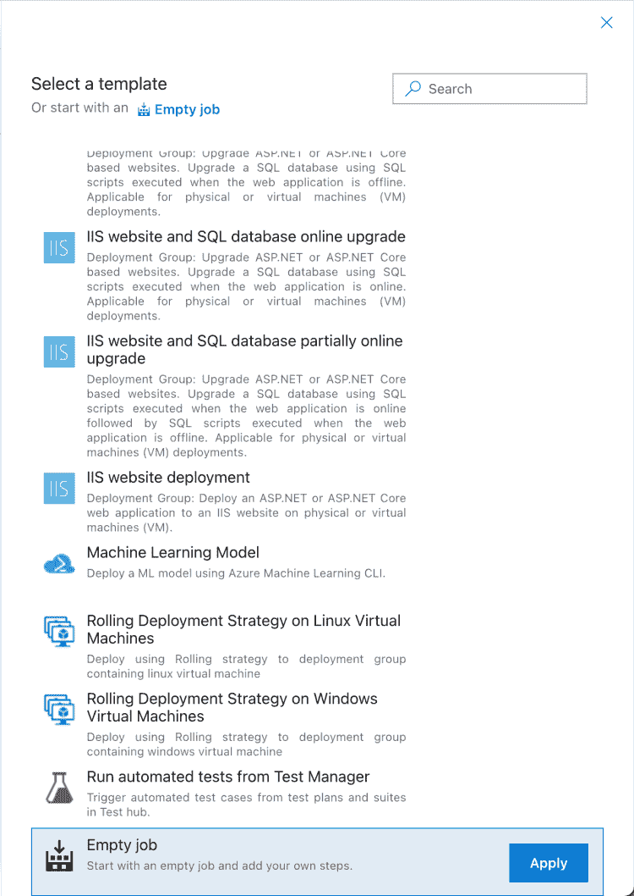

输入阶段名称“部署”。它可以是您想要的任何东西，但是为了清楚起见，我将其设置为部署。

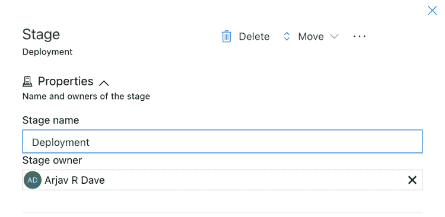

我们现在将选择一个我们想要上传的工件。工件是在 Azure 构建管道运行时创建的东西。所以在我们的例子中，工件是从我们之前的教程中生成的。

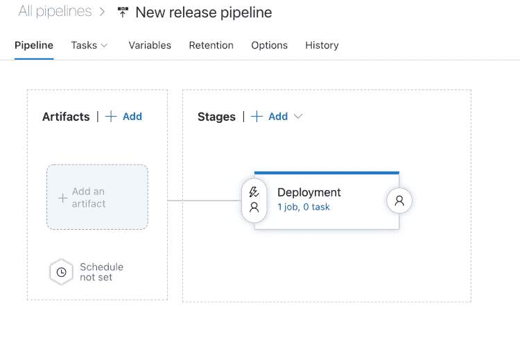

点击*工件*标签旁边的*添加*按钮，或者点击*添加工件*。这将在右边打开一个新的对话框。

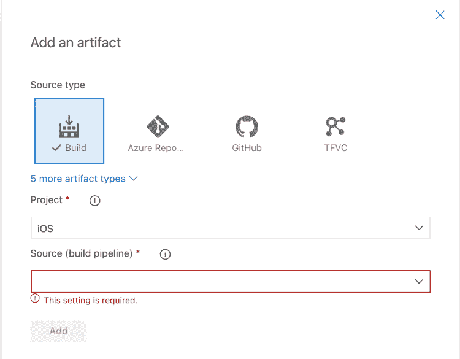

在下拉列表中，您将看到我们在上一个教程中的 CI 设置。选择并点击*添加*按钮。

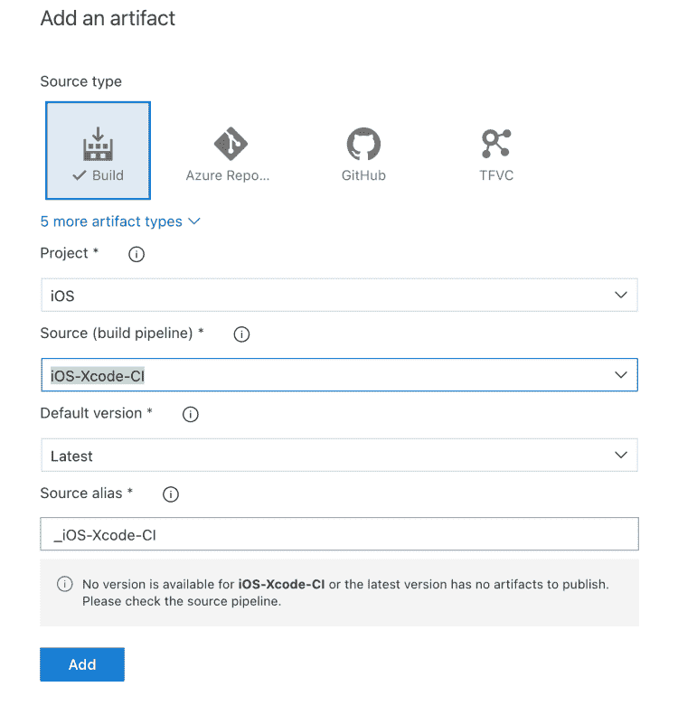

添加工件后，我们的发布管道将看起来像下面这样。

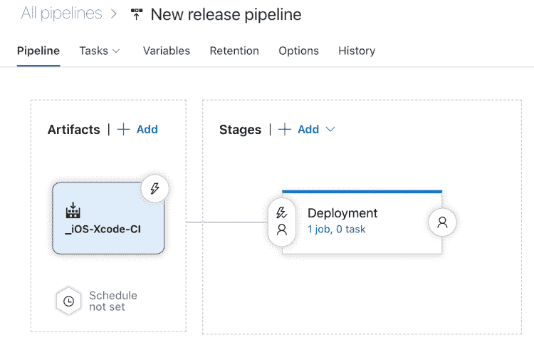

现在为我们刚刚添加的工件选择*闪电*图标。这将在右侧打开一个对话框，其中包含启用/禁用持续部署触发器的设置。当构建触发器启用时，当我们的构建(CI)管道完成一个新的构建时，我们的发布管道将自动启动。我们不会启用拉取请求触发器。

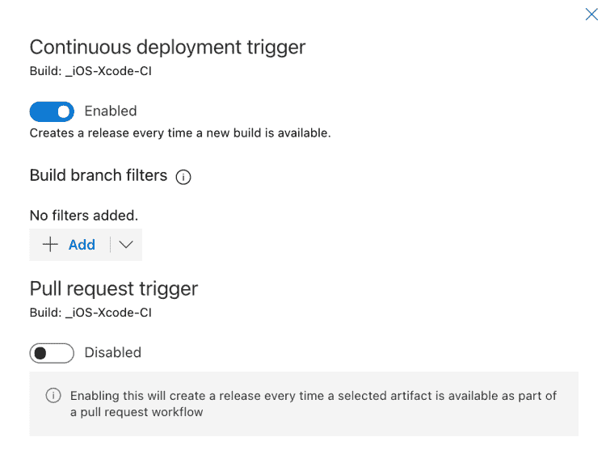

到目前为止，我们已经将管道设置为在我们的构建管道中有新的构建可用时自动启动。我们还设置了一个*部署*阶段，我们将在下一节中为实际部署添加任务。

# 部署任务

选择 *1 作业 0 任务*超链接，将切换到任务选项卡。选择*代理作业*旁边的+号，打开新任务列表。搜索*苹果应用商店*。如果你没有看到任何任务，你将不得不从市场安装应用程序。一旦安装完毕，当你再次搜索*苹果应用商店*时，你会看到如下几个新任务。

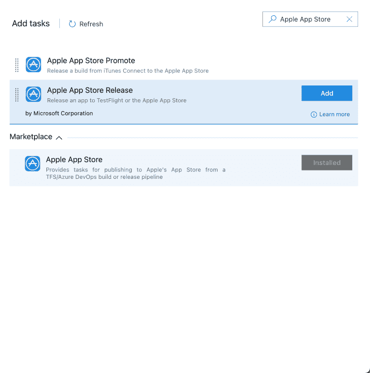

添加*苹果应用商店发布*任务。它将添加需要*服务连接*的任务。服务连接基本上是与苹果 itunesconnect 网站的连接。

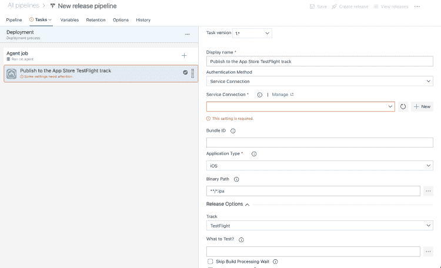

我们现在将添加一个新的服务连接。点击服务连接旁边的*新建*按钮，这将打开一个新的对话框。在新建对话框中输入电子邮件的&密码。尽管*特定于应用的密码*和*浪子会话*被标记为可选，但它们对于将构建上传到应用商店的自动化过程是必需的。

# 特定于应用程序的密码

要创建特定于*应用的密码*，请在新标签中访问[appleid.apple.com/account/manage](https://appleid.apple.com/account/manage)并向下滚动至安全部分。点击标签*特定于应用程序的密码*下方的*生成密码……*链接，这将打开一个对话框。输入标签的任意名称并点击*创建*。复制生成的文本并切换回我们的 Azure DevOps 选项卡，然后将其粘贴到特定于应用程序的密码字段下。

# 浪子会话令牌

作为先决条件，您的机器上应该已经安装了 fastlane。浪子需要生成会话令牌，这样我们的云机器就可以在没有我们干预的情况下自动登录。是时候打开终端并发出一些命令了。

`fastlane spaceauth -u xxxxxxx@gmail.com`

作为双因素身份验证的一部分，您将被要求输入密码，然后输入一个 6 位数的代码。它将为您生成会话令牌，并询问您是否要复制它。按“y ”,然后切换到您的 Azure DevOps 选项卡，并将会话令牌粘贴到*浪子会话*字段中。

根据您的偏好输入服务连接名称，并根据需要输入描述。

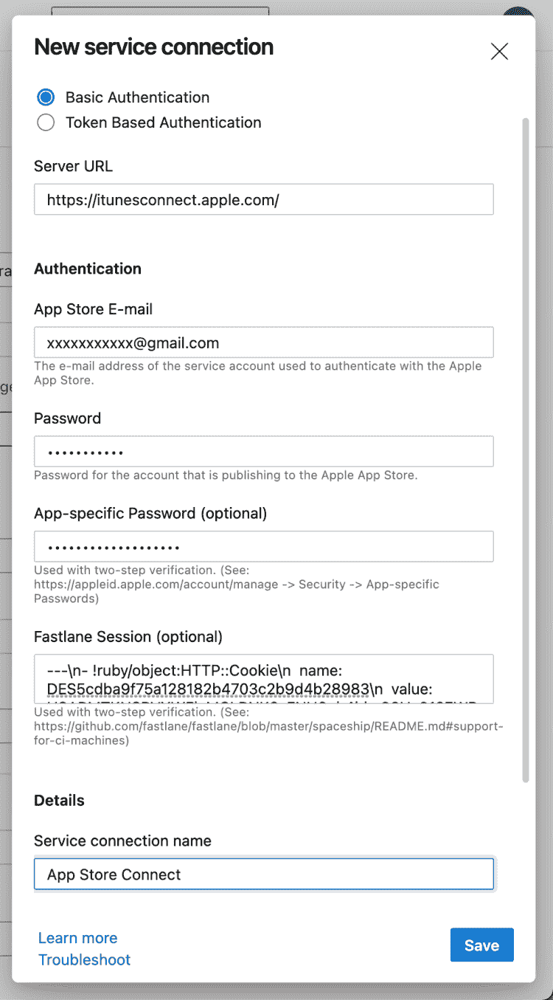

# 发布详细信息

您将看到服务连接现在已经设置好了。接下来输入您的应用程序的捆绑 id。选择*跳过构建处理等待*和*跳过提交*以便我们的管道不等待构建可用，否则它将消耗宝贵的构建时间。最后输入 *App 专用 Apple Id* ，登录[https://appstoreconnect.apple.com](https://appstoreconnect.apple.com/)点击你的 App 查看详情，最后访问*通用*部分下的 *App 信息*即可获得。

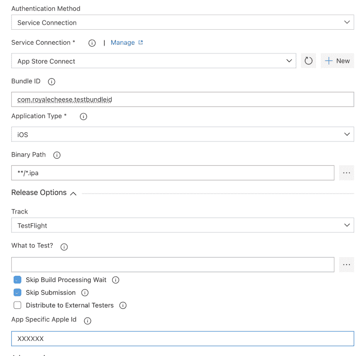

就这样了，伙计们。当您运行您的管道并看到随着任务的完成，绿色的勾号一个接一个地出现时，您的辛勤工作将最终得到回报。这将是世界上最美好的感觉之一。

你有任何建议，优化和/或只是想连接让我知道在下面的评论。