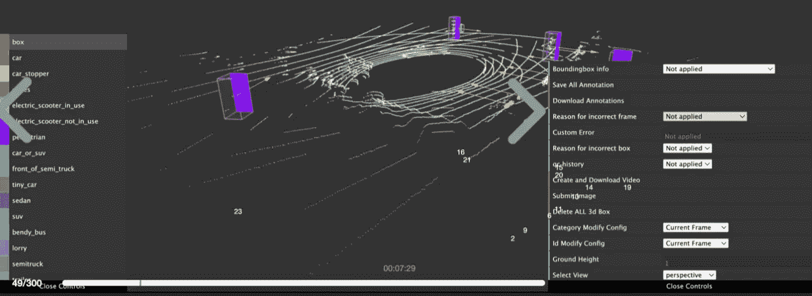

# 连续帧三维点云标注

> 原文：<https://medium.com/nerd-for-tech/continuous-frame-3d-point-cloud-annotation-815ddb483e24?source=collection_archive---------4----------------------->

## **图像数据和点云数据的差异**

第一，视角不同。图像数据是真实世界的二维表示，而点云包含三维信息(坐标系)，可以投影到各种视图。

第二，数据结构不同。影像数据是规则的、密集的、有序的，而点云数据是不规则的、无序的、稀疏的。

在空间分辨率上，影像数据也远高于点云数据。

## **图像数据劣势**

但图像数据的缺点是受外界光照条件影响较大，很难适用于所有天气条件。激光雷达不受黑暗或极端天气的限制。

一定程度上弥补了相机的不足，可以准确感知物体的距离。

现在，我们想分享一个 3D 点云注释案例。

# 点云数据注记

## 注释类型:

3D 边界框-由中心点坐标、长度、宽度和方向角组成的长方体，用于在点云中定位对象的位置。

障碍。在驾驶环境中，类别列表上的所有对象(在特定条件下)都需要进行标记。

例如，主要是道路上的参与者(包括行人、车辆等。)和基本的交通设施(包括道路标记和交通标志)。

## **目标 ID**

根据前后帧标记目标 id。一个对象只有一个目标 ID，并且不能重复使用。

序列帧中有 50–100 帧，序列帧中对象的 ID 和大小应该相同。

## **三维标注指南**

(1)地面上所有动态障碍物的 3D 包围盒底部应贴合地面，不得高于或低于地面(如有坡度，应以障碍物在地面上的最低点为测量值)。

(2)标记的障碍物不得有漏点。

(3) 3D 包围盒要与障碍物吻合，即障碍物要用 3D 包围盒精确标记。

(4)标记车辆、行人或骑自行车或摩托车的人的前进方向。

(5)车辆的后视镜、天线、打开的车门、后备箱都要贴上标签。

(6)最小标注尺寸:点数大于或等于 10 点的对象需要标注，点数小于 10 点的对象不需要标注。

(7)跟踪 ID:前后帧中同一目标的 ID 必须一致。

(8)只标注位置和形状可以确定的物体，2D 图像和三维点云不能确定的障碍物类别标注为其他。

(9)标注范围:对 ego 车辆半径 150 米范围内的物体进行标注。

## **车辆标注**

1.汽车

顶部有集装箱/货架的汽车应贴标签，当汽车顶部有货物时，车辆应与货物一起贴标签。

检查点云的完整性。如果点云密集，并且点云的实际大小超过正常大小，则使用实际大小作为度量。这里的高度视具体情况而定，请确保不超过地面，并且包含所有的点云。给汽车贴标签的时候，尽量把盒子的边框精确的贴在物体上，忽略外面零散的点。

2.大中型客车

如果有一辆公共汽车有两个或三个车皮直行，标记整个公共汽车；车辆在转弯时，如果前后部过大，无法标注在一个方框内，应将客车车身分为两部分，前后部分别标注。(车辆直行时，前后车架 ID 应一致。当车辆在转弯时，在转弯点将原来的盒子拆分成两个新的独立的盒子，并将两个新的盒子与直行车辆的 ID 相关联)

3.卡车

(1)非封闭式货车运载超过车身尺寸的货物时，应将货物标签在一起。

(2)当拖车上有汽车时，应单独标记被运载的汽车。

(3)车辆载体上的汽车和车辆本身被标记为一个目标。

4.工程车辆

(1)叉车应与货叉一起贴上标签。货物过大时，只标注叉车本身，叉的方向为前方方向。

(2)对于起重机吊臂非常极端、非常长的结构，只标注影响交通的车辆主体部分，延伸的起吊部分不需要标注。

5.三轮车

(1)人骑或推的三轮车及其使用者整体标注为三轮车，人与三轮车分离时单独标注。

(2)如果三轮车载有超过车辆尺寸的物体，货物也将贴上三轮车的标签。

卡车(货车、卡车、拖车、皮卡车等)的注释。)、公交车(大型公交车、公交车、校车等。)，以及工程车辆(油罐车、吊车、叉车等。)应按实际尺寸标注。

## **行人标注**

行人标注的具体要求如下:

(1)行人不需要分成人和儿童，各种姿势也一样(蹲着的人也需要贴上行人的标签)。

(2)人群中的行人应单独标示。如果它们过于密集，无法分离出某个行人轮廓，请参考前后帧(如果还是很难分割，整体标注，其 ID 应该是新的 ID)。

(3)对于手持物体的人，如果难以将物体与行人分开，且行人较小，则将手持物体与行人一起标记。

(4)对于正在拉行李箱或其他物件的人，只箱子行人自己。

(5)婴儿推车和载人轮椅应标明使用者为行人。当婴儿车或轮椅上没有人时，不需要贴标签。

(6)人行的包厢应根据实际大小进行调整。

(7)成人抱婴儿时，婴儿和成人在一个盒子里贴标签。

(8)成人和儿童手拉手时，儿童和成人分别用两个盒子标记。

在行人注释中，有四个关键点:

(1)盒子的下边缘必须适合地面。

(2)盒子顶边贴合头顶。

(3)共享尺寸:如果人体不包含伸出的手臂和腿，则只标注身体。

(4)行人边界框的长度和宽度应在 1m×1m 以内。

## **自行车和摩托车**注解

(1)如果一个人坐在或站在自行车上，自行车及其使用者需要一起标记，站在旁边的人也需要一起标记；在标注过程中，前面骑自行车的人一般只有在点云的后半部分。标注前面骑自行车的人时，方框的右侧要与点云的轮廓相匹配。同样的，后面骑自行车的人只有点云的前半部分，所以盒子的左边要和点云的轮廓吻合。

自行车和摩托车应尽可能分开贴标签。如果单个自行车或摩托车的轮廓无法分割，工人要以前后的车架为参照(如果还是很难分割，就要整体标注，ID 为新 ID)。

## **其他动态障碍物标注**

除了道路上的动态障碍物，道路两侧的动态障碍物也需要标注。标注时，对于被遮挡的物体，贴标机需要根据实际大小对其进行成像。

## **障碍前进方向规格**

车辆、行人和自行车等障碍物需要标上前进方向。在可视化操控板中，3D 框的方向应与真实方向一致。

## **箱子尺寸规格**

(1)点云密集时，应根据实际大小调整大小和虚部。

注意:不漏点。注意准确性。

(2)点云稀疏时，应标注与参考文献中相同的大小。如果在稀疏的点云中可以看到汽车的轮廓和大小，它应该与实际的点云精确匹配。

注意:不漏点。注意准确性。

## 结束

把你的数据标注任务外包给 [ByteBridge](https://tinyurl.com/57ma8wtv) ，你可以更便宜更快的获得高质量的 ML 训练数据集！

*   无需信用卡的免费试用:您可以快速获得样品结果，检查输出，并直接向我们的项目经理反馈。
*   100%人工验证
*   透明标准定价:[有明确的定价](https://www.bytebridge.io/#/?module=price)(含人工成本)

## 为什么不试一试？