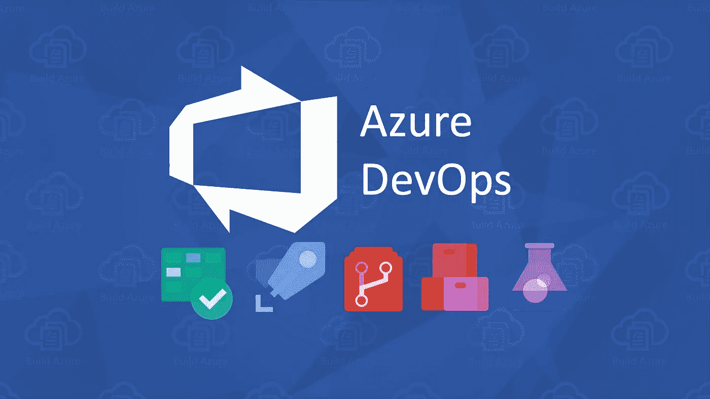

# Azure DevOps CI/CD 管道—第 1 部分

> 原文：<https://medium.com/nerd-for-tech/continuous-integration-azure-devops-pipeline-part-1-3e09d6e9d7f0?source=collection_archive---------3----------------------->

在这里，对于初学者，我解释了“如何实现 Azure DevOps 管道”

从 Azure 复制的图像

# 介绍

使用像 Jenkins 这样的工具并不意味着你遵循 CI/CD。

持续集成(CI)是一种开发实践。其中开发人员频繁地将代码集成到共享存储库中，最好是一天几次。自动化构建或自动化 …