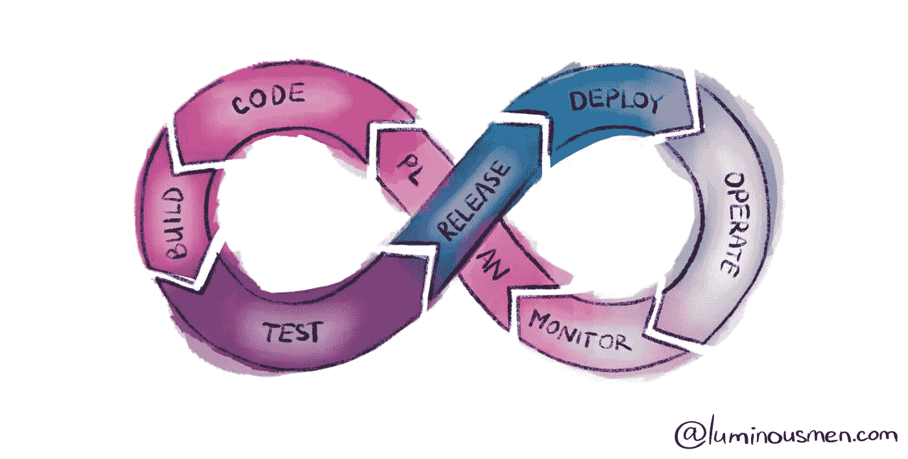

# 持续集成和交付主要思想

> 原文：<https://medium.com/nerd-for-tech/continuous-integration-delivery-main-ideas-2b2cafeea28e?source=collection_archive---------15----------------------->

在这个过程中，开发人员经常需要更新和部署他们的服务。当团队和服务数量很小时，这不是问题，因为发布和部署很少。测试、发布管理、发布工件和部署可以手动运行。但是随着时间的推移，服务和任务的数量增加，认知负荷增加更多，发布周期开始…