# 连续概率分布

> 原文：<https://medium.com/nerd-for-tech/continuous-probability-distribution-4255933bb454?source=collection_archive---------4----------------------->

马库斯·温克勒在 [Unsplash](https://unsplash.com?utm_source=medium&utm_medium=referral) 上的照片

在我的前两篇文章中，我们已经看到了[离散概率分布](/nerd-for-tech/discrete-probability-distribution-part-1-d8ee0fee2f57)，其中数据由不同的数值组成，我们可以指定每个数据的准确概率值。但是在现实生活中，最大值问题不涉及这种类型的离散数据。在连续随机变量的情况下，它们可以在特定的区间内取无穷多个值。例如，[4，7]之间的值。这里的变量可以是 4 到 7 之间的无限个值。我们可以再举一个具体城市一年的降雨量的例子。

**概率密度函数:**

当我们处理一个离散的概率分布时，我们通过在一个表中显示每个值的概率来产生分布。但是在连续数据的情况下，不可能给每个值分配一个概率。相反，我们需要计算特定级别的准确性和获得一系列值的概率。

我们可以用概率密度函数(pdf)来描述连续的概率分布。

概率密度函数 f(x)是一个函数，用于描述一个连续随机变量在一个值范围内的概率。

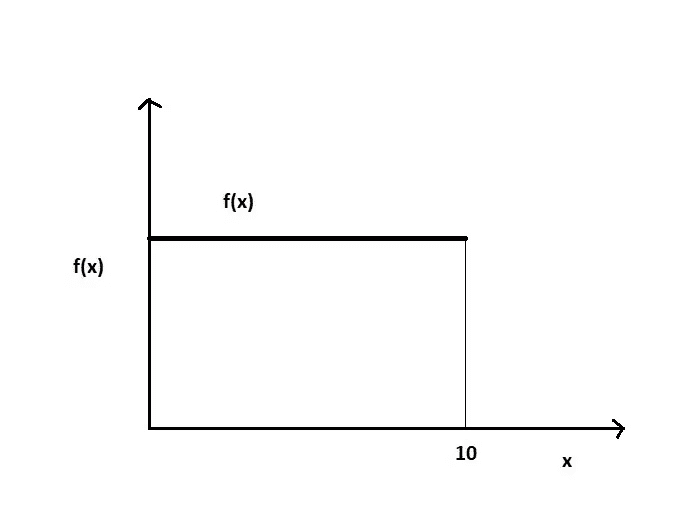

作者图片

在上图中，函数 f(x)或概率在 x=10 之前是常数，然后对于所有其他值都变成 0。这里 f(x)代表曲线在 x 点的高度，对于连续的随机变量，概率只不过是曲线下的面积。

对于任何连续概率分布:

*   对于 x 的所有值，f(x) ≥ 0。
*   整条曲线下的面积等于 1。

上面的曲线代表一个底为 10 的矩形。由于曲线下的总面积将变为 1，我们可以写成:

1 = 10 x 高度(f(x))

f(x) = 1/10 = 0.1

所以 f(x)必须等于 0.1，以确保它下面的总面积为 1。

f(x) = 0.1，因为 x 在 0 和 10 之间。

> 对于连续概率，我们必须通过计算概率密度曲线下的面积来找到概率。为了找到面积，我们将使用积分。

假设，对于一个随机变量 X:

f(x) = ax 表示 2≤x≤4，否则为 0。

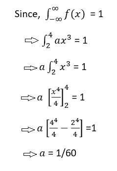

所以，f(x)= 1/60 x 对于 2≤x≤4，否则为 0。

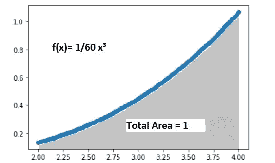

作者图片

假设，我们需要为上面的函数 f(x)求 P(X≥3)。然后我们要找到函数的以下区域。

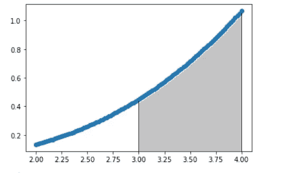

作者图片

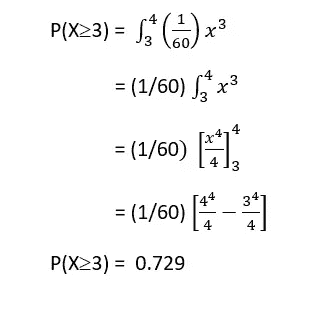

我们也可以计算上述函数的中值。中间地带将把整个地区分成两半。设 m 是 x 的值，它把整个区域分成两半。

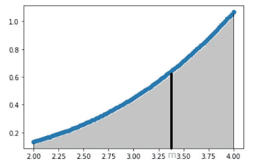

作者图片

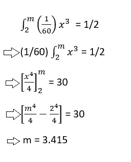

因此，上述函数的中值将是 3.425。

**连续概率分布的均值和方差:**

连续概率分布函数 f(x)的均值由下式给出:

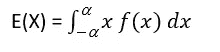

因此，要找出上述函数的平均值，我们可以写成:

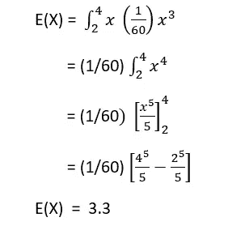

同样，连续概率分布函数 f(x)的方差由下式给出:

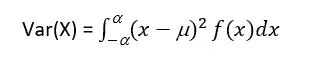

但是，我们也可以将 X 的方差描述为:

**Var(X)= E(X)-【E(X)】**

我们需要求上述函数的方差，f(x) = 1/60 x，对于 2≤x≤4。我们将使用上面的方差公式。这里，E(X) = 3.3。我们必须找到 E(X)。

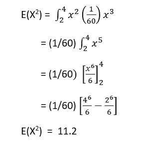

所以，Var(X)= E(X)-[E(X)]= 11.2-(3.3)= 0.31

今天到此为止。希望你们喜欢这篇文章。保持微笑。😃