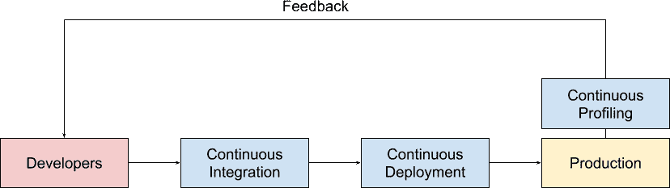
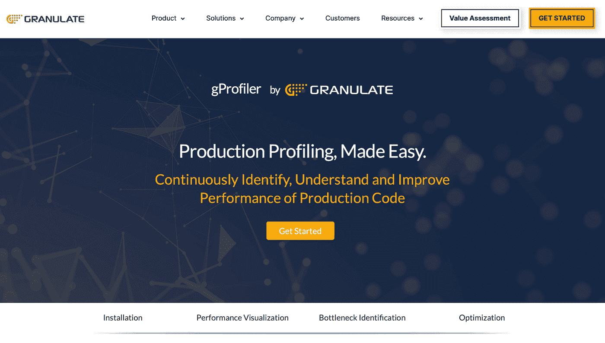
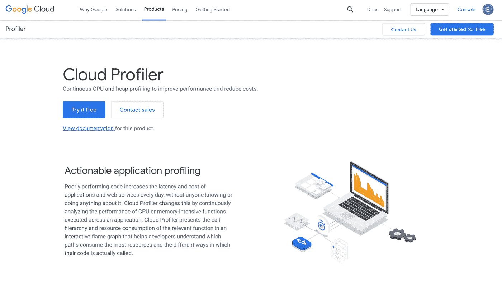
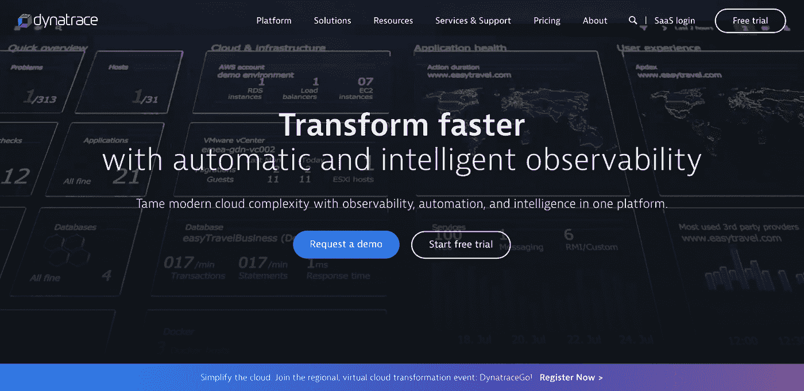
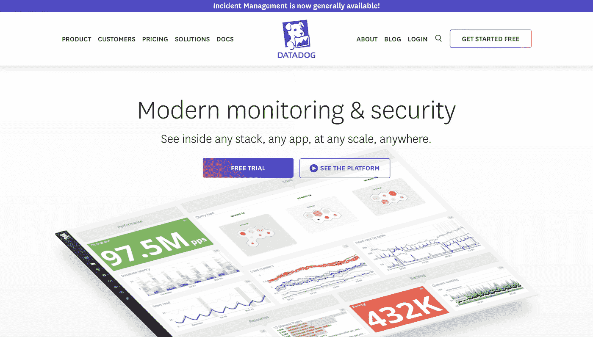
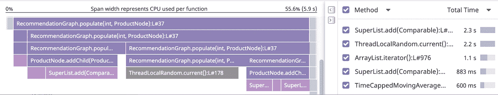

# 什么是 Go 中的连续剖析

> 原文：<https://medium.com/nerd-for-tech/continuous-profiling-in-go-9dce9b353e81?source=collection_archive---------7----------------------->


马文·迈耶在 [Unsplash](https://unsplash.com/s/photos/laptop?utm_source=unsplash&utm_medium=referral&utm_content=creditCopyText) 上的照片

# **简介**

由于市场需求增加，现代发展提高了生产部署的速度。由于高度自动化，这种速度的提高已经成为可能。在软件开发中，通过应用程序性能监控过程，我们可以了解 IT 基础设施中是否存在任何问题，或者是否有任何网络入侵正在发生。它还告诉我们应用程序的性能是否有问题。然而，监控本身并不能解决微小的代码级性能问题，这需要持续性能分析的高度自动化过程。

剖析告诉我们哪部分代码导致了问题，执行一个特定的任务需要多长时间，调用一行代码的频率，从哪里调用，以及在任何给定的时间点执行代码花费了多少时间。本文将介绍连续概要分析的概念，并讨论为 Go 提供连续概要分析的不同工具。

# 什么是连续剖析？

[持续剖析](https://granulate.io/introduction-to-continuous-profiling/)涉及从真实生产环境中持续收集详细的生产线级性能数据，以便开发人员和运营团队能够快速分析应用的性能，并改进性能不佳的代码部分。



[来源](https://www.opsian.com/blog/what-is-continuous-profiling/)

# 持续分析的优势

我们到底为什么需要持续的剖析？

1.  它帮助我们调试生产过程中出现的问题。
2.  它使我们能够更好地了解 CPU 的使用情况，以控制过度计费。
3.  它可以帮助我们发现[内存泄漏](https://en.wikipedia.org/wiki/Memory_leak)。
4.  它揭示了代码中发生争议的地方，并对它们进行了优化。
5.  它有助于我们分析新特性的性能。
6.  它有助于我们发现[延迟](https://www.cloudflare.com/learning/performance/glossary/what-is-latency/)的根本原因。

# 不同的分析工具

# 1.gProfiler



[gProfiler](https://granulate.io/g-profiler/) 提供对生产环境的即时可见性，并帮助团队识别导致性能下降和成本膨胀的性能瓶颈。通过在整个生产环境中使用连续的代码性能分析，可以优化大多数消耗资源的代码行。反过来，这将提高应用程序的性能并显著降低成本。

gProfiler 最具定义性的特性之一是它的即插即用结构:它可以使用容器映像或 AWS、GCP 或 Azure 上的公共映像，通过一个命令进行部署。

## 装置

Docker 安装:在您希望连续运行的服务中的每个节点上运行以下命令。

```
docker pull granulate/gprofiler:latestdocker run — name gprofiler — restart=always -d — pid=host — userns=host -v /var/run/docker.sock:/var/run/docker.sock -v /lib/modules:/lib/modules:ro -v /usr/src:/usr/src:ro — privileged granulate/gprofiler:latest -cu — token <unique_api_key> — service-name “Service name”
```

命令行:

```
wget [https://github.com/Granulate/gprofiler/releases/latest/download/gprofiler](https://github.com/Granulate/gprofiler/releases/latest/download/gprofiler)sudo chmod +x gprofilersudo ./gprofiler -cu — token <unique_api_key> — service-name “Service name”
```

# 2.谷歌云分析器



[Google Cloud Profiler](https://cloud.google.com/profiler/) 是一个事实性的低开销分析器，旨在持续收集生产中应用程序的 CPU 使用或内存分配情况。它从产生它的代码行/策略中获取分析数据。它会发现应用程序的哪些空间使用了最多的资产。该云剖析器包括剖析专家和接口；专家作为库被附加到分析的应用程序中。然后，在这一点上，它偶尔会收集正在运行的应用程序的概要信息，这可以通过一个具有两个图形组件的界面看到:一个火灾图和一个正常资产利用率的视图。附图是 Google Cloud Profiler 信息的图解。Cloud Profiler 支持 Java、Go、Node.js 和 Python，设计人员可以利用它来分析在 Google Cloud、其他云平台或内部运行的应用程序。

下面是启动分析器的示例代码。一旦您运行您的程序，分析器包将报告分析器。

```
if err := profiler.Start(profiler.Config{Service: “indexing-service”,ServiceVersion: “1.0”,ProjectID: “bamboo-project-606”,}); err != nil {log.Fatalf(“Cannot start the profiler: %v”, err)}
```

# 3.动态跟踪代码探查器



[Dynatrace](https://www.dynatrace.com/) 给出了代码级演示仪器，这些仪器可以显示导致 CPU 或 I/O 瓶颈的棘手区域。它提供计算机处理器和内存分析设备，允许工程师深入到技术层面来识别问题。例如，附图显示了最大的 CPU 客户。这些代码级调查工具支持用 Java 编写的应用程序。NET、PHP、Node.js 和 Golang。

# 4.数据狗连续剖面仪



[Datadog](https://www.datadoghq.com/) 的持续剖析服务可用于了解您的 API 中哪些代码是 CPU 或内存的最大消费者。例如，下图(火焰图)描述了在 CPU 上执行每个方法所花费的时间。Datadog 支持用 Java、Python 和 Go 编写的应用程序。



每个函数的 CPU 使用率的数据狗分析火焰图([来源](https://docs.datadoghq.com/tracing/)

# 摘要

在本文中，我们讨论了为在生产环境中持续运行而设计的不同分析技术和工具，特别是针对 Go。选择最适合您需求的工具。

很高兴听到想法和反馈！