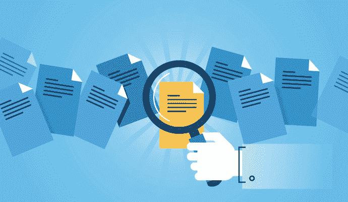
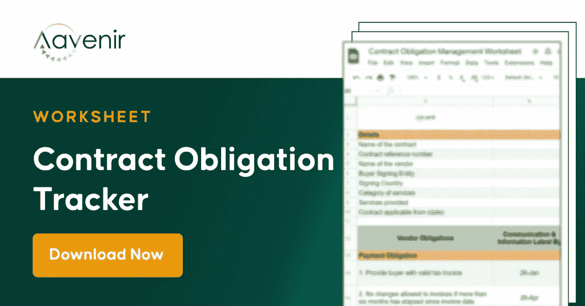

# 合同义务管理—是否有一种简单的方法来跟踪和管理？

> 原文：<https://medium.com/nerd-for-tech/contract-obligation-management-is-there-an-easy-way-to-track-and-manage-2fa05d3db647?source=collection_archive---------4----------------------->

在大多数情况下，合同双方在签订合同时自己选择权利和责任。

**合同义务是根据**合同条款，合同双方**对**承担的义务。

因此，双方义务的性质主要取决于合同条款。

合同的目的是定义义务和期望，限制或定义潜在的责任，安排支付条款，确定谁承担商业风险，并明确角色和责任。从买方的角度来看，合同确保按预期提供产品/服务，从卖方的角度来看，合同确保付款和成功的合同关闭。

关于交换对价，合同各方将承担不同的义务。不履行合同条款规定的任何义务通常构成违约。

几乎在所有合同中都可以找到的一些最基本的[合同义务](https://aavenir.com/contracts-obligations-compliance-tracking-management/)形式包括:

*   **付款**——合同也可能在金额、期限、时间表等方面指明责任和义务。
*   **交付**——合同可以规定交付时间、地点和方式的义务。
*   **货物/服务的质量**——其中期望可以在合同中再次规定。

这些类型的具体义务可以根据手头合同的相关细节进行变更或修改。此外，缔约双方在订立合同时也可能受某些一般原则和义务的约束。例如，合同的每一方都有义务公平、诚实地与其他方交易，也有义务不使用武力或胁迫手段来获得对协议的同意。

合同义务管理的真正挑战是在正确的时间跟踪和分配义务给正确的当事人，以避免不遵从的风险。有没有简单的方法可以做到这一点？

是的，如果您维护了一个维护各方义务和权利的合同义务追踪器，那么您的工作就完成了一半。下载这个现成的可编辑的[合同义务追踪器](https://aavenir.com/resource/contract-obligations-tracker/)，以减轻不遵守和违反合同的后果，并实现高水平的合同遵守。这不仅有助于你记录这些义务，也有助于你遵守这些义务，并在不遵守的情况下采取纠正措施。

如果您有更复杂的需求，并渴望了解[自动化义务管理如何工作](https://aavenir.com/webinar/realize-contract-value-through-automated-obligation-management/)，请点击此处注册关注实现高合规水平和实现更大合同价值的网络研讨会:

