# 初学者:用 GitHub 桌面参与 GitHub 项目

> 原文：<https://medium.com/nerd-for-tech/contributing-to-a-github-project-with-github-desktop-57514f640aa1?source=collection_archive---------9----------------------->

我知道大多数人都在使用命令为 GitHub 项目做贡献，但我是个老派，我真的很喜欢我的类似 windows 的界面。我很难找到关于桌面版的文章，所以我决定把它写下来。从这里取一点，从那里取一点，我想出了这些步骤。

# 叉

在 github.com，像对待任何项目一样分叉存储库。

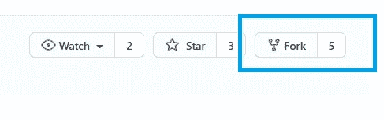

此时，您的本地 fork 应该已经更新了所有的更改。

# 克隆

仍然在 GitHub.com 点击“代码”获得你需要克隆的网址。这将是您自己的分叉副本的 URL。

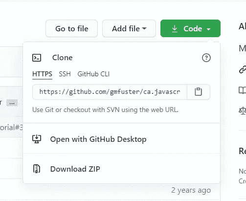

请确保复制显示的 URL。

打开你的 GitHub 桌面。转到文件—克隆存储库。

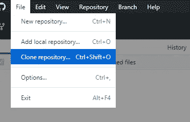

选择 URL 选项卡并粘贴您刚刚复制的 URL。

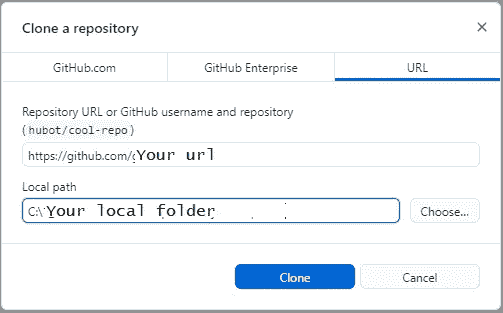

克隆完成后，您将得到类似这样的东西。我现在选择“为了我自己的目的”。

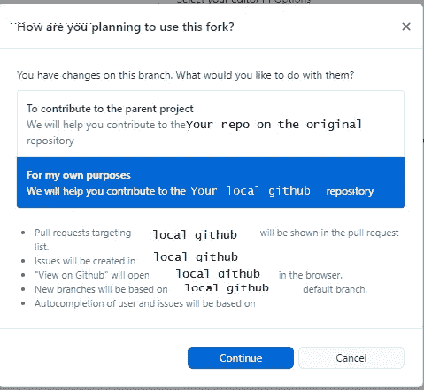

当我写这篇文章的时候，GitHub Desktop 不允许你设置一个远程的原点，所以要用其他用户的修改来更新你的本地副本，你必须修改属性来指向原点，获取所有的东西，然后把它改回来，然后把其他的修改推送到你的 GitHub 副本中(后面的步骤)。

# 处理一个文件

在开始处理文件之前，确保在 GitHub 桌面上选择了正确的存储库。

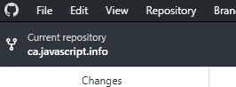

使用您喜欢的编辑器对文件进行任何更改。一旦您完成了您的更改，通过检查存储库—存储库设置，仔细检查您是否指向您的分支副本。提交您的更改:

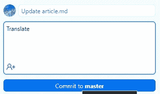

提交后，您将在屏幕上看到以下内容:

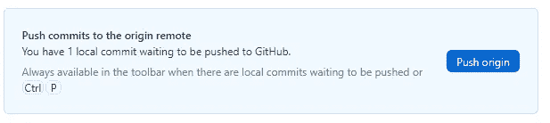

# 推动你的改变

单击“推原点”或从顶部栏进行操作，这也将显示一个“推原点”选项。

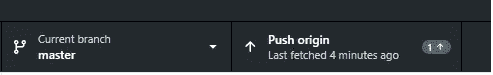

一旦推送，GitHub 桌面将不再显示您的更改。去你在 github.com 的岔路口。你会看到这样的东西。

# 创建拉取请求

在它的右边，首先单击“比较”来查看您的更改。如果你这样做，你应该会看到一个“能够合并”的消息。从那里点击**创建拉取请求**。添加您的注释并创建拉取请求。

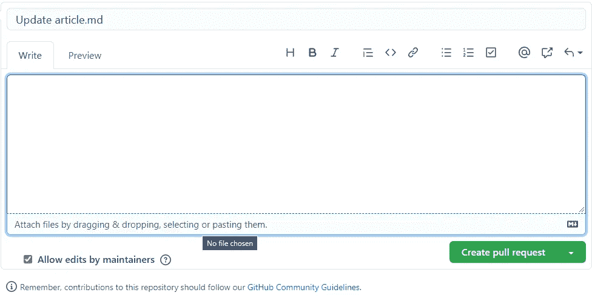

您可能会被要求签署 CLA(贡献者协议)。然后，你必须等待你的贡献是否被接受。但是你做到了。

# 从原点刷新代码

使用 GitHub desktop，您可以指向您自己的本地 GitHub，将更改推送到那里，然后从那里创建到您分叉的源的 pull 请求。如果你的本地代码在原点后面呢？您需要转到存储库属性，将远程 URL 更改为原始 URL(**不是您分叉的那个**，**是您从**分叉的那个)。然后就可以做取原点了。刷新代码后，将 URL 改回 GitHub(分叉版本)上的本地，这样就可以继续修改了。

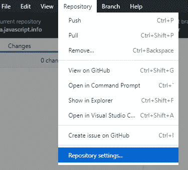

注意:**在开始更改文件**之前，记得刷新您的本地驱动器。合并冲突一点也不好玩。如果你确实有合并冲突，我喜欢打开在 Visual Studio 代码上给我一个冲突的文件，然后做任何更改(或者在那里接受你的更改)。

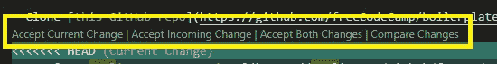

就是这样。这应该足以让你有所贡献，精神焕发，等等。