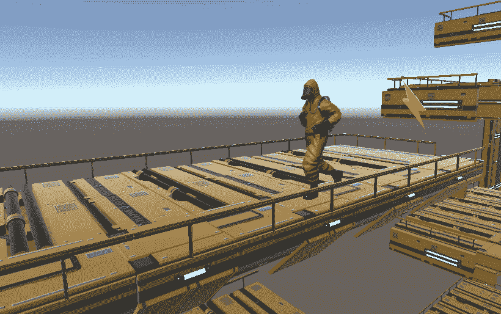
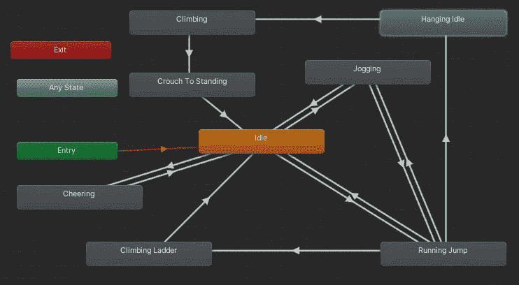
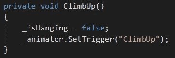
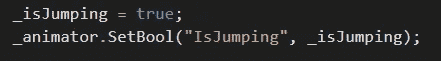
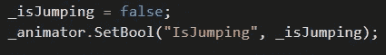
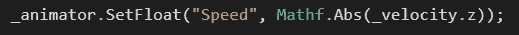

# 通过代码控制动画

> 原文：<https://medium.com/nerd-for-tech/controlling-animation-through-code-42751a9e4f96?source=collection_archive---------15----------------------->

**目的:**让玩家脚本控制动画状态。

我们已经用我们的*状态*和过渡规则设置了我们的*动画师*。

我们所有状态和转换的布局。

现在我们将使用代码来操作激活我们的*转换*的*参数*。

我们将用来表示转变的参数。

最容易使用的参数是一个*触发器*。当我们的玩家挂在壁架上时，如果他们按下 *E* 键，就会调用 *ClimbUp* 方法。该方法触发我们的 *ClimbUp* 参数，该参数过渡到*攀爬*状态，播放*攀爬*动画*剪辑*。

接下来，我们将使用一个*布尔值*参数。当我们的玩家按下跳转按钮时，我们会将 *IsJumping* 参数设置为 *true* 。只要这个参数*为真*，角色就会停留在*运行跳转*状态。一旦角色控制器接触地面，它被设置为*假*。

当我们行走时，我们将把*速度* *浮动*参数设置为我们的 *z* 速度的绝对值。这也将使行走动画与我们的速度相匹配！

还有一个 *int* 参数，它的工作方式很像 *float* 参数，但是在这个设置中我们不需要那种参数。