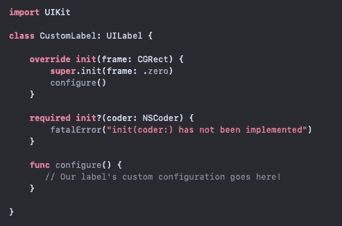
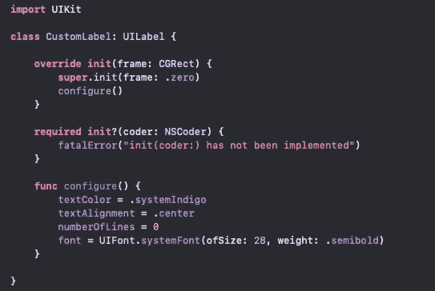
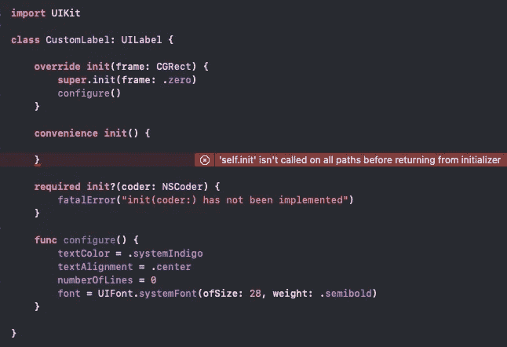
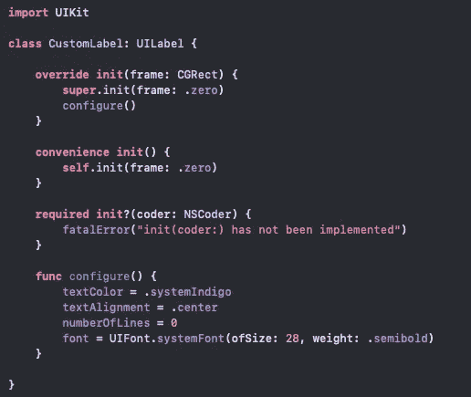
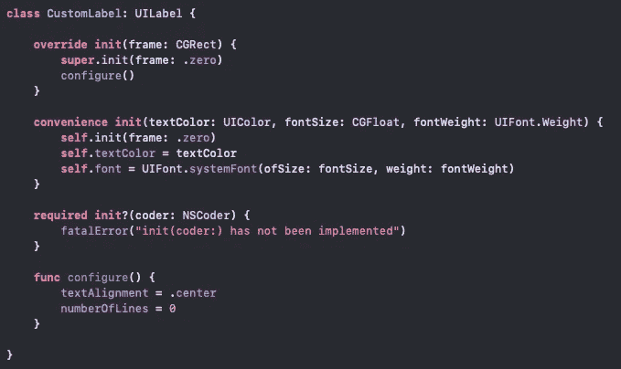
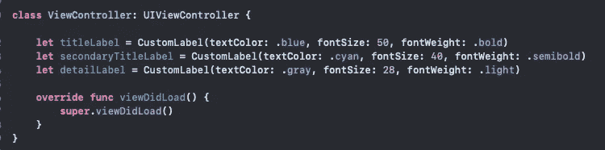

# Swift 中的便利初始化器

> 原文：<https://medium.com/nerd-for-tech/convenience-initializers-in-swift-19519dd57587?source=collection_archive---------5----------------------->

卡尔·帕夫洛维奇在 [Unsplash](https://unsplash.com/s/photos/coding?utm_source=unsplash&utm_medium=referral&utm_content=creditCopyText) 的照片

swift 中的初始化器给了我们定制自定义类在创建时如何初始化的灵活性。在 Swift 中，苹果在他们的框架中创建了多个初始化器，给开发者更多的选择来实例化具有不同配置的对象。通常情况下，有必要为我们的自定义类编写自己的初始化器。

假设我们正在开发一个需要多个标签的应用程序。我们正在以编程方式构建应用程序，标签需要一些自定义样式。我们可以从覆盖标签的一个指定初始化器来设置我们的自定义类开始。

为了保持初始化器的整洁，我们将使用一个定制的配置函数来保存标签的定制。

随着我们的标签的指定 init 被覆盖和我们的 configure 函数就位，我们可以开始定制了。(注意，我们还必须使用 **NSCoder** 实现所需的 init，如果从我们的自定义初始化器创建我们的对象时出现问题，NSCoder 将触发并崩溃我们的应用程序)

我们的 CustomLabel 类现在为我们的应用程序提供了独特的样式。虽然这肯定有效，但我们的标签并不是非常动态*的*:我们创建的每个标签每次都会有这种精确的样式。例如，如果我们想改变 textColor，我们就必须在应用程序生命周期的某个地方改变它。这个实现不完全是 ***方便***；有更简单的方法！

在我们的自定义类中，我们可以创建**纵容初始化器**，给我们的对象更多的灵活性，并分离我们的代码，使其可重用。现在你可能会想，给我们的自定义类添加一个完整的初始化器需要更多的代码，你是对的，但是它会清理我们项目中实例化对象的其他文件。

为了创建我们的便利初始化，我们从初始化器前的便利关键字开始，告诉 Xcode 这个初始化器可以用来实例化我们的标签。如你所见，我们得到一个错误，说明在从初始化器返回之前没有在所有路径上调用' self.init'。 这是什么意思？为了方便调用 init，我们还必须在初始化器中调用父对象的一个指定初始化器。 [Swift 文档](https://docs.swift.org/swift-book/LanguageGuide/Initialization.html)告诉我们:

"*指定的初始化器*是类的主初始化器。指定的初始化器完全初始化该类引入的所有属性，并调用适当的超类初始化器来继续超类链的初始化过程

前面我们覆盖了标签的父初始化器 init(frame:)，并调用了我们的自定义函数，我们只需要在方便的 init 中调用这个初始化器，然后我们就可以为标签添加动态代码了。

注意，在便利 init 中调用的 init(frame:)是我们覆盖的 init。

当我们使用便利的 init 时，我们的 configure 函数将被自动调用，允许我们分离出我们想要动态的代码。

我们的便利 init 现在可以使用了！我们现在编写的配置函数只保存我们不想在创建的每个标签之间改变的代码！现在，当我们创建自定义标签时，Xcode 会让我们选择使用新的 init，并通过自动调用指定的 init 来处理标签的构造，然后应用我们的自定义代码。

方便的初始化器确实给你的自定义类增加了更多的代码，但是它们也允许你从重复的对象中初始化动态代码，从而清除了使用对象的调用点。