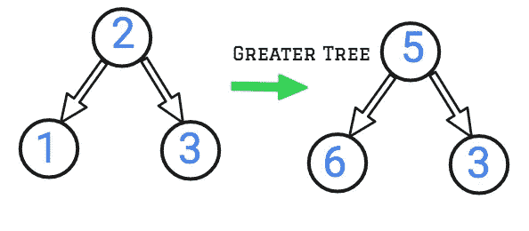
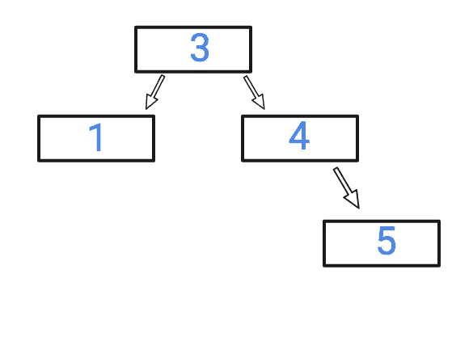
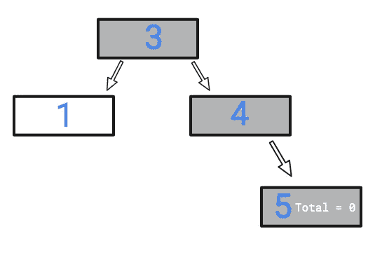
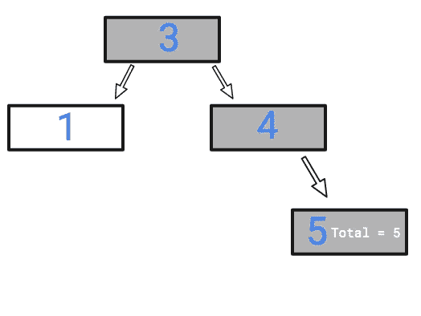
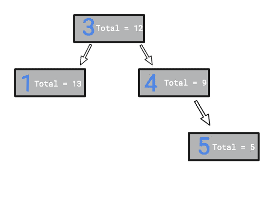

# 将 BST 转换为更大的树-第 72 天(Python)

> 原文：<https://medium.com/nerd-for-tech/convert-bst-to-greater-tree-day-72-python-1d1e4c7e3364?source=collection_archive---------4----------------------->


照片由[托德·夸肯布什](https://unsplash.com/@toddquackenbush?utm_source=medium&utm_medium=referral)在 [Unsplash](https://unsplash.com?utm_source=medium&utm_medium=referral) 拍摄

今天的问题摘自 leetcode 的每日编码挑战二月版。这个问题不经常被问到，但是这个问题将测试我们对递归的理解。

[538](https://leetcode.com/problems/convert-bst-to-greater-tree/)**。将 BST 转换为更大的树**

给定一个二叉查找树(BST)的`root`，将其转换成一个更大的树，使得原始 BST 的每个键都变成原始键加上大于 BST 中原始键的所有键的总和。

提醒一下，*二叉查找树*是满足这些约束的树:

*   节点的左子树只包含键**小于节点键**的节点。
*   节点的右边子树只包含键**大于节点键**的节点。
*   左右子树也必须是二分搜索法树。

**注:**此问题同 1038:[https://leet code . com/problems/binary-search-tree-to-greater-sum-tree/](https://leetcode.com/problems/binary-search-tree-to-greater-sum-tree/)

**例 1:**


```
**Input:** root = [4,1,6,0,2,5,7,null,null,null,3,null,null,null,8]
**Output:** [30,36,21,36,35,26,15,null,null,null,33,null,null,null,8]
```

**例二:**

```
**Input:** root = [0,null,1]
**Output:** [1,null,1]
```

**例 3:**

```
**Input:** root = [1,0,2]
**Output:** [3,3,2]
```

**例 4:**

```
**Input:** root = [3,2,4,1]
**Output:** [7,9,4,10]
```

**约束:**

*   树中的节点数量在范围`[0, 104]`内。
*   `-104 <= Node.val <= 104`
*   树中的所有值都是唯一的。
*   `root`保证是有效的二叉查找树。

在我们开始之前，让我们了解什么是更大的树。更大树中的节点将具有该节点的当前值和所有节点的当前值之和，该值大于当前节点的值。



大树

让我们来解决这个问题。

我们得到了一个二叉查找树。在二叉查找树中，当前节点左侧的所有节点的值都小于当前节点的值。当前节点右侧的所有节点的值都将大于当前节点。这意味着最左边的节点权重最小，而最右边的节点权重最大。

我们如何利用这些知识来解决这个问题？

我们可以使用 reverse inorder 遍历来到达树中最右边的节点，然后有一个变量可以保存添加的节点，直到当前点。这听起来是不是很混乱？

让我们举一个例子。



输入 BST


反向有序遍历



最右边节点的初始总计



将总计与当前节点的值相加后



填充其他节点

让我们来看看代码片段。

```
class BSTToGSTConverter:
    def convertBST(self, root: TreeNode) -> TreeNode:
        self.addition = 0
        def convert(node):
            if node != None:
                convert(node.right)
                self.addition += node.val
                node.val = self.addition
                convert(node.left)
            return node
        return convert(root)
```

**复杂性分析。**

**时间复杂度**

我们正在访问树中的每个节点。因此，时间复杂度是 O(N)，其中 N 是节点的数量。

**空间复杂性。**

我们为每个节点递归调用函数，递归函数在内部使用堆栈。因此，空间复杂度是 O(N)，其中 N 是节点的数量。