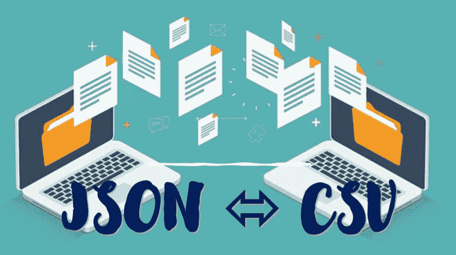
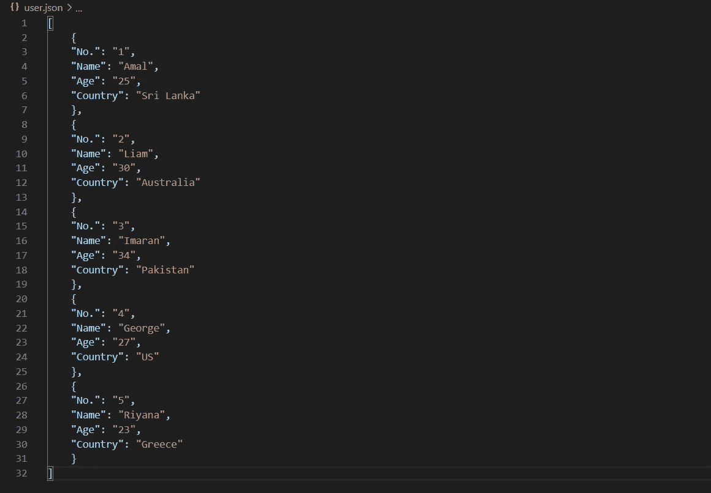
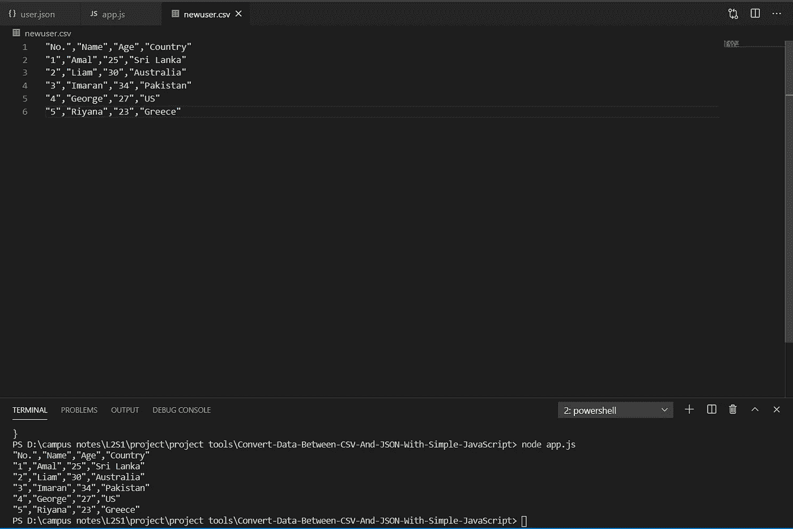
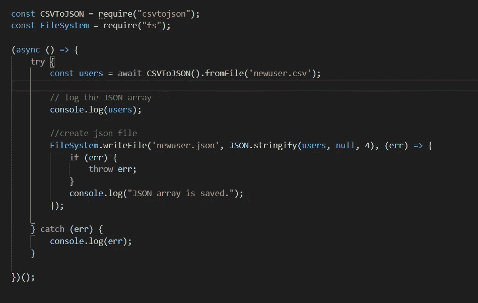
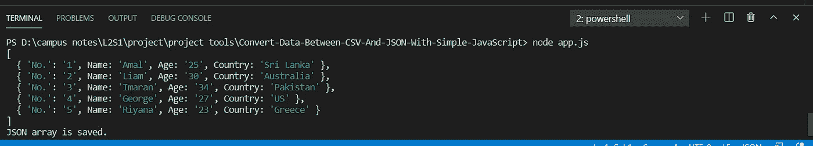
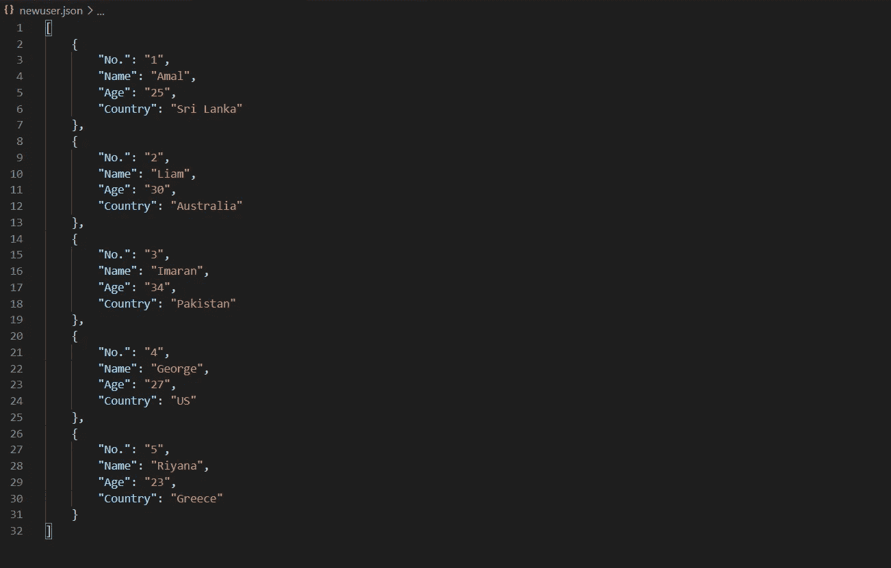

# 使用简单的 javascript 和 npm 在 CSV 和 JSON 之间转换数据文件。

> 原文：<https://medium.com/nerd-for-tech/convert-data-files-between-csv-and-json-using-simple-javascript-with-npm-f4c3ed42112c?source=collection_archive---------1----------------------->

在这篇文章中，我将用几个简单的步骤展示如何转换。csv 文件转换成。json 和。json 文件转换成。csv 文件，使用简单的 javascript 和 npm。

JSON 到 CSV 和 CSV 到 JSON

# 的转换。json 文件转换成。csv 文件

让我们一步一步来

## 第一步|

运行 npm 代码来初始化 npm 程序包。

> **npm init -y**

## 第二步|

接下来让我们安装需要转换的软件包。json 文件转换成。csv 文件。

> **npm 安装 json2csv -s**

## 第三步|

创建一个 javascript 文件 app.js，在您的终端中运行以下代码。

> **触摸 app.js**

## 第四步|

我们要去拯救。json 文件为。csv 文件。所以接下来我们需要添加文件保护包。

> npm i 文件保护程序

## **步骤 05 |**

创建一个 JSON 文件作为 user.json，并包含以下代码。

user.json

## 第六步|

在 app.js 中包含以下代码

app.js

我们之前创建的 user.json 文件将另存为 newuser.csv。

## 第七步|

开始了。现在让我们运行最后一个命令来测试结果。

> **节点 app.js**

输出

当您运行上面的命令时，您可以看到 CSV 数据出现在您的控制台中，还可以看到一个名为 newuser.csv 的文件出现在您的文件列表中。点击它。

newuser.csv 和控制台输出

就是这样。现在我们已经将 JSON 文件转换成了 CSV 文件

# 的转换。csv 文件转换成。json 文件

让我们使用上面创建的 newuser.csv 文件来转换成 JSON 文件。

## 第一步|

安装转换所需的软件包。csv 文件转换成。json 文件。在您的终端中运行以下命令。

> **npm 安装 csvtojson -s**

## 第二步|

在 app.js 中，注释所有命令并键入以下命令。

app.js

## 第三步|

又来了。现在让我们运行最后一个命令来测试结果。

> **node app.js**

输出

当您运行上面的命令时，您可以看到 JSON 数据出现在您的控制台中，还可以看到一个名为 newuser.json 的文件出现在您的文件列表中。点击它。

控制台输出

newuser.json

仅此而已。现在你知道了如何将 JSON 文件转换成 CSV 文件，以及如何将 CSV 文件转换成 JSON 文件。