# 转换器参数绑定—如何在 Xamarin(MAUI)绑定复数值

> 原文：<https://medium.com/nerd-for-tech/converter-parameter-binding-how-to-bind-complex-values-at-xamarin-maui-a23b6c45ab31?source=collection_archive---------1----------------------->


## 如何在 Xamarin 或 MAUI 中解析 ConverterParameter 的绑定？对🥹转换器中的反射进行简短的深入研究

潜艇人员🤗，今天的故事会很短，但我希望很有帮助。我们写的或者用的都是一些预定义的转换器，绑定一些值。但是你有没有尝试过🧐？

在深入探讨之前，让我们回顾一下如何将值绑定到转换器参数。

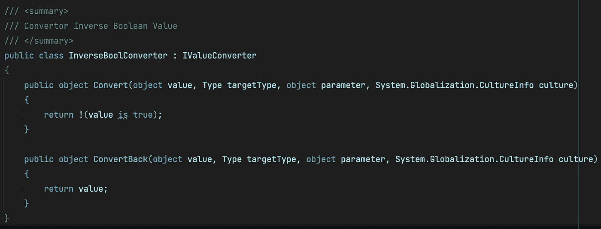

`IValueConverter`的简单实现

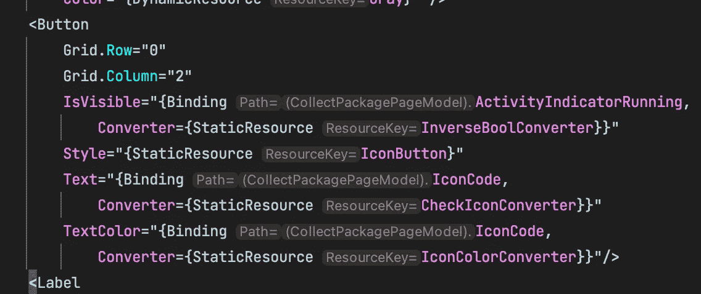

绑定 BindingContext 中的值

这里我们从我们的`BindingContext`绑定了一个`object value`，这里我们的上下文就是我们的视图模型。我们的绑定被解析，并将自己传递给转换器`object`，转换器作为`StaticResource`从资源中被解析

> 如果你也为你的父容器(比如 page)指定了数据类型，你可以从你的 IDE (Visual Studio 或 Rider)看到提示，以确保你不会在你的 XAML 代码中出错。

```
xmlns:viewModels="clr-namespace:ProjectNamespace.ViewModels"
x:DataType="cviewModels:SpecifiedViewModel"
```


从 XAML 中的另一个对象传递值

此外，我们能够使用一些`Reference`来传递运行时可用内容的值，例如，其他控件的一些`Width`或来自外部上下文的内容，如命令，如果我们在具有不同`DataType`和`BindingContext`的列表元素中

# 将简单数据传递给转换器

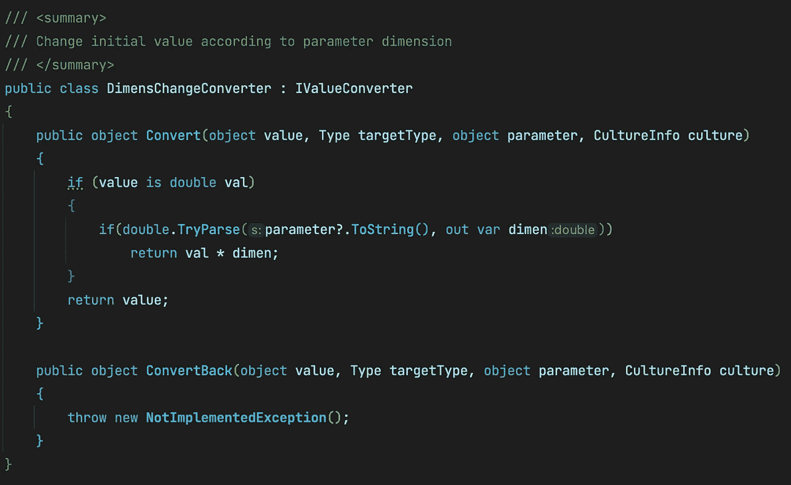

需要一些“double”作为参数

又没什么特别的，但是等一下。我们很快会再来🙃。

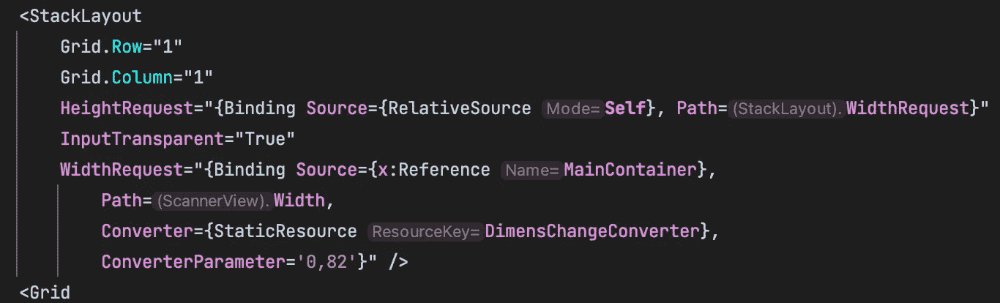

将静态“double”值作为转换器参数传递

同样，我们可以传递一些文本或静态资源，它们都将按照我们的预期得到解析😊

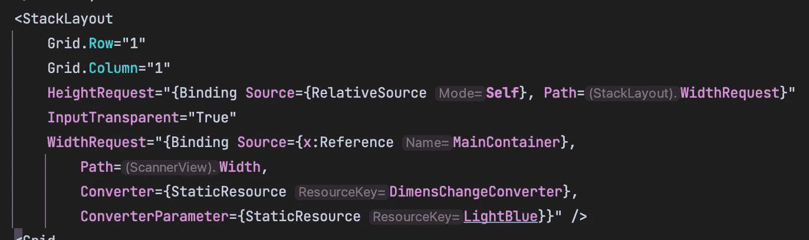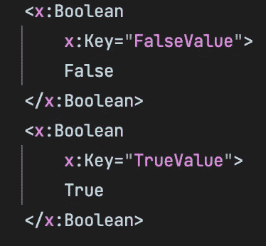

在 XAML 中定义布尔值，并将 StaticResources 作为转换器参数传递

# 将值数组传递到转换器中

我知道，我知道，所有人都知道，但如果我开始了，我需要经历它们😝

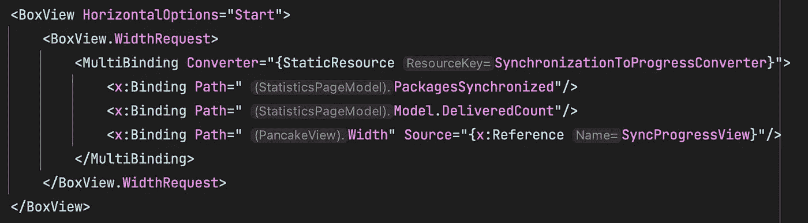

将多个值(可以是不同的类型或不同的传递方式)传递到转换器中

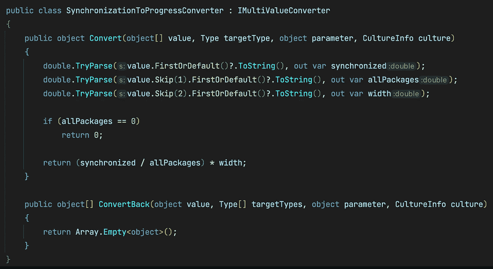

并期望它们(值)在转换器内部

我只想提一下，我们可能有一个转换器列表，每个转换器都有一个参数列表😱

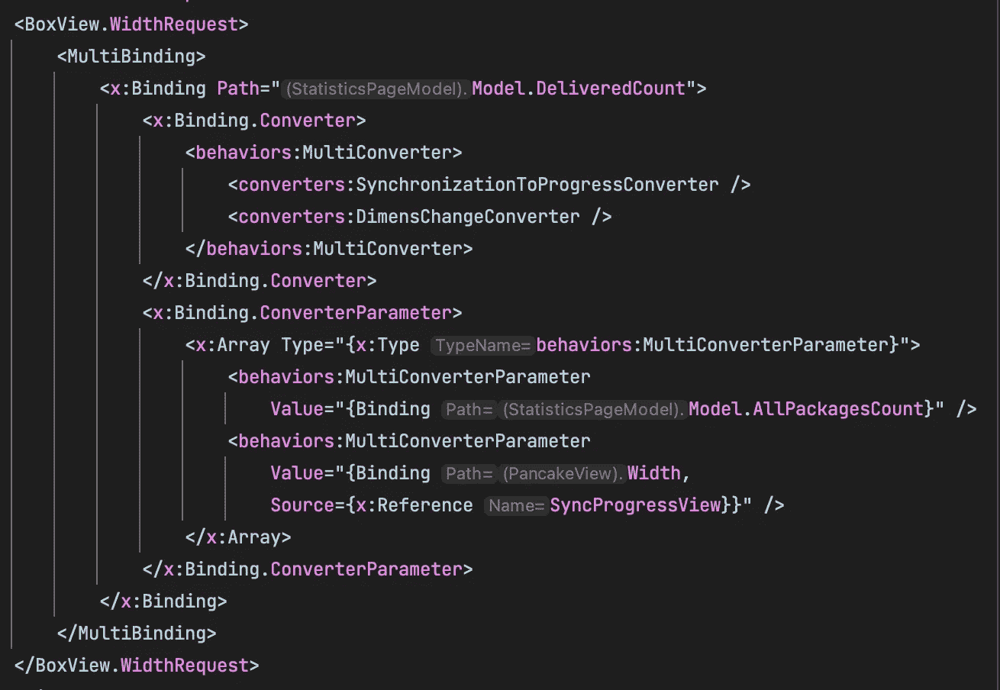

带有参数列表的转换器列表，用于将一个值链接到另一个值和最终可绑定属性。

[](https://learn.microsoft.com/en-us/xamarin/community-toolkit/converters/multiconverter) [## Xamarin 社区工具包多转换器

### MultiConverter 允许用户根据当前活动的安全区域在屏幕上偏移元素。

learn.microsoft.com](https://learn.microsoft.com/en-us/xamarin/community-toolkit/converters/multiconverter) 

# Bing 通用的东西作为转换器参数🫣

它来了😁...根据前面的例子，我们可能期望将`StaticResource`改为`Binding`将由引擎为我们解决。但是不，不，不，不，它绝不会传递一个绑定对象😳

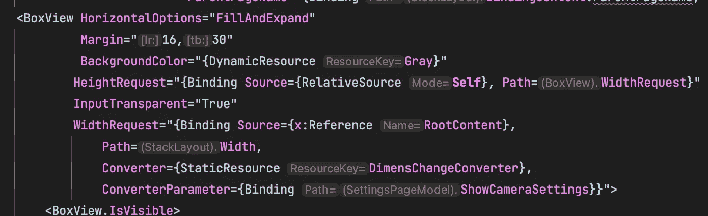

将视图模型中的可绑定值作为转换器参数传递

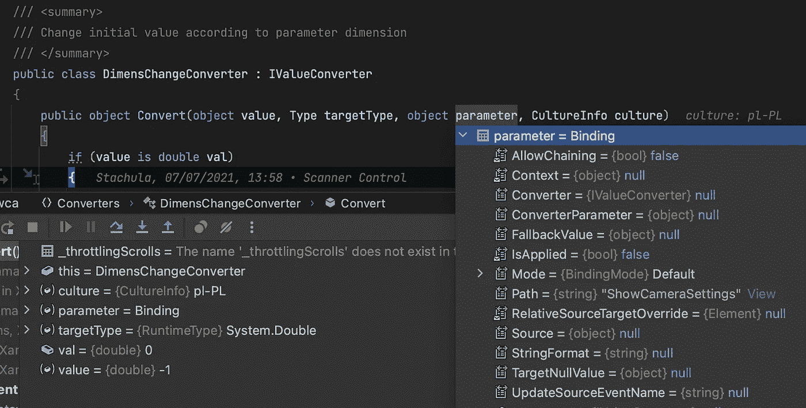

绑定对象仍然是绑定的，而不是绑定的值

好吧，那么我们能做什么，如何解决这个问题？—我们可以检查它的类型，如果它是绑定的并且有一个源，我们可以通过使用反射从源逐部分获取值。

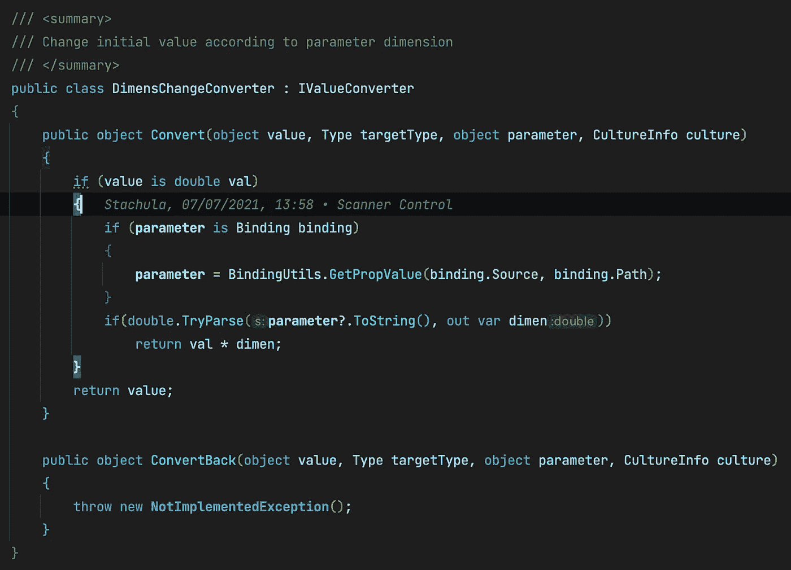

更新了转换器以检查参数是否为绑定

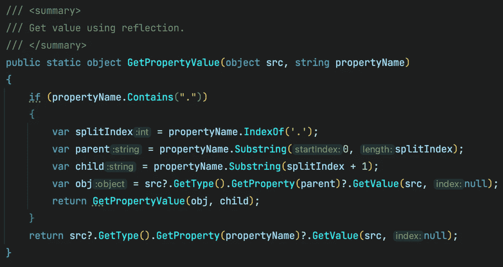

通过使用反射获取值的特殊工具

所以，我们在这里做的是🤔？我们检查`propertyName`是否包含任何`.`,因为这意味着我们需要从绑定上下文中解析某些属性的属性。原因如下:

```
Binding Model -> Means that in BindingContext(for example, ViewModel), we have some property named `Model`Binding Model.InnerModel -> Means that in BindingContext, we have some class or struct property named `Model` which contains public property named `InnerModel` 
```

它可以根据需要进行深度递归。这就是为什么我们通过获取`.`的第一个索引来检查我们是否包含一些内部属性

如果我们包含任何内容，我们将获得 source(点的左边)和 property name(点的右边),并使用更新的 source 和 property name 递归调用方法`GetPropertyValue`。现在我们可以从我们的`BindingContext`绑定顶级属性，从更复杂的对象绑定一些内部公共属性😊。

但是，如果你注意转换器内部，我们将`Source`传递到`GetPropertyValue`，它是一个`null`，即使我们确定我们在同一个`BindingContext`下。为了解决这个问题，我们需要将`Source`指定为父元素或其自身的`Reference`。

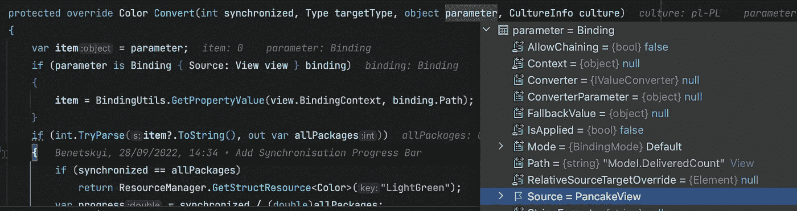

通过 BindingContext 从源获取值

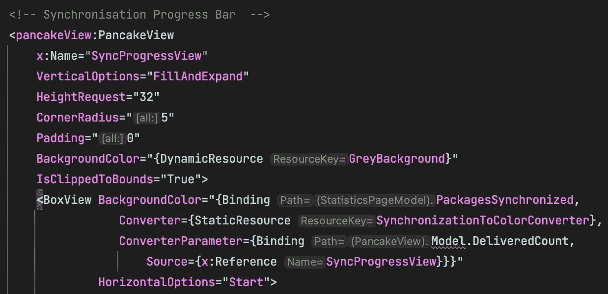

通过源传递 ConverterParameter

现在，我们可以对它进行一些处理，并将值与转换器和转换器参数绑定，其中转换器参数具有可与其自身的转换器和自身的转换器参数绑定的值🤯

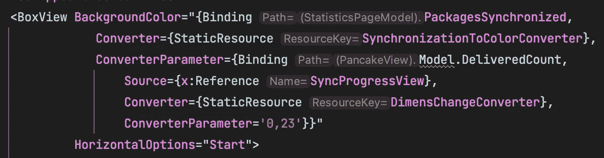

将简单转换器参数作为转换器参数传递给转换器😆

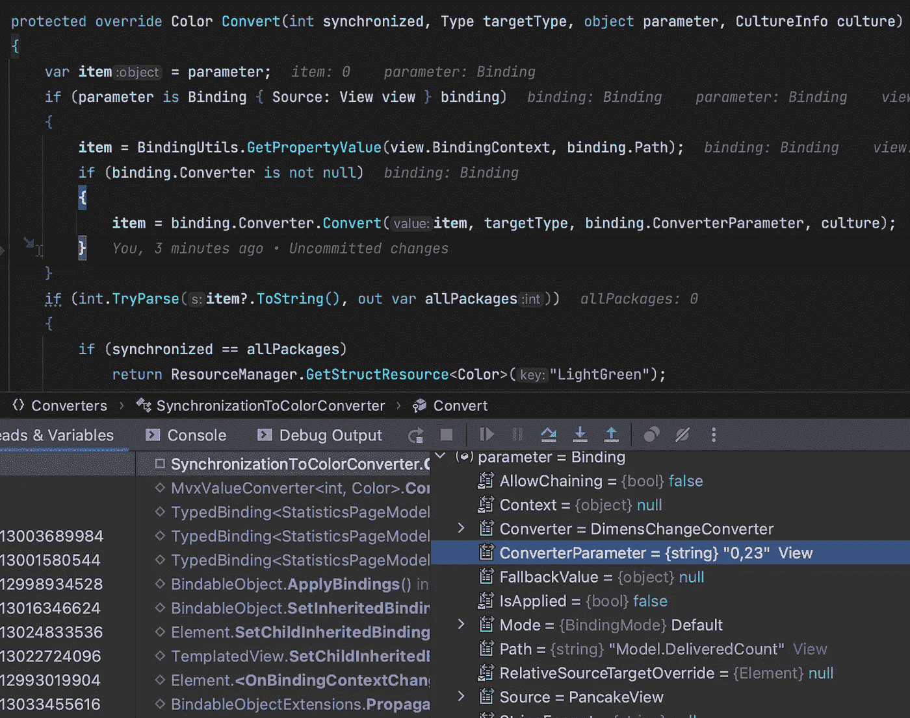

从绑定到下一个转换器逐步解析值

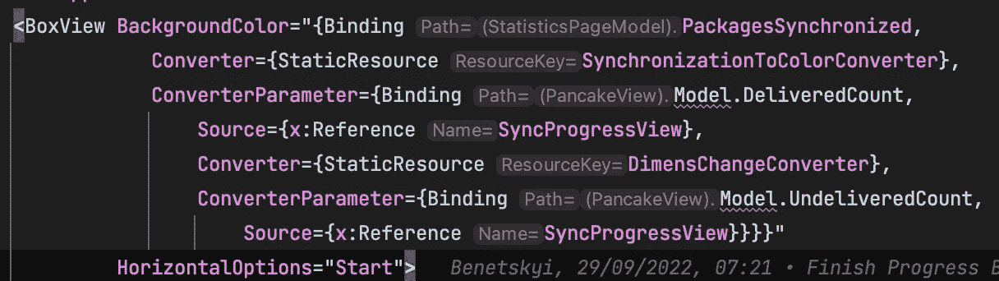

将另一个内部绑定作为背景色绑定传递给转换器参数绑定🤯😱😱😱

我希望在这篇博文之后，你会知道转换器可能期望比简单的值稍微多一点的值作为转换器参数，并且你将准备好在你的 C#代码中解析所有的绑定和内部转换器🙃 😉

请在 Twitter 上关注我，如果你喜欢这个博客，你可以为我买一杯啤酒来支持我😅

[https://www.buymeacoffee.com/bbenetskyy](https://www.buymeacoffee.com/bbenetskyy)T13
https://twitter.com/bbenetskyy