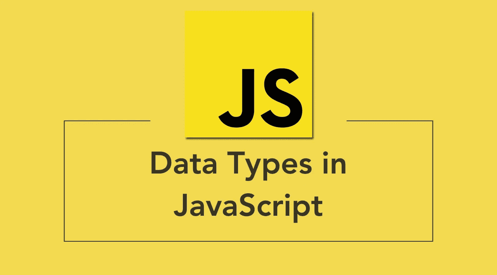
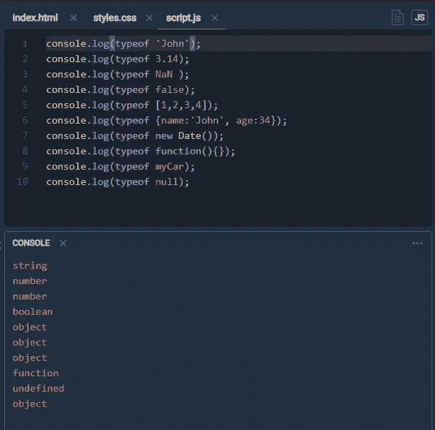
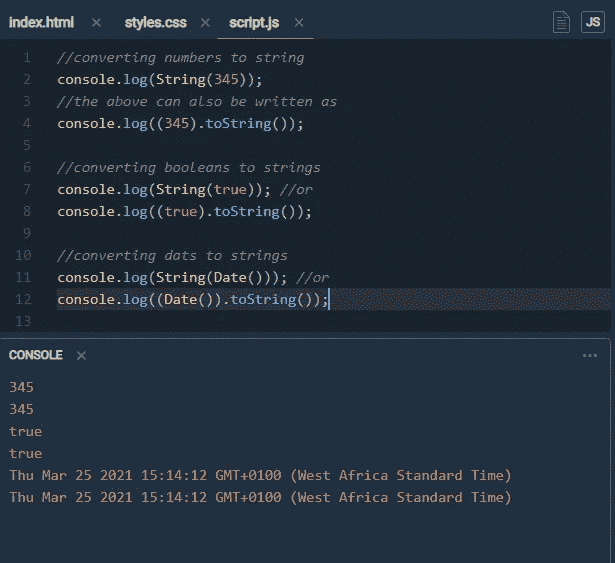
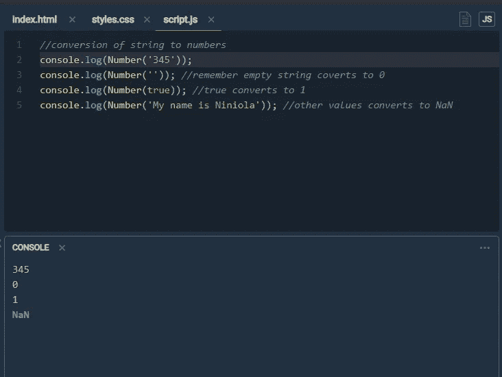
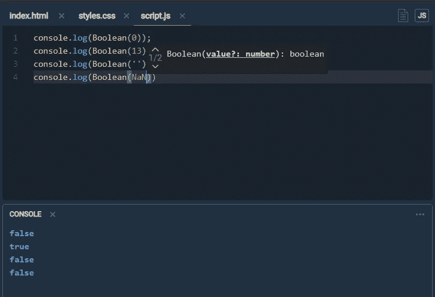
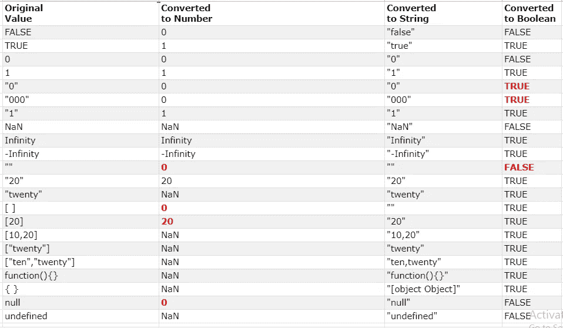

# 转换数据类型 JavaScript..30 天 javascript == >第 10 天

> 原文：<https://medium.com/nerd-for-tech/converting-datatypes-javascript-30daysofjavascript-day10-bdcf55103b07?source=collection_archive---------13----------------------->

在 JavaScript 和大多数情况下，值在操作和函数中被转换成正确的类型。但是有时需要显式地将值转换为预期的类型。首先，让我们谈谈数据类型，我知道我们对此已经很熟悉了，但是让我们回顾一下。

在 JavaScript 中，有 5 种不同的数据类型可以包含值:

*   线
*   数字
*   布尔型
*   目标
*   功能

有 6 种类型的对象:

*   目标
*   日期
*   排列
*   线
*   数字
*   布尔代数学体系的

和 2 种不能包含值的数据类型:

*   空
*   不明确的

# 运算符的类型

用于查找 JavaScript 变量的数据类型的 **typeof** 运算符。你可能想知道什么样的数据类型是的**类型，而**操作符的**类型不是一个变量而是一个操作符。运算符(+ - * /)没有任何数据类型。但是，typeof 运算符总是**返回一个字符串**(包含操作数的类型)。**

操作类型

**NB: typeof** 不能用来判断一个 JavaScript 对象是数组(还是日期)。

现在回到类型转换，

## 字符串转换

使用全局 string()方法或 object toString()方法，可以将数字、布尔值甚至日期转换为字符串。

字符串转换

## 数字转换

全局方法 Number()可以将字符串转换为数字。包含数字的字符串(如“1.25”)会转换为数字(如 1.25)。空字符串自动转换为 0，其他任何字符串都转换为 NaN(不是数字)。True 和 false 转换为 1 和 0。

数转换

## 布尔转换

布尔转换非常简单，空值如空字符串、0、NaN、undefined 和 null 给出结果 **false** 而其他值给出结果 **true。**该转换使用全局方法 Boolean()执行。

布尔转换

下面是一个 JavaScript 类型转换表。请注意，引号中的值表示字符串值，r **ed 值**表示程序员可能不期望的值。

类型转换完整列表。来源:w3schools

## 这是怎么回事？

30daysofjavascript 是一系列关于我如何学习用 javascript 编码的文章。这几集尽可能地简化，对于像我这样的初学者，我希望你在这一集里发现 JavaScript 不那么令人困惑。谢谢大家，下集再见。