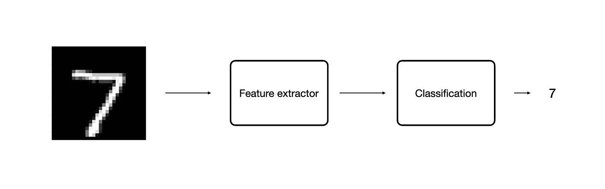
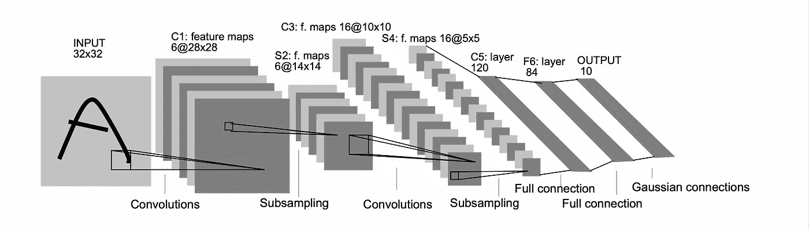
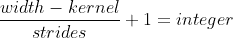
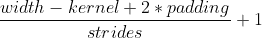
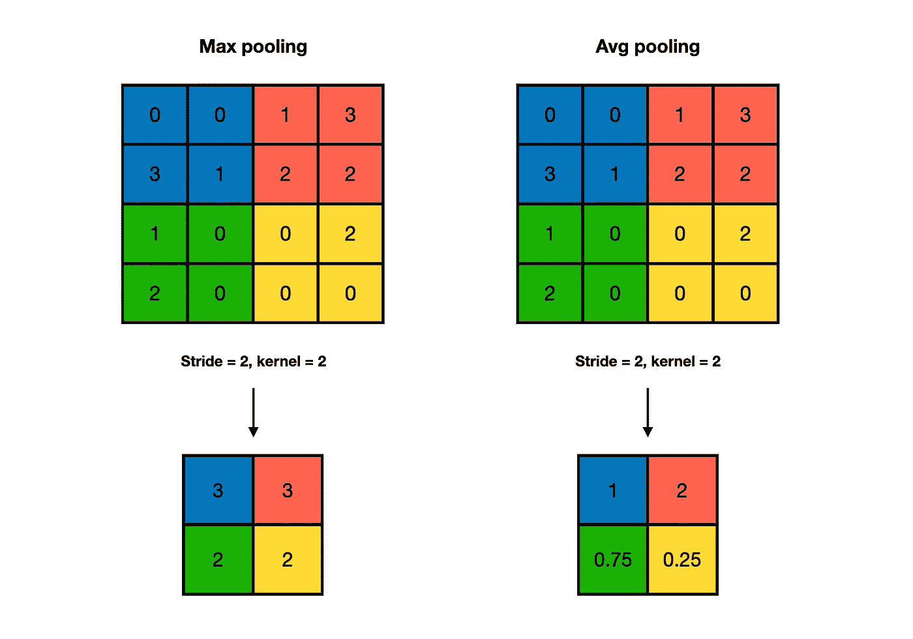
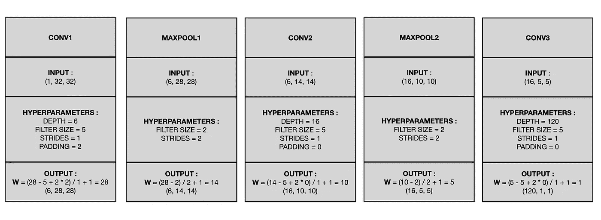
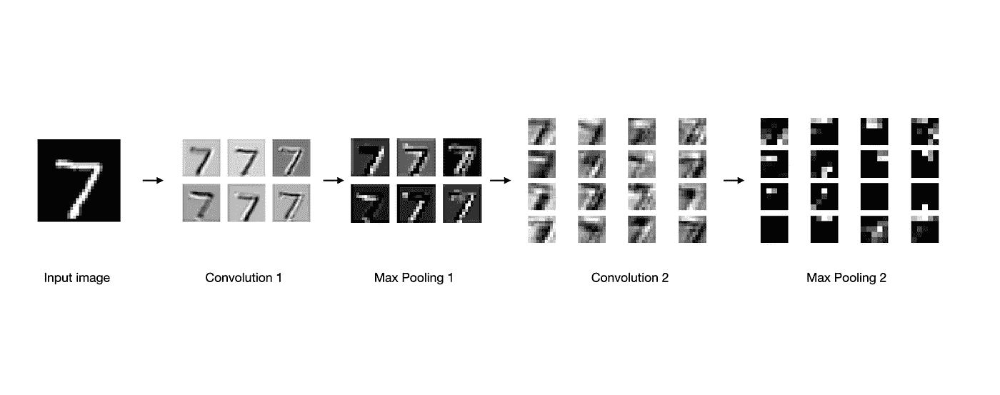
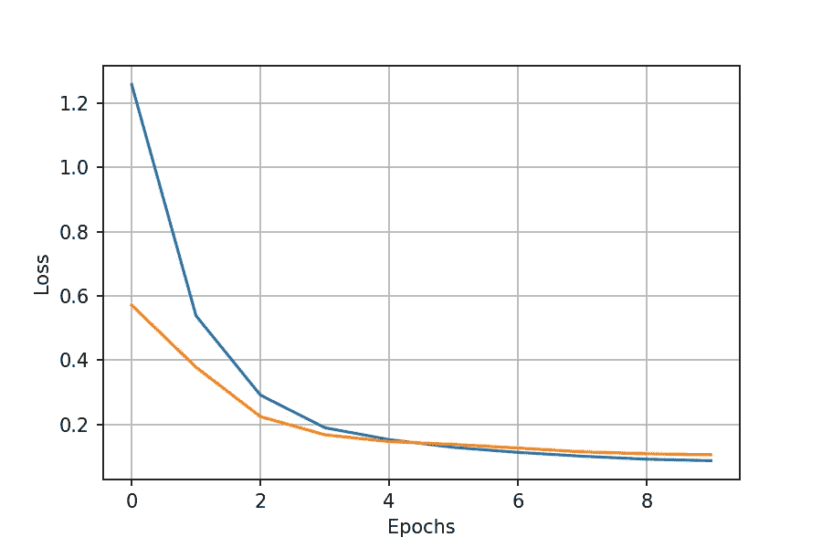
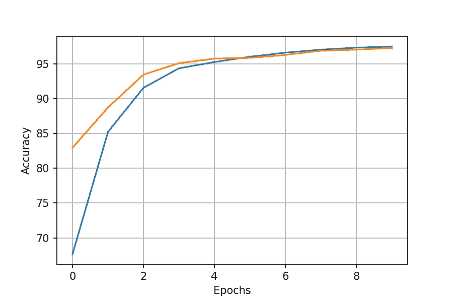

# PyTorch 中的卷积神经网络

> 原文：<https://medium.com/nerd-for-tech/convolution-neural-network-in-pytorch-81023e7de5b9?source=collection_archive---------1----------------------->

在本文中，我将解释 CNN 是如何工作的，并使用 PyTorch 实现稍微修改的 **LeNet5** 模型。以上是我关于卷积神经网络的笔记，以通俗易懂的方式总结在一起，帮助你理解这个话题。

照片由[马特·诺布尔](https://unsplash.com/@mcnoble?utm_source=medium&utm_medium=referral)在 [Unsplash](https://unsplash.com?utm_source=medium&utm_medium=referral) 上拍摄

# **我们为什么要使用卷积神经网络？**

CNN 类似于常规的神经网络。它们有重量和偏差，但它们是专门为计算机视觉任务设计的，如对象识别或图像分割。自 2012 年以来，它们一直是深度学习革命的驱动力，因为它们能够利用 GPU 的能力和处理大量数据。

好的，让我们看看 ConvNets 的构建模块是什么以及它们是如何工作的！

# **建筑**

通信网的总体结构

LeNet5 架构[3]

**特征提取器**包括:

*   卷积层
*   池层(“二次采样”)

**分类** **块**使用**全连接层**(“全连接”)给出最终预测。

在每个卷积或全连接层之后，我们添加非线性激活函数(除了最后一层，这里我们使用 **Softmax** )。目前， **ReLU** 是一个常用函数，因为****计算速度更快，效果最好。****

> ****我将尝试简要介绍每一层的用途和属性，我们可以直接进入编码。****

## ****先说卷积层！****

****简单来说，卷积就是随图像滑动的**滤波器**，计算乘和。那么，过滤器是什么呢？****

****你可能使用了棕褐色的效果，给照片增加了一种温暖的棕色调。事实上，它是一个带有**预定义的**值的 3x3 窗口，在图片中移动。****

********

****卷积运算[1]****

****在 CNN 中，我们要**学习**这些值来提取相关特征。学习过程使用反向传播算法，与常规神经网络相同。****

****卷积层有四个**超参数**，决定输出的大小:****

*   ******滤波器尺寸** —标准选择是 3x3 和 5x5，根据经验，3x3 可产生最佳精度结果****
*   ******深度** —输出中**滤波器的数量**，由于计算原因通常为 2 的幂。当我们得到一个更深的网络时，每一层都有更广范围的特性和抽象联系可以寻找。因此，我们在每一层增加它们的数量，通常像[64，128，256…]。****
*   ******步幅** —控制滤镜的移动。如果步长为 1，我们将过滤器移动一个像素。当 stride 为 2 时，我们将过滤器移动两个像素。它减小了输出的大小，从而加快了计算速度。****

****为了检查步数是否可行，该等式的结果必须是整数:****

********

*   ******填充** —控制空间输出大小的另一种方法，但这次是通过在边界周围添加零。**补零(" same")** 有助于保持初始大小。**“有效”**表示完全没有填充。这对更深的网络是有益的，如果没有它，交易量会下降得太快。****

****计算**输出尺寸**的公式:****

********

## ******汇集层******

********

****另一个下采样操作给予网络一定量的**平移不变性。**共有两种不同的联营方式:****

*   ******最大汇集** —取窗口的最大值，从而提取最清晰和最明亮的特征****
*   ******平均池** —取窗口的平均值，从而提取平滑特征****

> ****如今，合并操作主要被大步取代。[2]****

## ******全连通层******

****它们用于学习从不同过滤器提取的特征之间的**连接**，并输出类别预测的概率。****

********

****输出计算和超参数****

# ****编码****

****最后，经过一点理论，我们准备做一些编程。如果想看完整的代码，可以看看我的 [**Github**](https://github.com/maciejbalawejder/DeepLearning-collection/blob/main/ConvNets/LeNet/LeNet5.ipynb) 。****

## ****LeNet 模型****

## ****培训功能****

## ****资料组****

****我使用了著名的 MNIST 数据集，它非常适合这样一个简单的模型。****

## ****培训和测试****

# ******结果******

****经过 2 分钟的训练，模型达到了大约 98.5%的准确率。我还绘制了特征地图，以查看过滤器如何提取特征。如果你对特征地图如何寻找不同的输入感兴趣，我推荐这个[网站](https://tensorspace.org/html/playground/lenet.html)。****

************************

# ****结论****

****卷积神经网络是深度学习的基础，在许多领域发挥着重要作用，如对象识别、图像分割或医学成像。因此，了解它们是如何优化和升级的至关重要。我希望读完这篇文章后，您能够在 PyTorch 中构建自己的 ConvNet！****

****如果你想看我的其他项目，请查看我的 [**中型**](https://maciejbalawejder.medium.com/) 和 [**Github**](https://github.com/maciejbalawejder) 个人资料。****

# ****参考****

****[【1】](https://arxiv.org/pdf/1603.07285.pdf)深度学习卷积运算指南****

****[【2】](https://arxiv.org/pdf/1412.6806.pdf)力求简单:全卷积网****

****[【3】](http://vision.stanford.edu/cs598_spring07/papers/Lecun98.pdf)基于梯度的学习应用于文档识别****